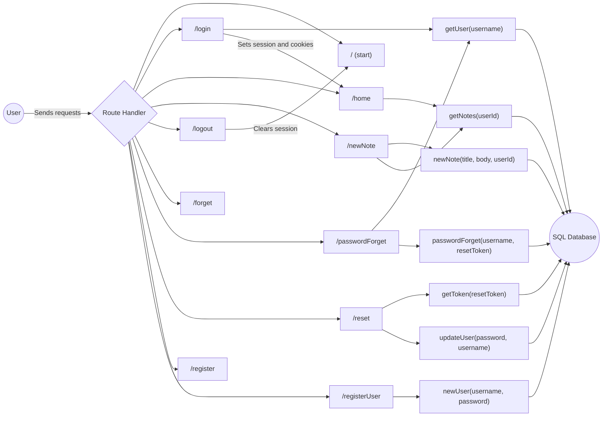
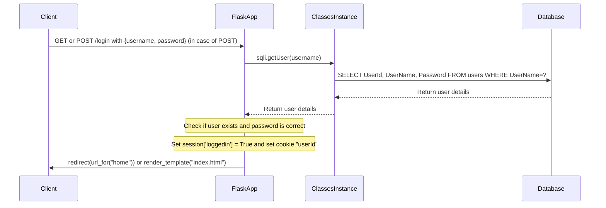
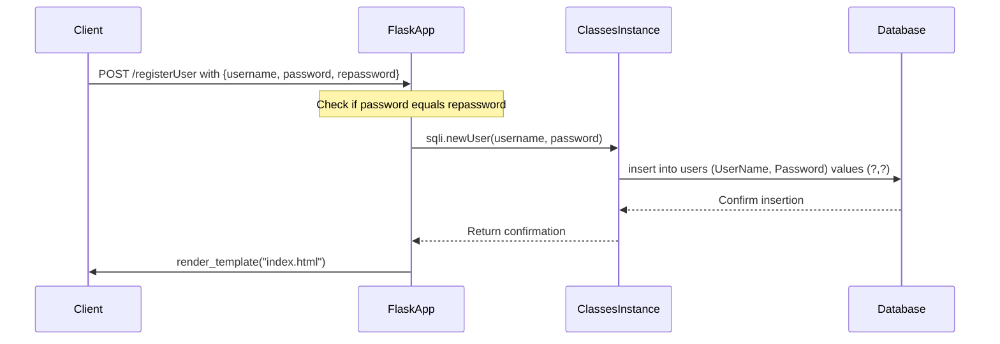
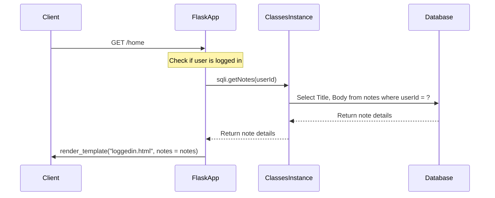
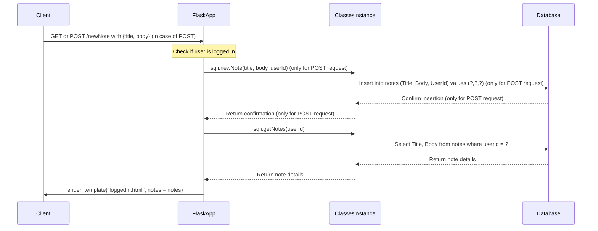
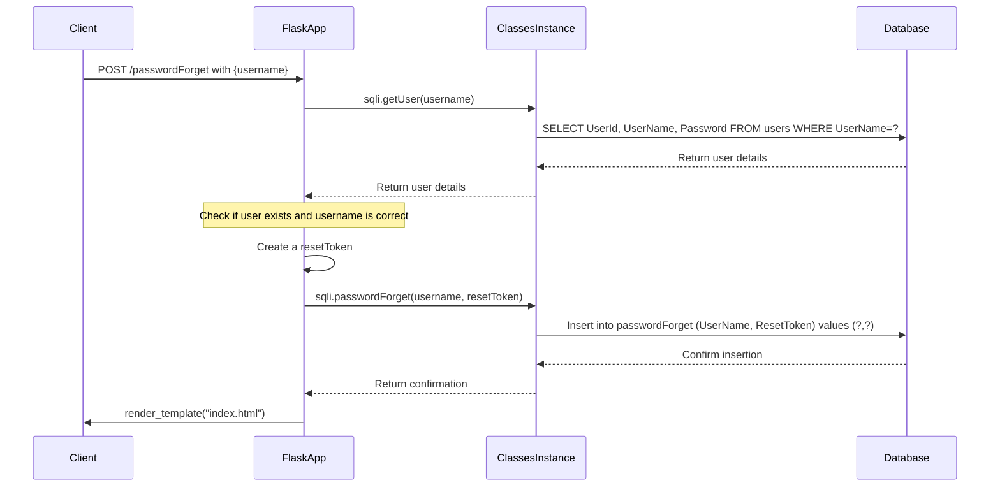
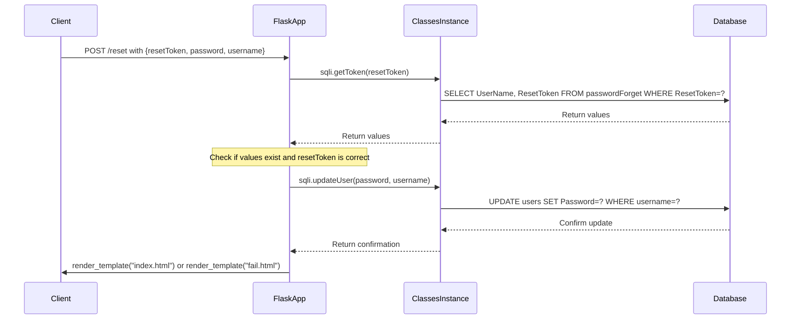
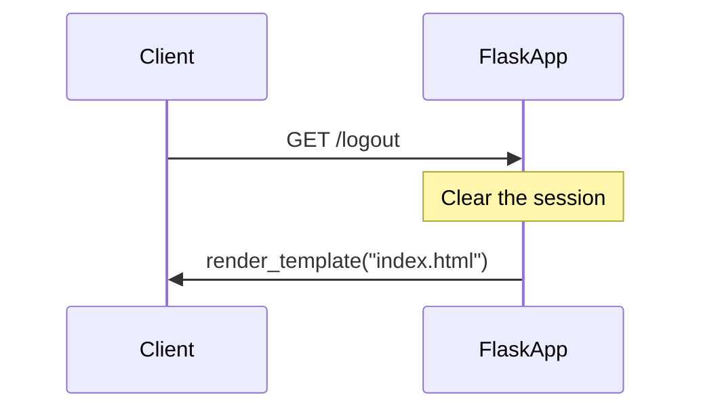

# Threat Modeling Tutorial

## Introduction to Threat Modeling

Threat modeling is a process by which potential threats, vulnerabilities and risks can be identified, enumerated, and prioritized; all from a hypothetical attacker's point of view. The purpose of threat modeling is to provide defenders with a systematic analysis of the probable attacker's profile, the most likely attack vectors, and the assets most desired by an attacker. 

Threat modeling answers the following four key questions:

1. **What are we building?** 
   Understand the system, its context, components and their interaction, data flow, security controls, and dependencies.
   
2. **What can go wrong?**
   Identify threats and possible vulnerabilities. You could use techniques like STRIDE, attack trees or kill chains.
   
3. **What are we going to do about that?**
   Determine and implement security measures to protect the system against identified threats.
   
4. **Did we do a good enough job?**
   Validate the security measures and iterate the process. Verification can be done via methods like code review, penetration testing, and red teaming.

## Approaches to Threat Modeling

There are four general approaches to threat modeling:

1. **Asset-centric:** This approach starts by identifying and classifying a system's assets, and then focuses on the threats to those assets.
2. **System-centric (or architecture-centric):** This approach focuses on the system's design and components, and their interactions. It identifies threats based on the attack surface exposed by the system's architecture.
3. **Attacker-centric:** This approach starts by assuming the perspective of the attacker, their skills, motives, and objectives, and then identifies threats based on what parts of the system the attacker would likely target.
4. **List-centric:** List-centric approaches to threat modeling, using tools such as the Application Security Verification Standard (ASVS) from the Open Web Application Security Project (OWASP), provide a systematic and comprehensive checklist for evaluating the security of software applications.

## Requirements Traceability Matrix (RTM)

A Requirements Traceability Matrix (RTM) is a document, usually in the form of a table, that co-relates any two base-lined documents that require a many-to-many relationship to check the completeness of the relationship. It's used to track the requirements and to check if they are being met. In the context of threat modeling, it's used to map functionalities (use cases) to threats (abuse cases) and their mitigations.

Here's an example:

| Use Case | Abuse Case | Threats | Mitigations |
|----------|------------|---------|-------------|
| User Login | Attacker obtains user credentials | Eavesdropping, Phishing, Brute Force | Use HTTPS, Implement two-factor authentication, Account Lockout |
| Register New User | Attacker registers a fake account | Identity Spoofing | Implement CAPTCHA, Email verification |
| Note Creation | Attacker creates a note with malicious content | Persistent Cross-Site Scripting (XSS) | Implement output encoding, Input validation |
| Reset Password | Attacker resets another user's password | Elevation of privilege | Implement a more secure password reset mechanism |
| User Logout | Attacker continues the session even after user logout | Session Hijacking | Implement secure session management |

## The challenge

For each use case, consider how it could be abused or what vulnerabilities may exist. These could be due to issues in the code itself or due to broader architectural problems. Consider various types of vulnerabilities, such as Injection attacks, Broken Authentication, Sensitive Data Exposure, etc.

Once you have created your RTM, use it to analyze the provided code and diagrams, and see how many potential vulnerabilities you can identify.

This process will not only help you understand the potential threats and vulnerabilities but also allow you to practice threat modeling, which is a crucial skill in cybersecurity

After you've created your Requirements Traceability Matrix, try to identify as many potential vulnerabilities in this application as possible. Use the OWASP Top 10 as a guide and see if you can identify threats that fall into each category. Be sure to consider both the code itself and the way the application is structured. Note that some vulnerabilities may not be immediately obvious, and may require a deeper understanding of how different components of the application interact with each other.

This exercise will test your ability to think like an attacker, which is a valuable perspective for any security professional. Remember, the goal isn't just to find vulnerabilities, but to understand why they're there, how they can be exploited, and how they can be mitigated or eliminated.

When you've identified as many vulnerabilities as you can, compare your findings with your peers. Did you all find the same issues, or were there some that only you noticed? This can be a great opportunity for discussion and learning.

## Python Flask Application Lab

In the context of this lab, you'll work with a small Python Flask application. You can find the source code [here]([#](https://github.com/blabla1337/skf-labs/blob/master/python/Threat-modeling/TM.py)). For each functionality of the application, diagrams and flowcharts are provided to give you an understanding of the data flow and interactions between components.

## Secuence diagrams

### Login functionality

This functionality allows a user to log in to their account. The user submits their username and password through the login form. The function retrieves the user's information from the database based on the provided username. It checks if the provided password matches the stored password for the user. If the credentials are valid, the function sets the session as logged in and returns a response with the user's information and a session cookie. If the credentials are invalid, the function returns a response redirecting the user back to the login page.

### Register New User Functionality

This functionality enables a user to register a new account. The user provides a desired username and password. The function inserts a new record into the "users" table in the database, storing the username and password as a new user entry.

### Home functionality

This functionality is responsible for rendering the home page after a successful login. It retrieves the notes associated with the logged-in user's user ID from the database and displays them on the page.

### Note Creation Functionality

This functionality allows a logged-in user to create a new note. The user provides the note's title, body, and their user ID. The function inserts a new record into the "notes" table in the database, storing the note's details associated with the user's ID.

### Password forget functionality

---

This functionality allows a user to initiate the password reset process. The user provides their username, and a reset token is generated. The function inserts a new record into the "passwordForget" table in the database, storing the username and reset token for future verification during the reset process.

### User Logout Functionality

This functionality logs out the currently logged-in user. It clears the session, effectively terminating the user's authenticated session. After logging out, the user is typically redirected to the login page or the home page.
