# OWASP S.K.F - Labs
https://github.com/blabla1337/skf-labs

## Authors:
- Alberto Rafael Rodríguez Iglesias
- Riccardo Ten Cate

## Index:
1. Introduction
2. Proxy configuration
   -  2.1 ZAP
   -  2.2 Burp Suite
3. Labs available and attacks covered

## 1. Introduction
The following manual has been designed in order to serve as a high-level guide for anyone interested in getting hands-on the OWASP S.K.F Labs. These labs are designed to help security professionals and beginners to learn the basics of web app hacking through real examples and explanatory guides.

## 2. Proxy configuration
### 2.1 ZAP

Let's suppose you have ZAP already installed.
You can go to your command line terminal and type:

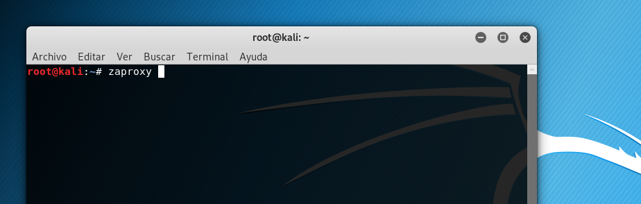

First time you use it you will have to accept the terms and conditions:

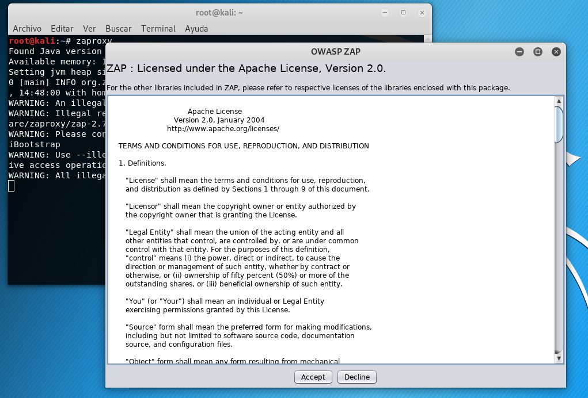

After that it will start loading:

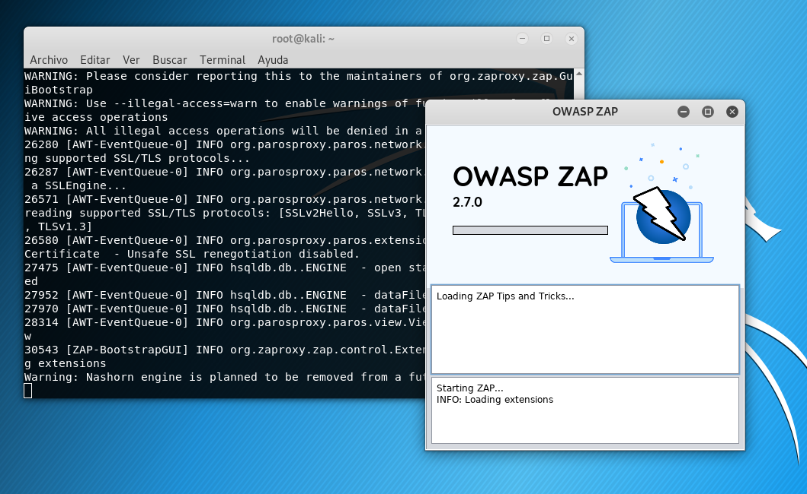

You will need to define the kind of session you want (Let's select: "No, I do not want to persist this session at this moment in time"):

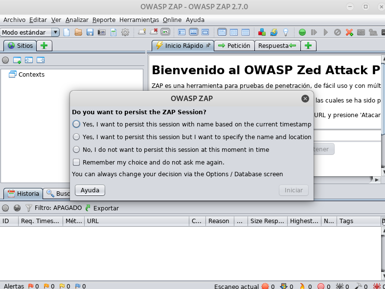

You can see the general panel of ZAP:

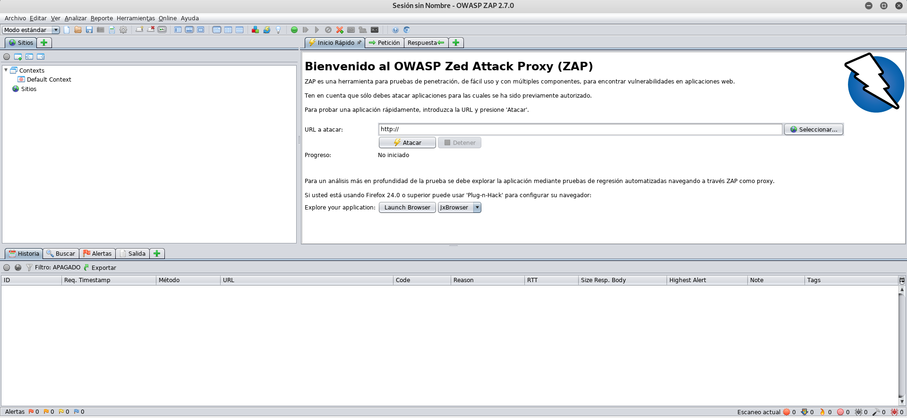

If we browse or navigate a little bit now (for example in a S.K.F lab's website), we will see that in the left panel of ZAP (under 'Sites'), a list of the URLs explored appears.
You can select one of this URLs in order to see which 'Request' and 'Response' (in Spanish, 'Petición' y 'Respuesta') was sent to and received from this URL:

Request:
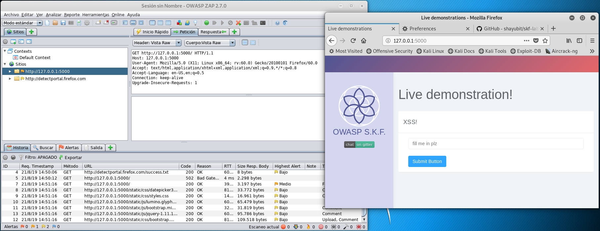

Response:
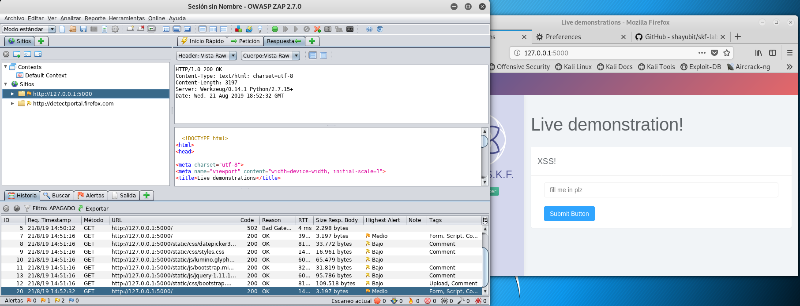

If you press the green ball at the upside-right of the panel you can intercep all the HTTP requests made and modify them at your own will. (The green ball turns red when it is in intercepting mode).

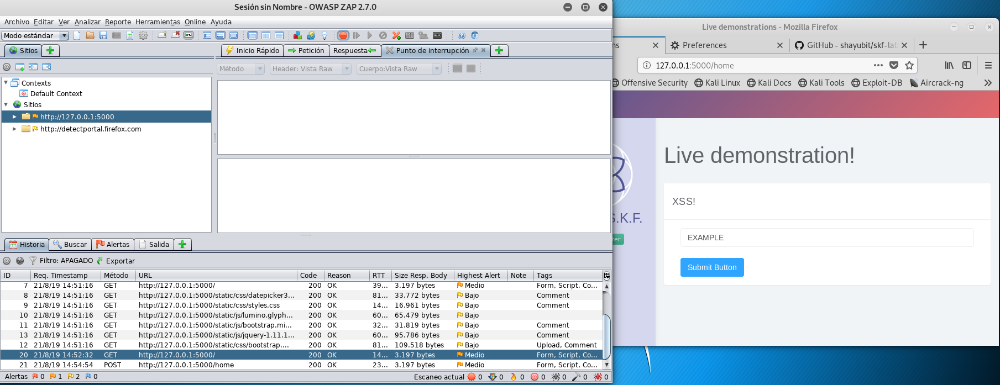

If we intercept an example of request with the string 'EXAMPLE' inside the input field, we can see something like this:

Let's change a little bit the request (in this case we will try to take advantage of a XSS vulnerability) by adding some extra text inside the intercepted request:

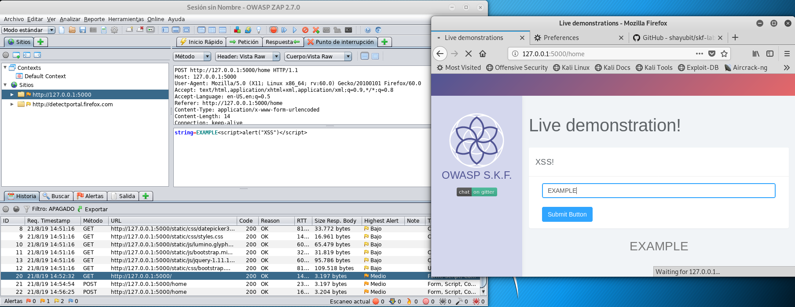

If you press now the 'Play' or continue button (represented by a light blue triangle next to the red ball of interception), the request will go on with it's predefined flow.
As we can see now, we have changed the expected behaviour of the website due to a change of the intercepted HTTP request.

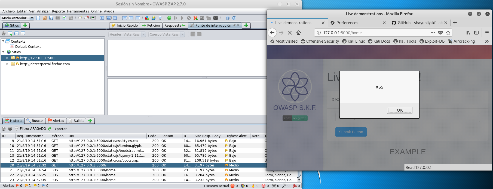

### 2.2 Burp Suite

Let's say we are going to use Kali Linux as our base OS. You can find Burp already installed and available at the left side of the desktop.

If we initiate the tool:

We select temporary project by now:

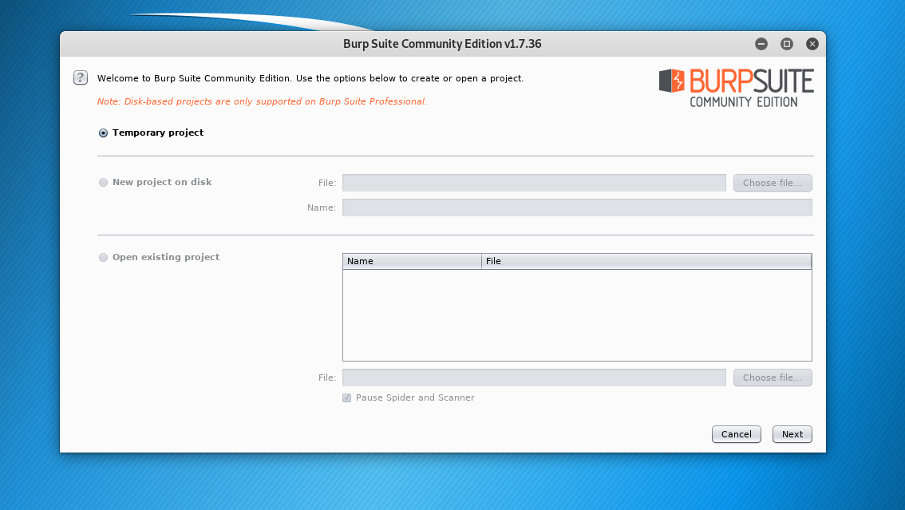

We select 'use Burp defaults':

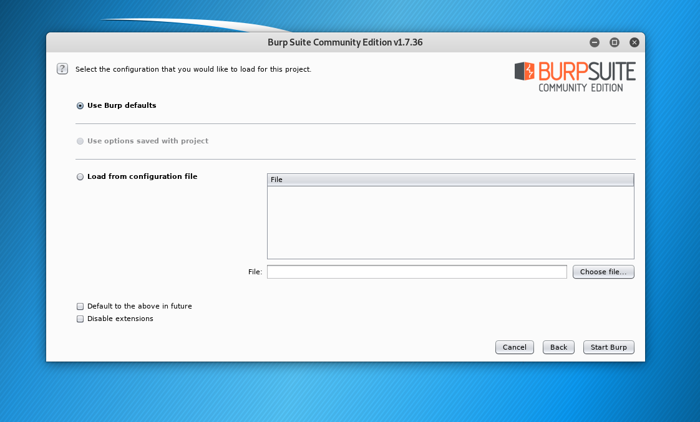

The tool is loading now:

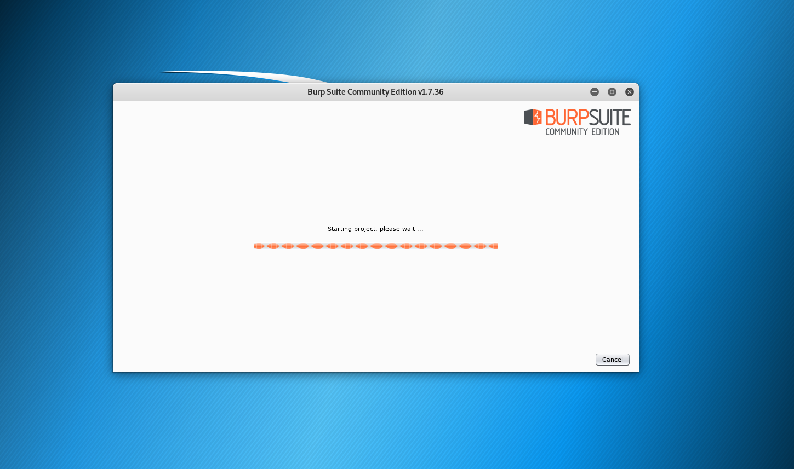

Now we have the main panel of the tool:

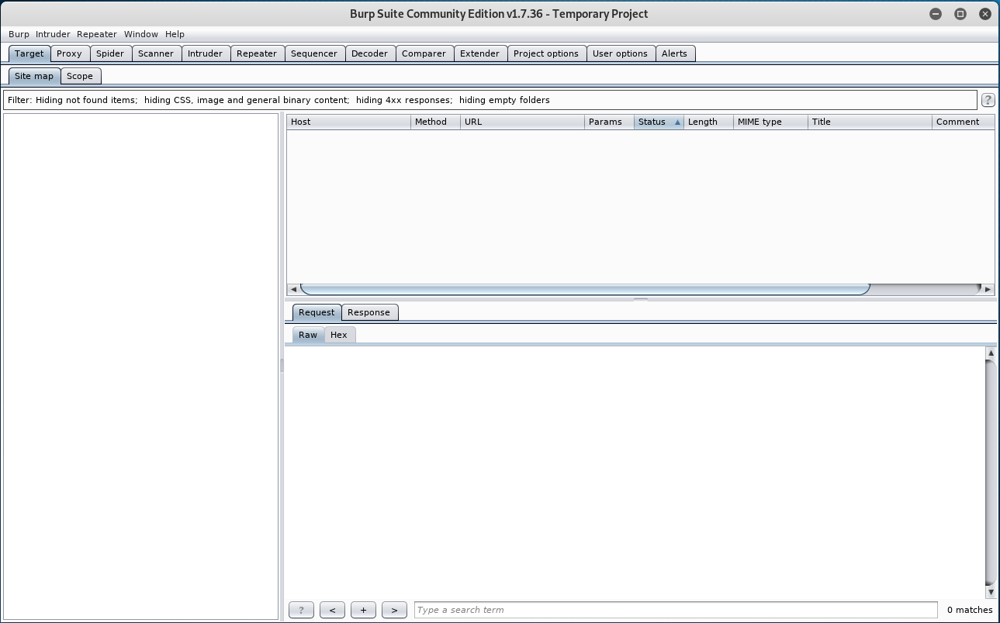

If we go to the window 'Proxy', and under this, the window 'Options', we must check that
an IP address and port associated is defined as a 'Proxy Listener'. By default, Burp will use 127.0.0.1:8080 .

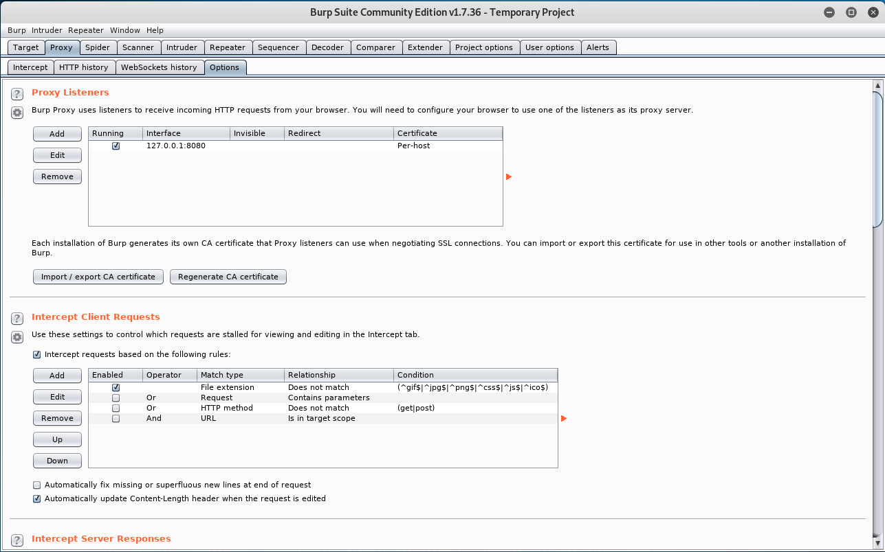

Now that we have the Burp proxy listening at this port in the computer, we must configure the browser in order to redirect the web traffic through this port, so that the proxy can intercept the requests.
Supposing that we are using Mozilla Firefox, we go to Preferences>General>Network Proxy:

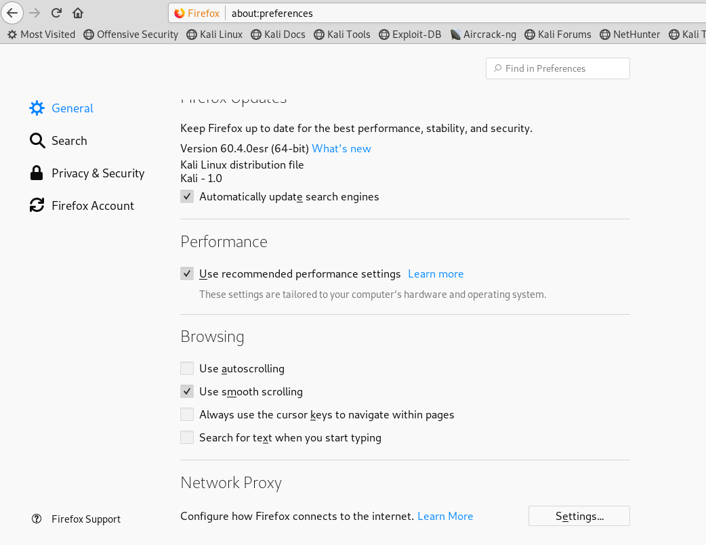

Now, we are going to select the option of 'Manual proxy configuration' and we will use the same IP and port that we defined in Burp before: 

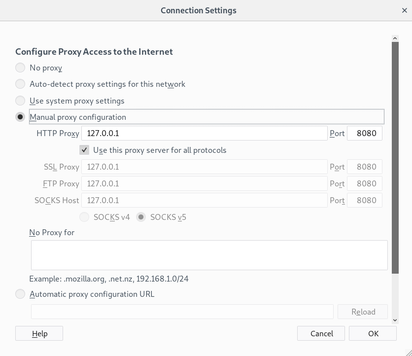

Then, we go back to the main Burp panel, inside the 'Proxy' window. We can see that the option is set to 'intercept is off'

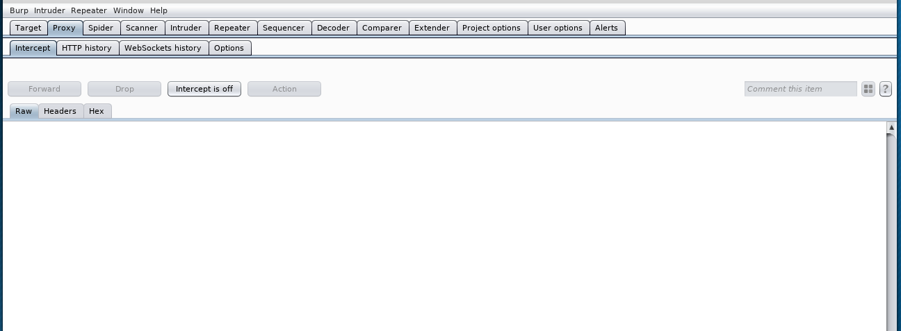

If we press this button, it will change to 'intercept is on'. In this moment, any request made through the web browser will be intercept and is going to appear here in case you may like to modify it:

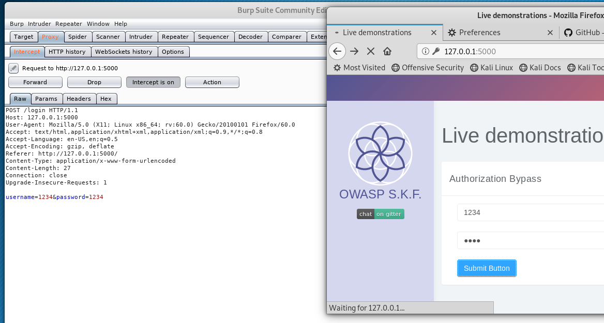

## 3. Labs available and attacks covered

