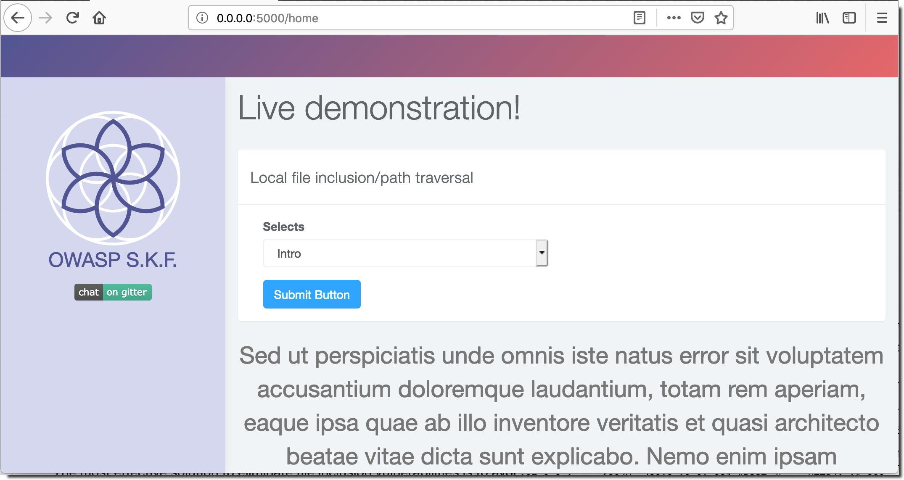
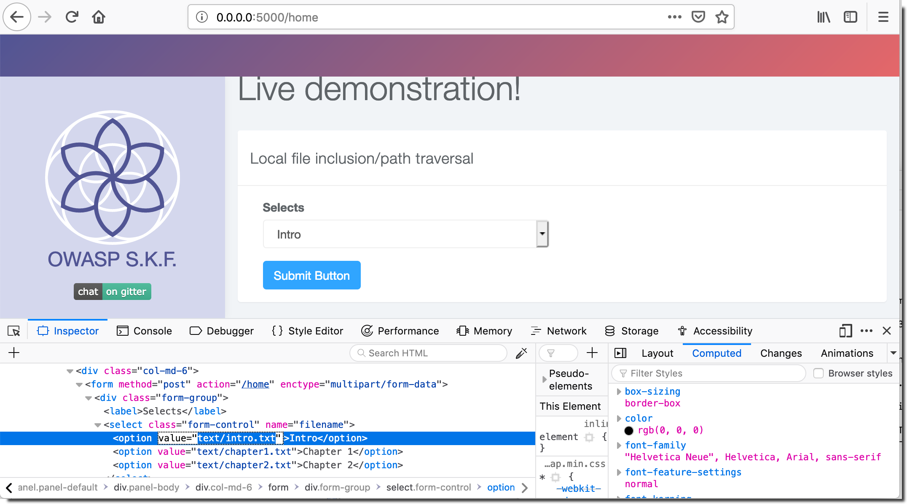
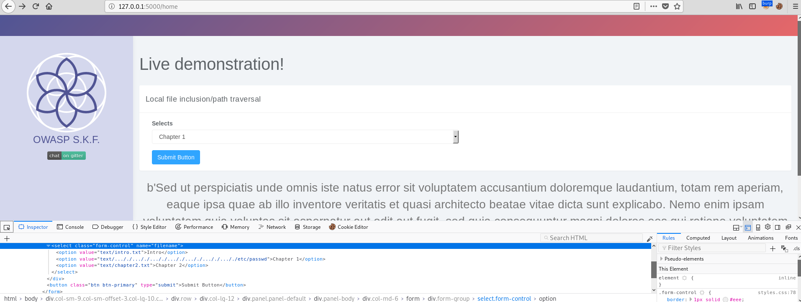
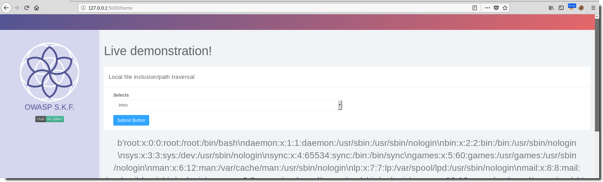

# KBID xxx - LFI-2


## Running the app


```text
$ sudo docker pull blabla1337/owasp-skf-lab:lfi-2
```

```text
$ sudo docker run -ti -p 127.0.0.1:5000:5000 blabla1337/owasp-skf-lab:lfi-2
```



Now that the app is running let's go hacking! 


## Reconnaissance

Local File Inclusion (also known as LFI) is the process of including files, that are already locally present on the server, through the exploiting of vulnerable inclusion procedures implemented in the application. This vulnerability occurs, for example, when a page receives, as input, the path to the file that has to be included and this input is not properly sanitized, allowing directory traversal characters (such as dot-dot-slash) to be injected. Although most examples point to vulnerable PHP scripts, we should keep in mind that it is also common in other technologies such as JSP, ASP and others.

Warning: To successfully test for this flaw, the tester needs to have knowledge of the system being tested and the location of the files being requested. There is no point requesting /etc/passwd from an IIS web server.

Some Examples:

```text
http://example.com/getUserProfile.jsp?item=../../../../etc/passwd

Cookie: USER=1826cc8f:PSTYLE=../../../../etc/passwd
```

## Exploitation

The File Inclusion vulnerability allows an attacker to include a file, usually exploiting a "dynamic file inclusion" mechanisms implemented in the target application. The vulnerability occurs due to the use of user-supplied input without proper validation.

This can lead to something as outputting the contents of the file, but depending on the severity, it can also lead to:

Code execution on the web server

Code execution on the client-side such as JavaScript 

which can lead to other attacks such as:

Cross-site scripting (XSS)

Denial of Service (DoS)

Sensitive Information Disclosure

Let us see how can we exploit the file inclusion vulnerability in a real world scenario, the application here allows us to view details on Intro, Chapter1, Chapter2 and so on.





We could try to modify the "intro" item and attempt to access the world-readable /etc/passwd file by directory traversal. This will not work since the developer implemented a protection by filtering out the '../' sequence.

If we however would create the folowing payload:

<span style="color:blue;font-size:200%;">.</span><span style="color:red;font-size:200%;">../</span><span style="color:blue;font-size:200%;">./</span>

the result will be a ../ sequence after the webserver filtered out the  ../ patern in the middle of our string.

So lets try a payload like this: /..././..././..././..././..././..././..././etc/passwd




 Success! As we observed, we can access the /etc/passwd file through LFI.

## Additional sources

https://www.owasp.org/index.php/Testing_for_Local_File_Inclusion 
