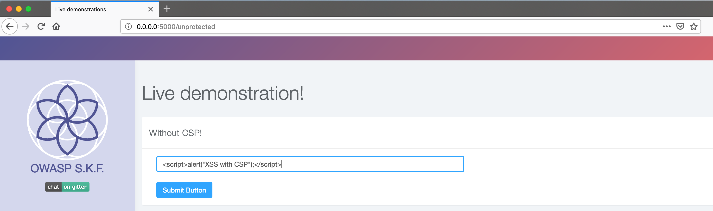
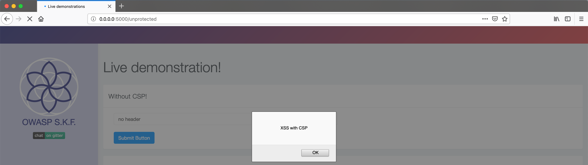
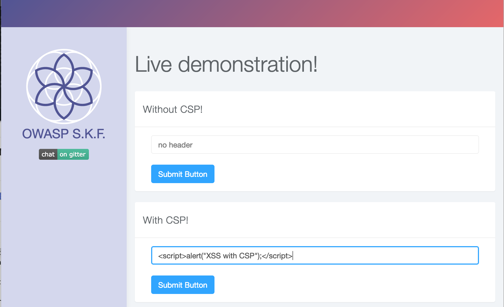
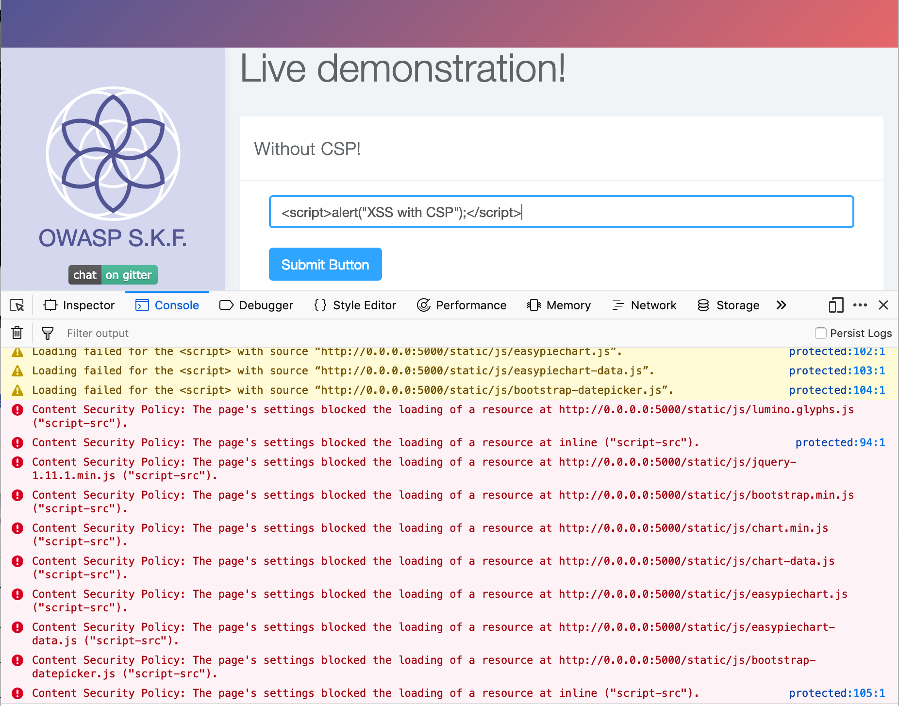

# KBID 178 - Content-Security-Policy

## Running the app

Becoming a super hero is a fairly straight forward process:

```text
$ sudo docker pull blabla1337/owasp-skf-lab:csp
```

```text
$ sudo docker run -ti -p 127.0.0.1:5000:5000 blabla1337/owasp-skf-lab:csp
```


 Now that the app is running let's go hacking!



## Reconnaissance

The main use of the content security policy header is to, detect, report, and reject XSS attacks. The core issue in relation to XSS attacks is the browser's inability to distinguish between a script that's intended to be part of your application, and a script that's been maliciously injected by a third-party. With the use of CSP\(Content Security policy\), we can tell the browser which script is safe to execute and which scripts are most likely been injected by an attacker.

## Exploitation

In the first scenario we explore the execution of an XSS attack without CSP in place.





With CSP in place, when we try to perform a XSS attack we notice that CSP header block the scripts since the inclusion of inline scripts is not permitted.





## Additional sources

[https://www.owasp.org/index.php/Content\_Security\_Policy](https://www.owasp.org/index.php/Content_Security_Policy)

