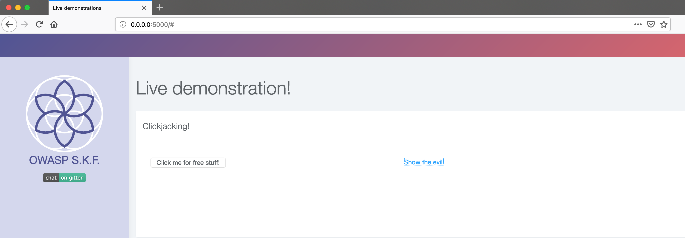

KBID 20 - Clickjacking

## Running the app

Becoming a super hero is a fairly straight forward process:

```
$ sudo docker pull blabla1337/owasp-skf-lab:clickjacking
```

```text
$ sudo docker run -ti -p 127.0.0.1:5000:5000 blabla1337/owasp-skf-lab:clickjacking
```

Now that the app is running let's go hacking!


 
## Reconnaissance

Clickjacking, also known as a "UI redress attack", is when an attacker uses multiple transparent or opaque layers to trick a user into clicking on a button or link on another page when they were intending to click on the top level page. Thus, the attacker is "hijacking" clicks meant for their page and routing them to another page, most likely owned by another application, domain, or both.

Using a similar technique, keystrokes can also be hijacked. With a carefully crafted combination of stylesheets, iframes, and text boxes, a user can be led to believe they are typing in the password to their email or bank account, but are instead typing into an invisible frame controlled by the attacker.


## Exploitation

In order to exploit this vulnerability, we need to place an iframe with the malicious link behind a valid actionable button and make it transparent to capture the clicks.



Once you click on show evil, we can notice in this scenario we actual capture facebook likes behind "Click me for free stuff!" button.


Paragrapgh

## Additional sources : https://www.owasp.org/index.php/Clickjacking

par
