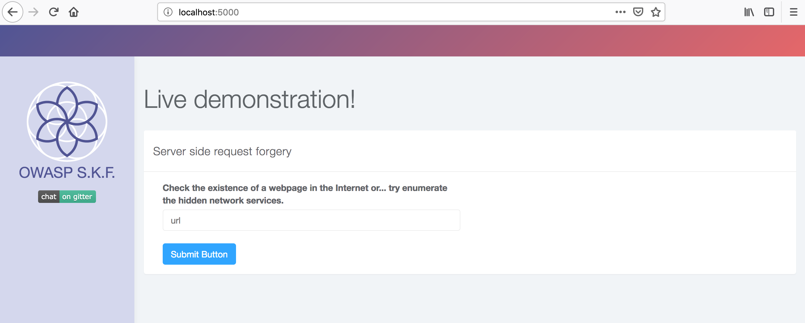
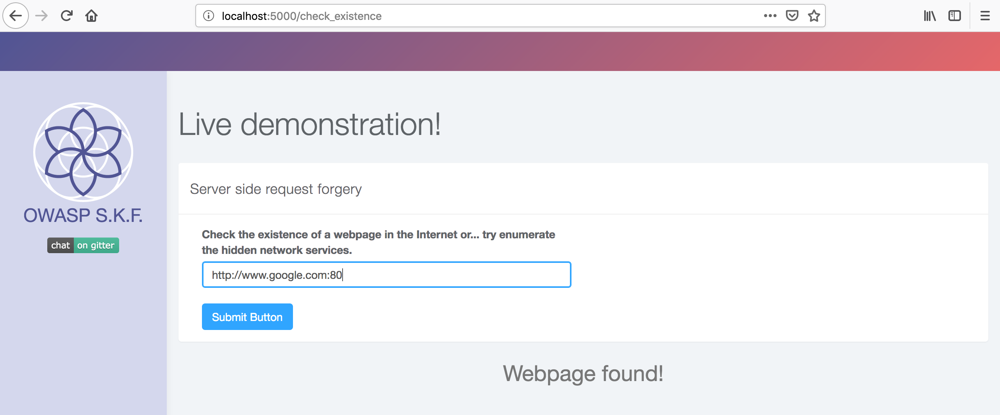
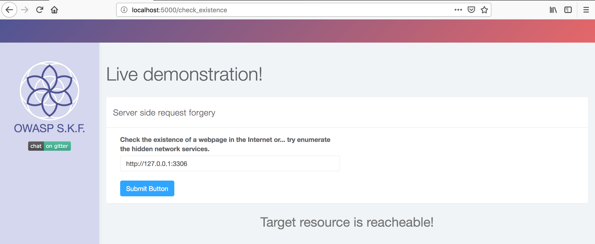

# KBID 262 - Server Side Request Forgery

## Running the app

```
$ sudo docker pull blabla1337/owasp-skf-lab:ssrf
```

```
$ sudo docker run -ti -p 127.0.0.1:5000:5000 blabla1337/owasp-skf-lab:ssrf
```


Now that the app is running let's go hacking!


## Running the app Python3

First, make sure python3 and pip are installed on your host machine. After installation, we go to the folder of the lab we want to practise "i.e /skf-labs/XSS/, /skf-labs/jwt-secret/ " and run the following commands:

```
$ pip3 install -r requirements.txt
```

```
$ python3 <labname>
```


Now that the app is running let's go hacking!



## Reconnaissance

Server Side Request Forgery (SSRF) attack, where an attacker abuse the functionality of a vulnerable web application to send crafter request which which read or update internal resources. Attacker can attack an internal network or application behind the firewall with this attack which is normally not accessible through external network and even attack the internal network web applications.

SSRF attack can be used to make requests to other internal resources for accessing the metadata and to run a port can on the internal network. URL schema such as file:// can be used to read the file from the server. Attackers can use legacy URL schemas such as dict, gopher, expect etc which can even cause remote code execution.

First lets see what type of services are open on the server that we try to attack.

```
nmap -vvvv -sT -sV -p -P0 ip_of_lab_here
```

```
Gibson:skf-labs gibson$ nmap -vvvv -sT -sV -P0 127.0.0.1
Warning: The -P0 option is deprecated. Please use -Pn
Starting Nmap 7.70 ( https://nmap.org ) at 2019-03-24 10:03 CET
NSE: Loaded 43 scripts for scanning.
Initiating Connect Scan at 10:03
Scanning localhost (127.0.0.1) [1000 ports]
Completed Connect Scan at 10:03, 5.41s elapsed (1000 total ports)
Initiating Service scan at 10:03
Scanning 1 services on localhost (127.0.0.1)
Completed Service scan at 10:03, 17.02s elapsed (1 services on 1 host)
NSE: Script scanning 127.0.0.1.
NSE: Starting runlevel 1 (of 2) scan.
Initiating NSE at 10:03
Completed NSE at 10:03, 0.07s elapsed
NSE: Starting runlevel 2 (of 2) scan.
Initiating NSE at 10:03
Completed NSE at 10:03, 0.01s elapsed
Nmap scan report for localhost (127.0.0.1)
Host is up, received user-set (0.00027s latency).
Scanned at 2019-03-24 10:03:24 CET for 23s

PORT      STATE    SERVICE       REASON      VERSION
5000/tcp  open     http          syn-ack     Werkzeug 

Read data files from: /usr/local/bin/../share/nmap
Service detection performed. Please report any incorrect results at https://nmap.org/submit/ .
Nmap done: 1 IP address (1 host up) scanned in 22.94 seconds
```

So as we confirmed the only open port is 5000. Now lets have a look at the application.



Here we have a keep alive functionality where we can verify different website's if they are alive and reachable. Lets try with google.com



## Exploitation

The keep alive functionality was intended to be used for external websites but we can abuse it to also check for internal IP addresses and enumerate services. Lets try a known port like for example 3306 a Mysql service, maybe this is running on the server?







Success! As we observed, we have found an Mysql service running locally.

Yes it was having a Mysql service running on the local listner 127.0.0.1 and that is why our Nmap scan didn't found it but with the SSRF vulnerability in the application we can find it.

Also there is another service running, find a way to automatically enumerate all the possible services and find the last one.

## Additional sources

[https://www.owasp.org/index.php/Server\_Side\_Request\_Forgery](https://www.owasp.org/index.php/Server\_Side\_Request\_Forgery)
