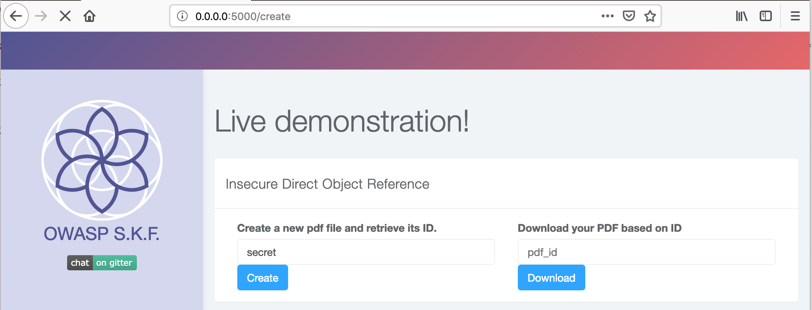
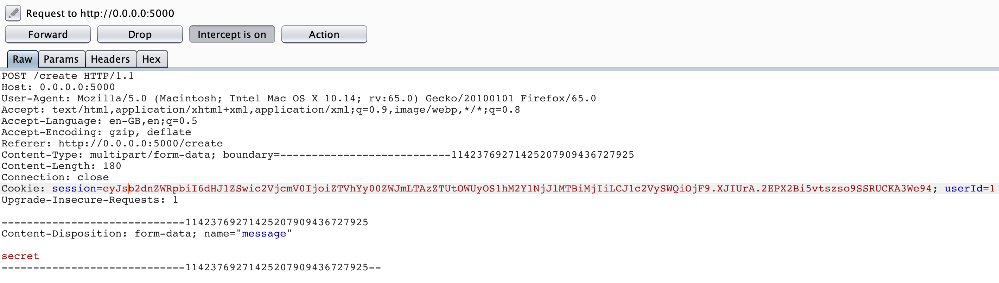
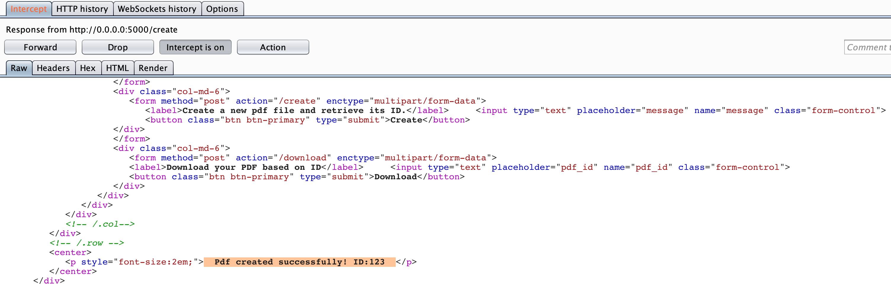
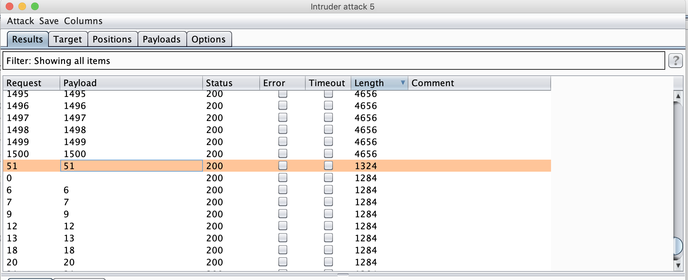
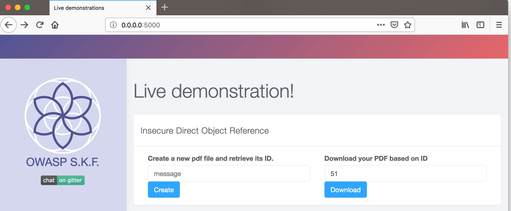
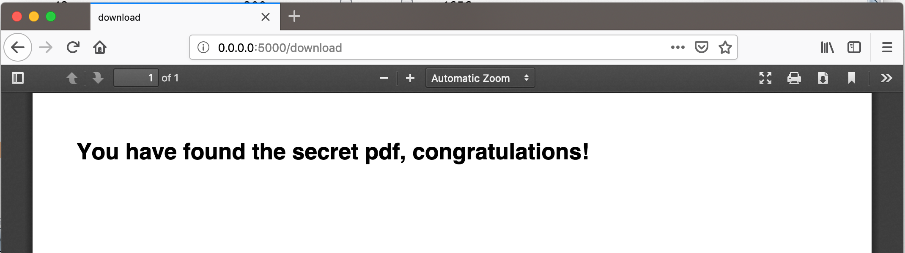

# KBID 268 - Insecure direct object references

## Running the app

Becoming a super hero is a fairly straight forward process:

```
$ sudo docker pull blabla1337/owasp-skf-lab:XXXXXX
```

```text
$ sudo docker run -ti -p 127.0.0.1:5000:5000 blabla1337/owasp-skf-lab:XXXXX
```


 Now that the app is running let's go hacking!



## Reconnaissance

Insecure Direct Object References occur when an application provides direct access to objects based on user-supplied input. As a result of this vulnerability attackers can bypass authorization and access resources in the system directly, for example database records or files. 

Insecure Direct Object References allow attackers to bypass authorization and access resources directly by modifying the value of a parameter used to directly point to an object. Such resources can be database entries belonging to other users, files in the system, and more. This is caused by the fact that the application takes user supplied input and uses it to retrieve an object without performing sufficient authorization checks. 

Lets look at an example:

```text
http://foo.bar/somepage?invoice=12345
```
In this case, the value of the invoice parameter is used as an index in an invoices table in the database. The application takes the value of this parameter and uses it in a query to the database. The application then returns the invoice information to the user.

Since the value of invoice goes directly into the query, by modifying the value of the parameter it is possible to retrieve any invoice object, regardless of the user to whom the invoice belongs.

## Exploitation

Step 1:

The application allows the user to create a PDF file and retrieve the file with the index assigned to it:



HTTP Request for Document Creation:





Lets try to retrieve with ID=123

.png)

Step 2:

Let's try to brute force if we can access other documents by fuzzing the index, consider the index ID=2000 for example:


Ok, that's a good start so now we atleast know the index value falls between 1-1500.

Step 3: To further exploit and attempt to access other indexed documents, we would use a tool called burp which would help us automate the fuzzing task.


.png)

So from the fuzzing results, if we observe closesly the index ID="51" seems interesting as the other ID's seem to have the same response length. Let's check what do we achieve with ID=51.







And we captured the right flag :-), so we could access the document belonging to some other user bypassing access controls of the application.

## Additional Sources

Please refer to the link below for more details around IDOR:




