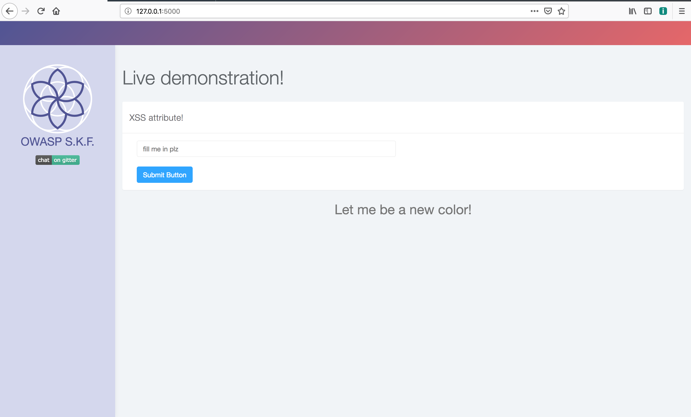
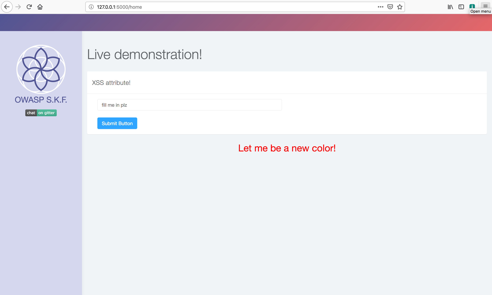
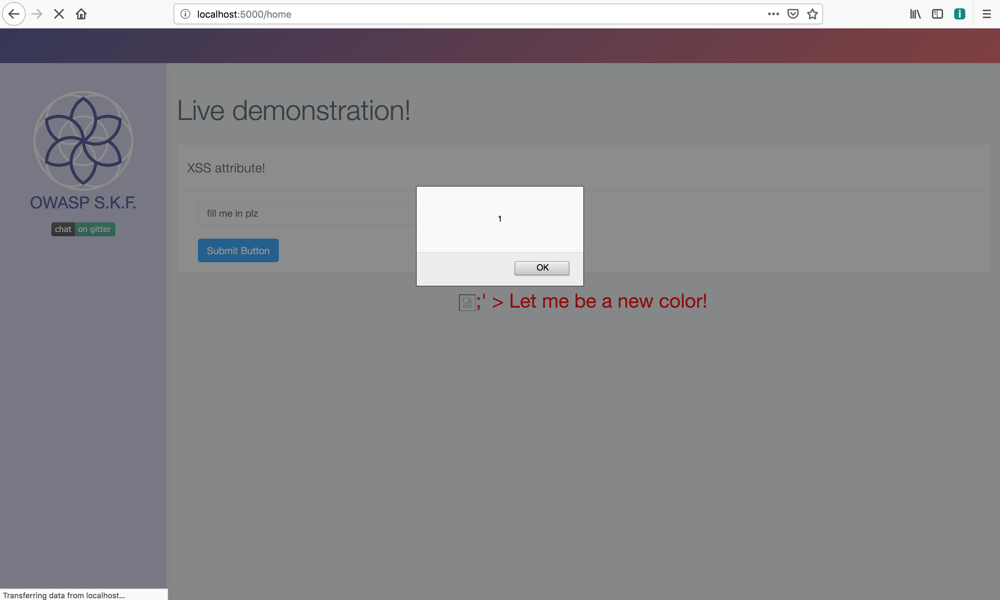

# KBID 3 - Cross site scripting \(attribute\)

## Running the app Docker

```text
$ sudo docker pull blabla1337/owasp-skf-lab:xss-attribute
```

```text
$ sudo docker run -ti -p 127.0.0.1:5000:5000 blabla1337/owasp-skf-lab:xss-attribute
```


Now that the app is running let's go hacking!


## Running the app Python3

First, make sure python3 and pip are installed on your host machine.
After installation, we go to the folder of the lab we want to practise 
"i.e /skf-labs/XSS/, /skf-labs/jwt-secret/ " and run the following commands:

```
$ pip3 install -r requirements.txt
``

```
$ python3 <labname>
```


 Now that the app is running let's go hacking!



## Reconnaissance

### Step 1

The application shows an input fields that allows the user to change the color of the text shown in the page.



If we want to make it red, we can just write `red` in the input box and click the Submit Button.



```markup
<center> <p style="font-size:2em;"> <span style='color:{{xss}};' > Let me be a new color!</span></p></center>
```

and it is not escaped so it should be possible to perform a Cross Site Scripting \(XSS\) injection.

## Exploitation

### Step 1

Now we have seen where the user input is being reflected in the style, we will have to look what dangerous HTML characters are not properly escaped, when the developer used the right encoding the metacharacters like " >< will be properly encoded. So we need to form a payload that does not utilize these characters in order to make the attack successful like the following payload:

*note: we disabled auto-escape for the challenge but in order to do it well you need to avoid using the " > < to leverage the attack*


```text
red ' onmouseover='alert(1337)'
```

Now, hovering over the paragraph will trigger our javascript event handler!



## Additional sources

Please refer to the OWASP testing guide for a full complete description about path traversal with all the edge cases over different platforms!



