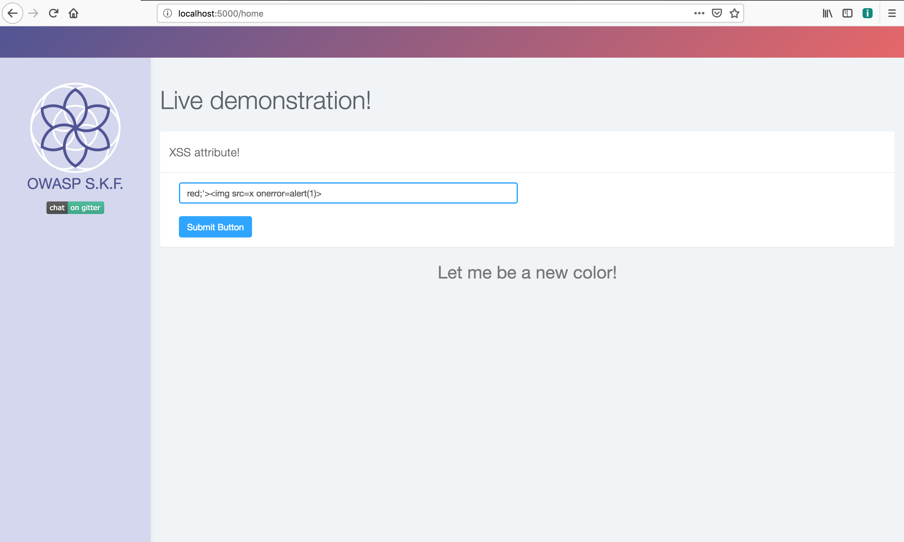

# KBID 3 - Cross site scripting \(attribute\)

## Running the app

```text
$ sudo docker pull blabla1337/owasp-skf-lab:cross-site-scripting-attribute
```

```text
$ sudo docker run -ti -p 127.0.0.1:5000:5000 blabla1337/owasp-skf-lab:cross-site-scripting-attribute
```


Now that the app is running let's go hacking!



## Reconnaissance

### Step 1

The application shows an input fields that allows the user to change the color of the text shown in the page.


If we want to make it red, we can just write `red` in the input box and click the Submit Button.


```markup
<center> <p style="font-size:2em;"> <span style='color:{{xss}};' > Let me be a new color!</span></p></center>
```

and it is not escaped so it should be possible to perform a Cross Site Scripting \(XSS\) injection.

## Exploitation

### Step 1

Now we have seen where the user input is being reflected in the style, we will have to look what dangerous HTML characters are not properly escaped so we can build our XSS payload. So for our first check we use the following string as an input:

```text
foobar"></
```

As you can see the application does not react at out malicious payload, so nothing happens. Why? Maybe the quotes that are used in the template are not the right ones. Let's try our new payload changing the quotes:

```text
red;'>
```



and clicking the button, we achieve what we were looking for.


## Additional sources

Please refer to the OWASP testing guide for a full complete description about path traversal with all the edge cases over different platforms!



