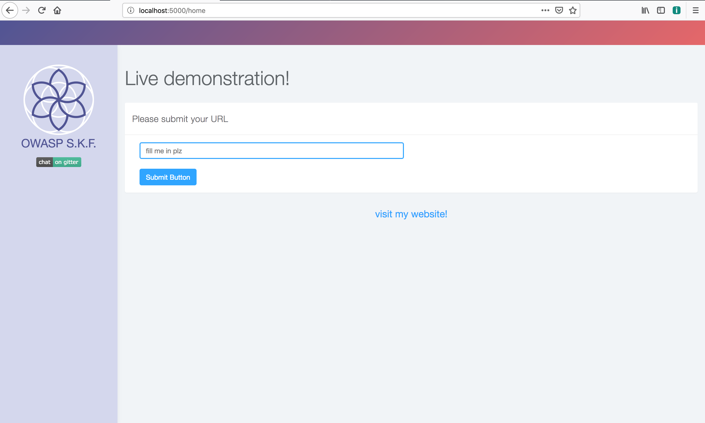
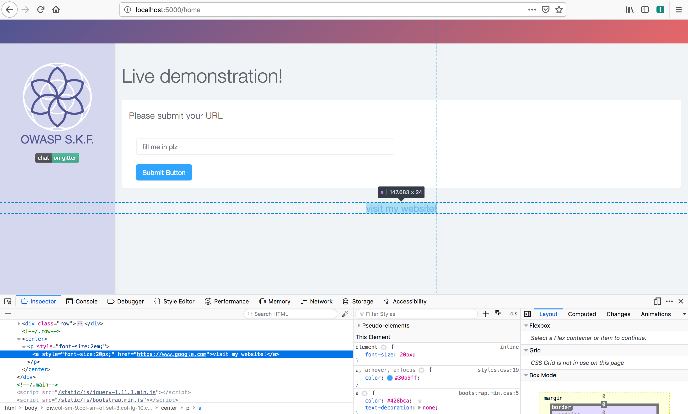
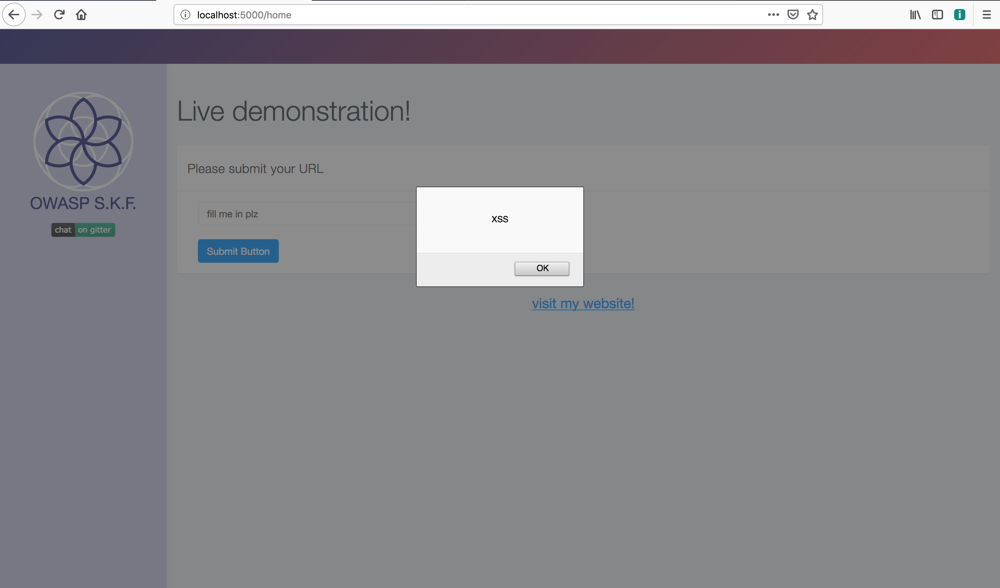
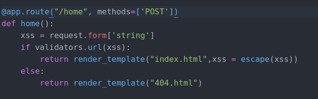

# KBID 3 - Cross site scripting \(href\)

## Running the app Docker

```text
$ sudo docker pull blabla1337/owasp-skf-lab:xss-url
```

```text
$ sudo docker run -ti -p 127.0.0.1:5000:5000 blabla1337/owasp-skf-lab:xss-url
```


Now that the app is running let's go hacking!


## Running the app Python3

First, make sure python3 and pip are installed on your host machine.
After installation, we go to the folder of the lab we want to practise
"i.e /skf-labs/XSS/, /skf-labs/jwt-secret/ " and run the following commands:

```
$ pip3 install -r requirements.txt
```

```
$ python3 <labname>
```


 Now that the app is running let's go hacking!



## Reconnaissance

### Step 1

The application invites you to fill a website in the input box, that will be used from the "visit my website!" link to redirect to it.



If we insert `https://google.com`, and click on "visit my website!" we will be redirected to the Google website. As we can see in the screenshot below our input is reflected in the page inside an `href` attribute.



#### Step 2

The next step is to see if we could include JavaScript that can be executed in the `href` attribute.


href="javascript:JS PAYLOAD"


Autoescape is disabled by default so every characters will be reflected in the following snippet in the template.

```markup
<center> <p style="font-size:2em;">  <a style="font-size:20px;" href="{{xss}}">visit my website!</a> </p></center>
```

## Exploitation

#### Step 1

Now we have seen where the user input is being reflected in the href, we can craft the payload to trigger an alert box and exploit our XSS.

```markup
javascript:alert('XSS')
```

and clicking the button, we achieve what we were looking for.




## Mitigation
XSS Prevention Rules:
The following rules are intended to prevent all XSS in your application. While these rules do not allow absolute freedom in putting untrusted data into an HTML document, they should cover the vast majority of common use cases.
RULE #0 - Never Insert Untrusted Data Except in Allowed Locations
RULE #1 - HTML Encode Before Inserting Untrusted Data into HTML Element Content
RULE #2 - Attribute Encode Before Inserting Untrusted Data into HTML Common Attributes
RULE #3 - JavaScript Encode Before Inserting Untrusted Data into JavaScript Data Values
RULE #4 - CSS Encode And Strictly Validate Before Inserting Untrusted Data into HTML Style Property Values
RULE #5 - URL Encode Before Inserting Untrusted Data into HTML URL Parameter Values
RULE #6 - Sanitize HTML Markup with a Library Designed for the Job
RULE #7 - Avoid JavaScript URLs
RULE #8 - Prevent DOM-based XSS

In this case, the input is directly rendered into the application without without following above rules so that the attacker can inject a malicious script.\
In the following vulnerable code, as there isn't any form of validation an attacker can manipulate the inputs.

Here the vulnerable code is:


For the fix, we have implemented URL validation by using validators package


Can you think of other cool solutions to fix this lab like checking input startwith() function or using regex?


## Additional sources

Please refer to the OWASP testing guide for a full complete description about path traversal with all the edge cases over different platforms!


