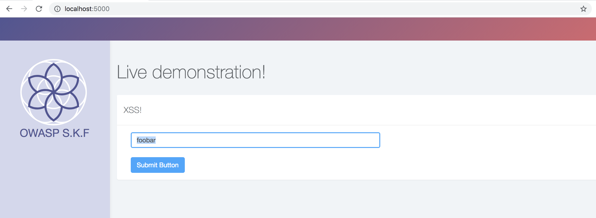
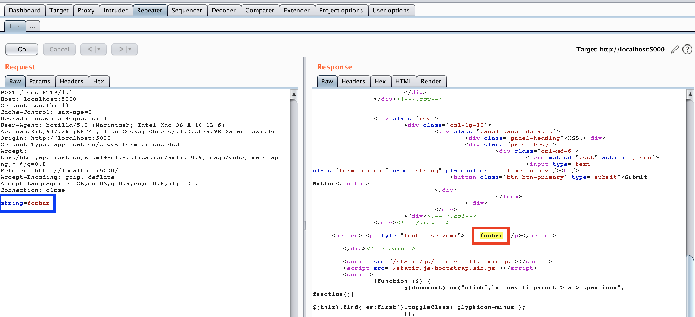
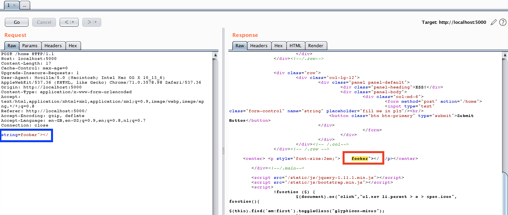
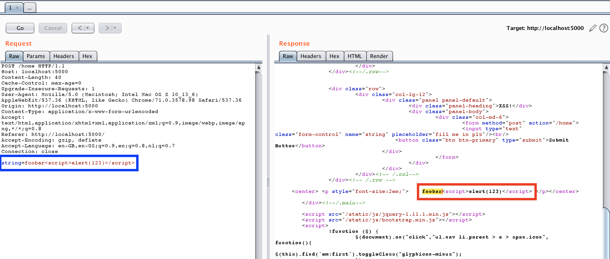
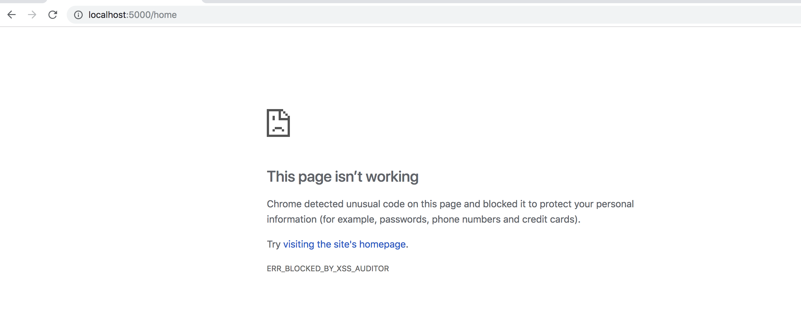
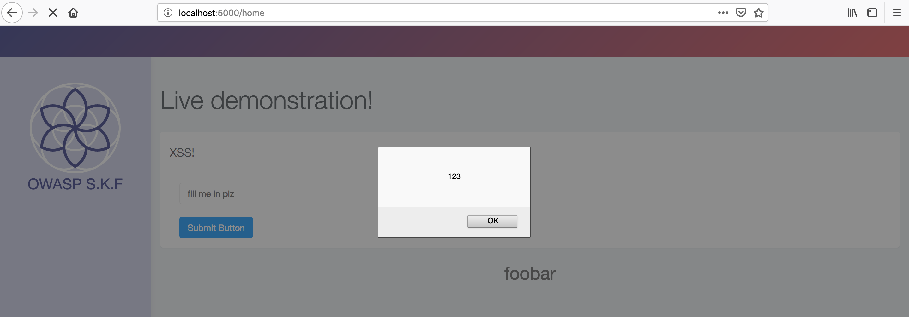
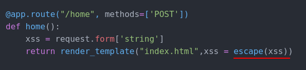

# KBID 3 - Cross Site Scripting

## Running the app Docker

```text
$ sudo docker pull blabla1337/owasp-skf-lab:xss
```

```text
$ sudo docker run -ti -p 127.0.0.1:5000:5000 blabla1337/owasp-skf-lab:xss
```


 Now that the app is running let's go hacking!


## Running the app Python3

First, make sure python3 and pip are installed on your host machine.
After installation, we go to the folder of the lab we want to practise
"i.e /skf-labs/XSS/, /skf-labs/jwt-secret/ " and run the following commands:

```
$ pip3 install -r requirements.txt
```

```
$ python3 <labname>
```


 Now that the app is running let's go hacking!



## Reconnaissance

#### Step 1

The application shows an input field box were we can try our injections. Lets first inject a normal test string and see how our input is used in the application.



As you can see below the request in our intercepting proxy that was made by the application.



In the source of the application we can see that this application will take the user input and use a template variable to display it in the application.

```python
@app.route("/home", methods=['POST'])
def home():
    xss = request.form['string']
    return render_template("index.html",xss = xss)
```

```markup
<center> <p style="font-size:2em;">{{xss}}</p></center>
```

The variable is then used in the index.html to display the content suplied by the user. But as you can see the autoescape method is set to false. This indicates that is should be possible to perform a Cross Site Scripting \(XSS\) injection.

## Exploitation

#### Step 1

Now we have seen where the user input is being reflected in the application we will have to look what dangerous HTML characters are not properly escaped so we can build our XSS payload. So for our first check we use the following string as an input:

```text
foobar"></
```



As you can see the application did not encode or blacklisted any of the dangerous HTML characters. Now lets try the XSS payload to see if this also is reflected back withouth any escaping or blacklist filtering.

```text
foobar"><script>alert(123)</script>
```



Again the application is not encoding or blacklisted any of the dangerous HTML characters. This payload seems to work in the intercepting proxy. Now lets try it in our Chrome browser.



As you can see in Chrome it didn't work because of the XSS Auditor setting that is enforced. This is an special browser header that can be set do add an additinal layer of security to the application. Let's use Firefox to see if we are able to trigger the XSS with our payload there.



In Firefox we can see the XSS alert pop-up and we have successfully performed the XSS attack.


## Mitigation
XSS Prevention Rules:
The following rules are intended to prevent all XSS in your application. While these rules do not allow absolute freedom in putting untrusted data into an HTML document, they should cover the vast majority of common use cases.
RULE #0 - Never Insert Untrusted Data Except in Allowed Locations

RULE #1 - HTML Encode Before Inserting Untrusted Data into HTML Element Content

RULE #2 - Attribute Encode Before Inserting Untrusted Data into HTML Common Attributes

RULE #3 - JavaScript Encode Before Inserting Untrusted Data into JavaScript Data Values

RULE #4 - CSS Encode And Strictly Validate Before Inserting Untrusted Data into HTML Style Property Values

RULE #5 - URL Encode Before Inserting Untrusted Data into HTML URL Parameter Values

RULE #6 - Sanitize HTML Markup with a Library Designed for the Job

RULE #7 - Avoid JavaScript URLs

RULE #8 - Prevent DOM-based XSS

In this case, the input is directly rendered into the application without without following above rules so that the attacker can inject a malicious script.\
This input can be handled by jinja2 where they provide escape() function which escaping HTML and javascript entities.

Example :\
```
from jinja2 import escape

data="<script>alert('Hello')</script>"
print(escape(data))
```
Output:
```
&lt;script&gt;alert(&#34;Hello&#34;)&lt;/script&gt;
```
Here the vulnerable code is:


XSS prevented using escape() function:


Additional Rules:

Bonus Rule #1: Use HTTPOnly cookie flag

Bonus Rule #2: Implement Content Security Policy

Bonus Rule #3: Use an Auto-Escaping Template System

Bonus Rule #4: Properly use modern JS frameworks

## Additional sources

Please refer to the OWASP testing guide for a full complete description about path traversal with all the edge cases over different platforms!


