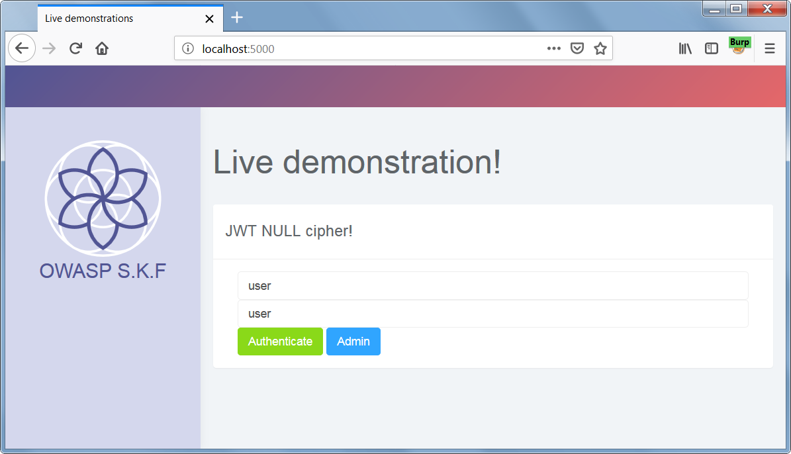
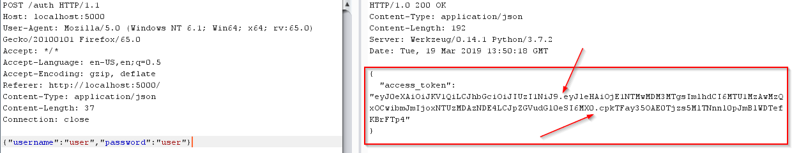
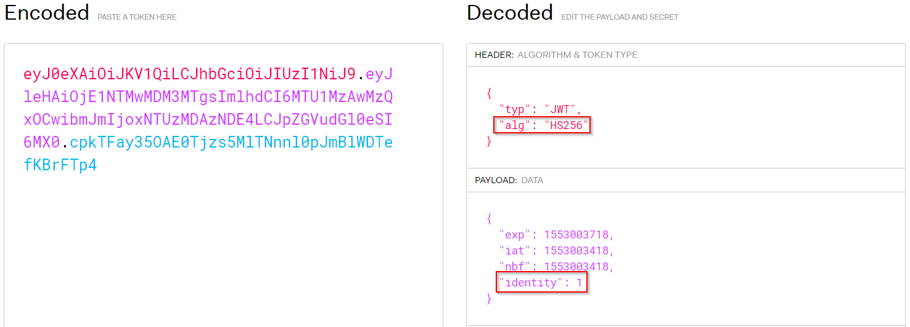
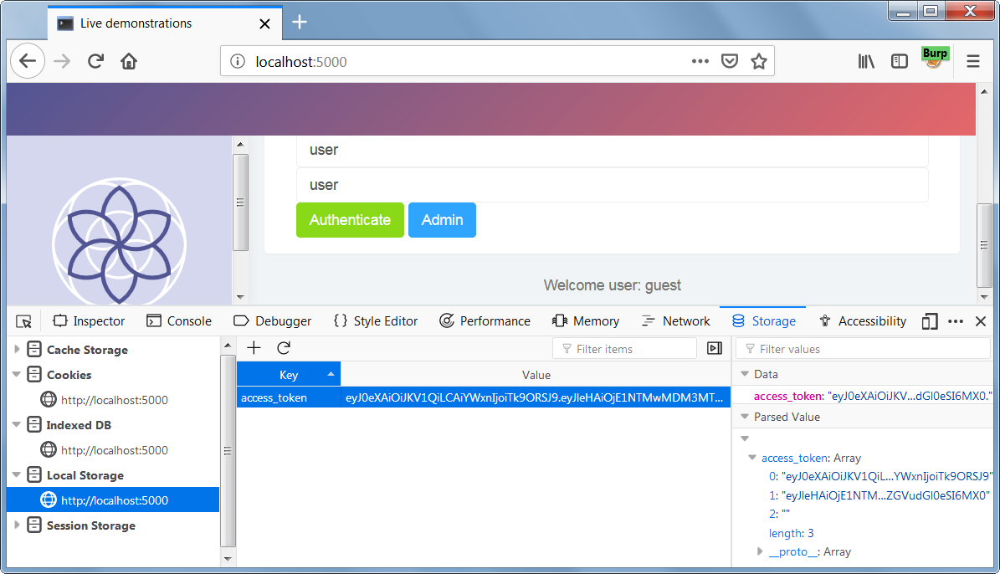
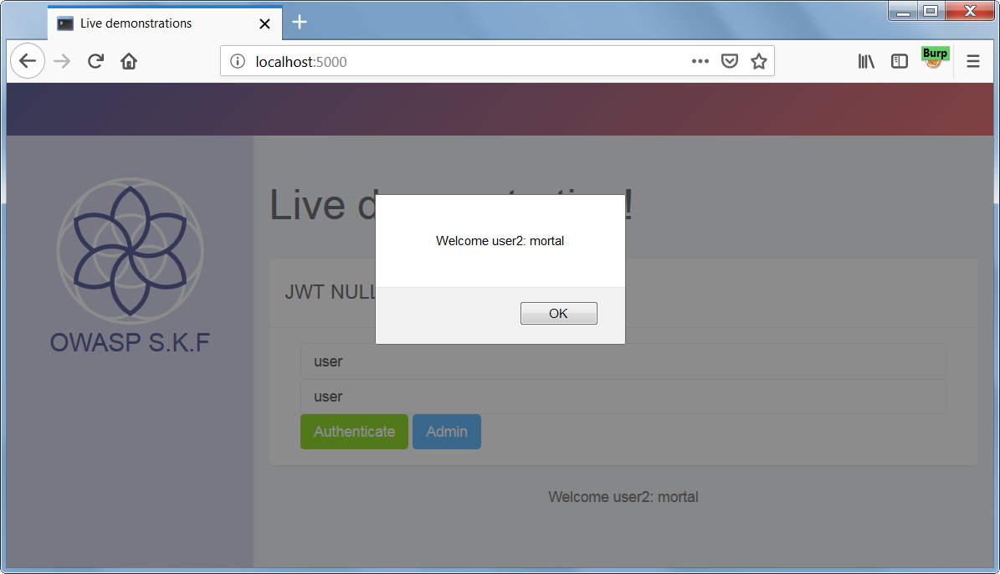

# KBID 7006 - JWT Null

## Running the app

```text
$ sudo docker pull blabla1337/owasp-skf-lab:jwt-null
```

```text
$ sudo docker run -ti -p localhost:5000:5000 blabla1337/owasp-skf-lab:jwt-null
```


 Now that the app is running let's go hacking!



## Reconnaissance

### Step1

The application shows a dropdown menu from which we can choose an intro or chapters to be displayed on the client-side.



First thing we need to do know is to do more investigation on the requests that are being made. We do this by setting up our intercepting proxy so we can gain more understanding of the application under test.

After we set up our favourite intercepting proxy we are going to look at the traffic between the server and the front-end. Enter the credentials: _username: user_ \| _password:user_

The first thing to notice is after sucessful logon, the response contains an access token.



The image above shows the access-token contains three base64 encoded splitted with two dots \(.\) separators, which indicates it's a JSON Web Token \(JWT\):

#### Header

```javascript
{
 "alg": "HS256",
 "typ": "JWT"
}
```

#### Claims

```javascript
{
 "exp": 1553003718,
 "iat": 1553003418,
 "nbf": 1553003418,
 "identity": 1
}
```

#### Signature

Last encrypted part, containing the digital signature for the token..

## Exploitation

### Step 1

A potential attacker can now decode the token in [http://jwt.io](http://jwt.io) website to check its content.



As shown in the above picture, there are 2 points which can be tampered.

* alg header: contains the information of which algorithm is being used for digital signature of the token.
* indentity: this information is used by the application to identify which user ID is currently authenticated.

How about checking if the server is blindly accepting the digital signature algorithm as stored by token. Of course, changing the signature would also change the token signature, but, what if the server accepts NONE algorithm?

The NONE algorithm means signature is not required, so the token can be tampered and will be accepted by the server.

<<<<<<< HEAD:kbid-7006-JWT-null.md
<<<<<<< HEAD
#### Step 2
=======
##### Header tampering
>>>>>>> 50812bf54557ee2169537c4ac691dd846659819a
=======
### Step 2
>>>>>>> d903d8e90da5d4d97cdc04a2e5440d4f6b520c1e:kbid-7006-jwt-null.md

#### Header tampering

> 50812bf54557ee2169537c4ac691dd846659819a

```text
{
  "typ": "NONE",
  "alg": "HS256"
}
#base64 eyJ0eXAiOiJKV1QiLCAiYWxnIjoiTk9ORSJ9
```

Now, let's play with the identity:

```text
{
  "exp": 1553003718,
  "iat": 1553003418,
  "nbf": 1553003418,
  "identity": 2
}
```

As the signature is not required, the new tampered JWT token will look like this:

> eyJ0eXAiOiJKV1QiLCAiYWxnIjoiTk9ORSJ9.eyJleHAiOjE1NTMwMDM3MTgsImlhdCI6MTU1MzAwMzQxOCwibmJmIjoxNTUzMDAzNDE4LCJpZGVudGl0eSI6Mn0.

### Step 2

Open the local storage tab within the browser and replace the original token:



Now hit the _Admin_ button and check if the tampered token was accepted.



Yes! The server accepted the tampered access-token. Can we check if there are more users available which can be impersonated?

## Additional Resources

Please refer to the JWT.io information for more information regarding JWT.



Also consider OWASP JWT Cheat Sheet as reference.



