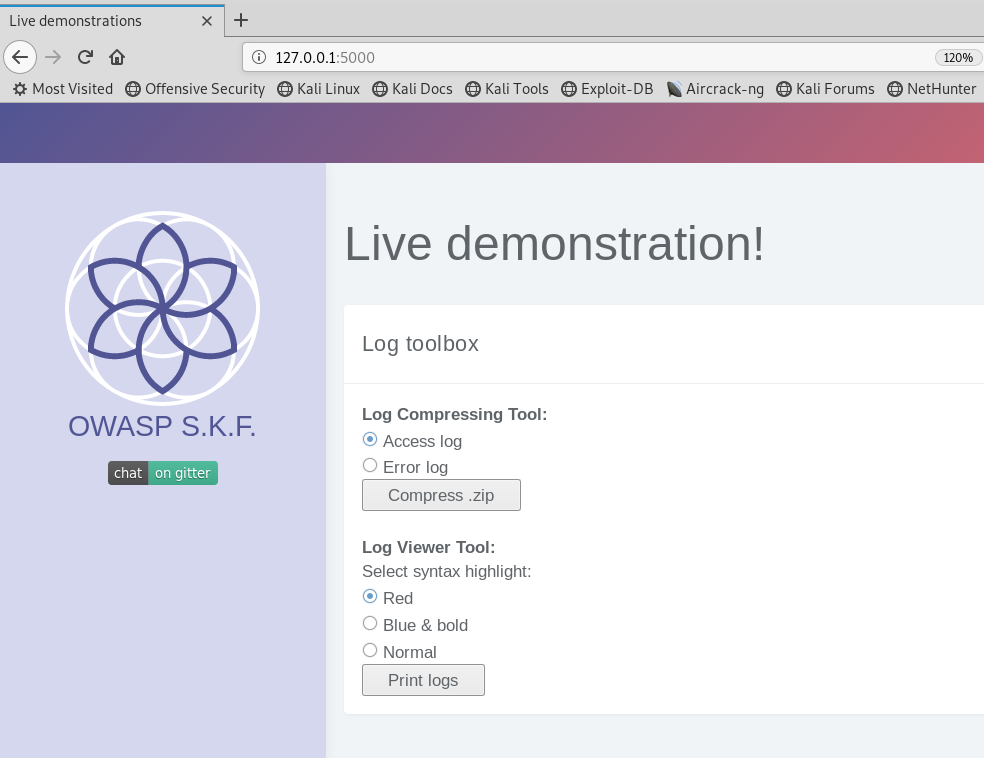
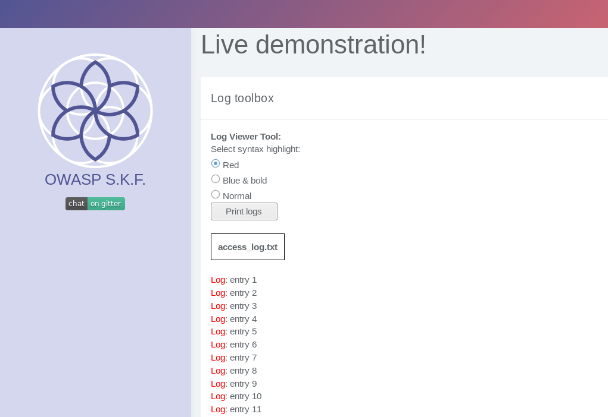
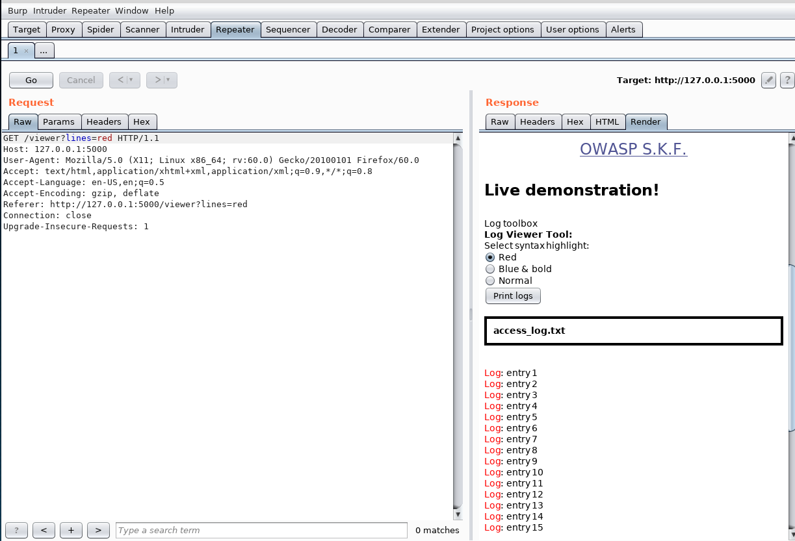
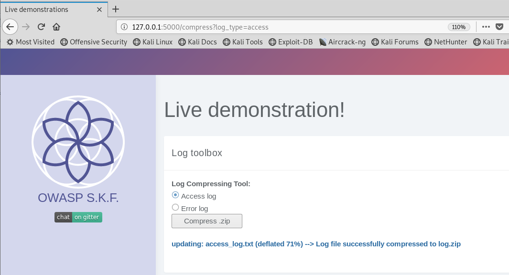
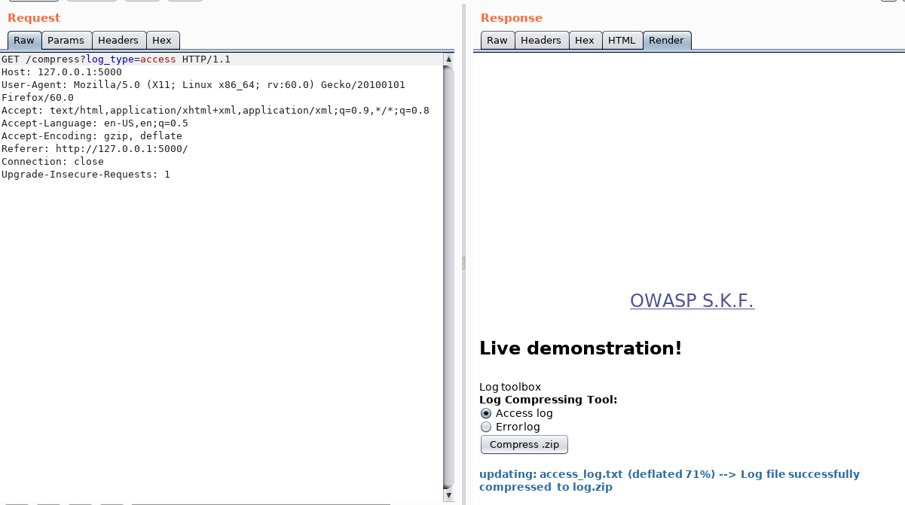
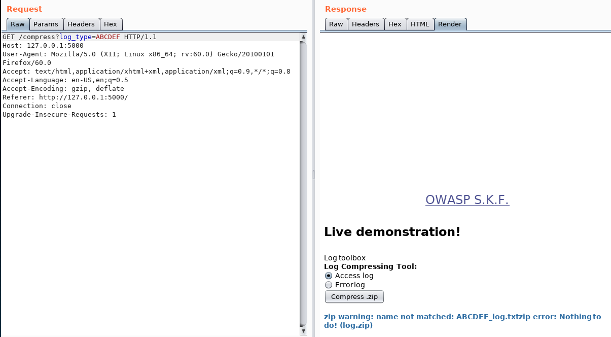
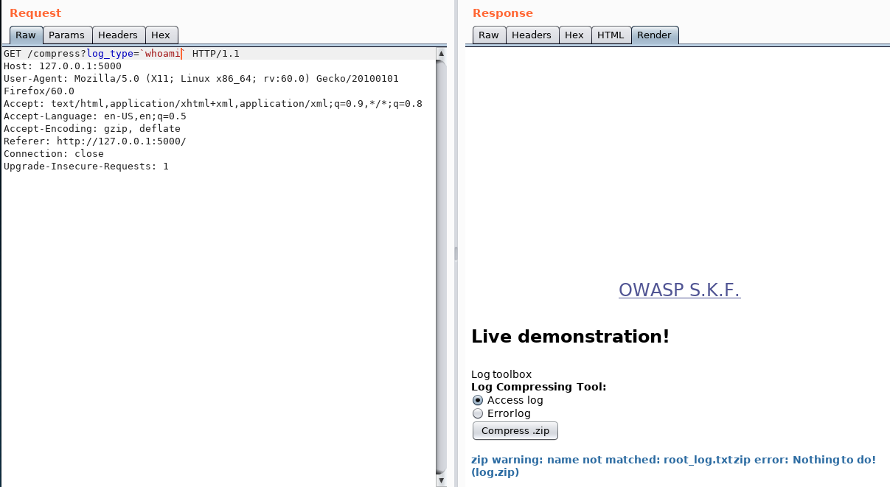

# KBID XXX - Command Injection 2 (CMD2)

## Running the app

```text
$ sudo docker pull blabla1337/owasp-skf-lab:cmd2
```

```text
$ sudo docker run -ti -p 127.0.0.1:5000:5000 blabla1337/owasp-skf-lab:cmd2
```


Now that the app is running let's go hacking!



## Reconnaissance
The command injecion is an attack in which the goal is the execution of 
arbitrary commands on the host operating system via a vulnerable 
application. Command injection attacks are possible when an application 
passes unsafe user supplied data (forms, cookies, HTTP headers etc.) to 
a system shell. In the first step, the attacker needs to inspect the 
functioning of the web app in order to find possible injection points. 
When we start the application we can see that there are two forms: the first one to select the logs and second one to select the color
in the logs. 



We are going to perform a basic exploration of the website trying the different options available.

We start by trying the Log Viewer Tool:



If we select the red color, the word log for the logs, will be red.
We can inspect the request with an intercepting proxy \(we are using 
Burp\):



Then, if we try the other functionality we get something like that:



This request would seem like that:



It compresses the file and outputs the information message.


## Exploitation
We guess that the output is related to what we write in log_type (access), so we change the input to ABCDEF:



Now, we discover that it outputs what we write in log_type as parte of the name of the file. So let's see if that is also being executed in the system by entering a os command:



Finally, we have sent a new HTTP request trying to send the output of the command 
whoami to the message in the website and we got it. 
The output of the command whoami, showing us the priviledge 
of the target user in the target system and that the web app is actually 
vulnerable to OS command injection. 

## Additional sources
[https://www.owasp.org/index.php/Command\_Injection](https://www.owasp.org/index.php/Command_Injection)
