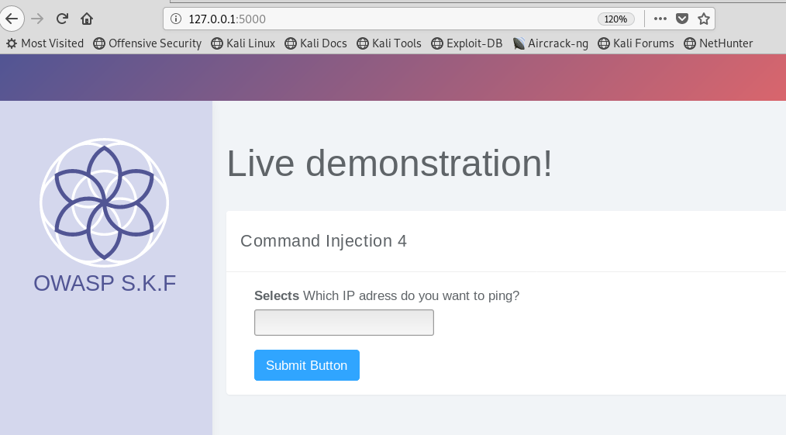
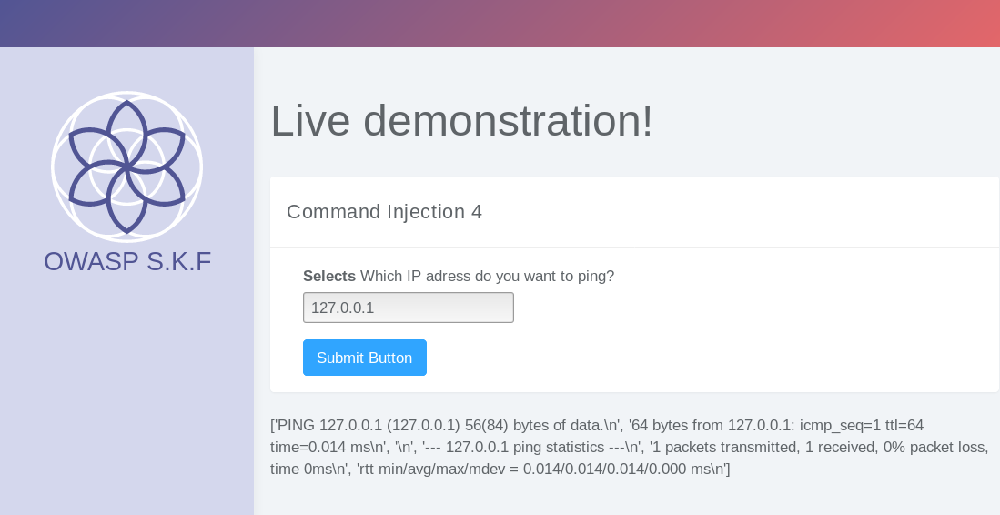
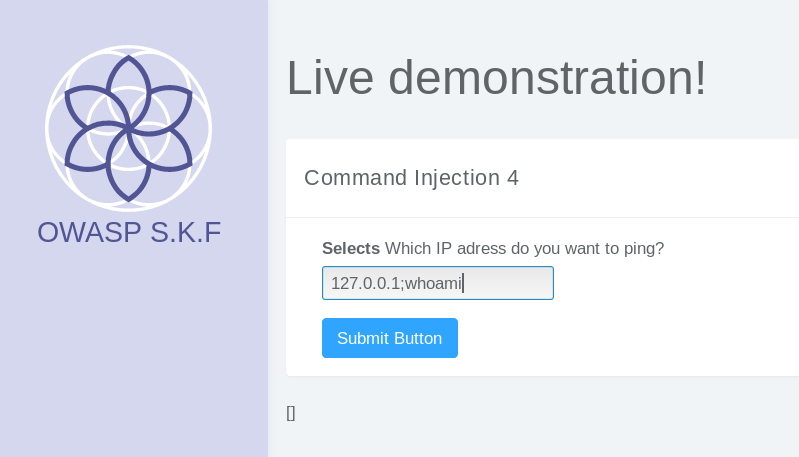
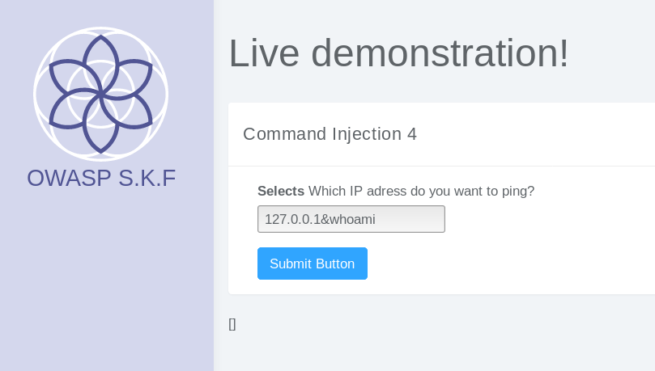
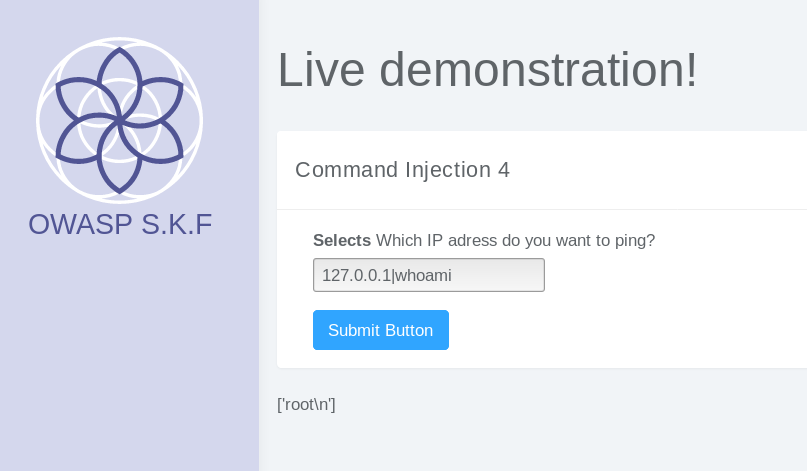
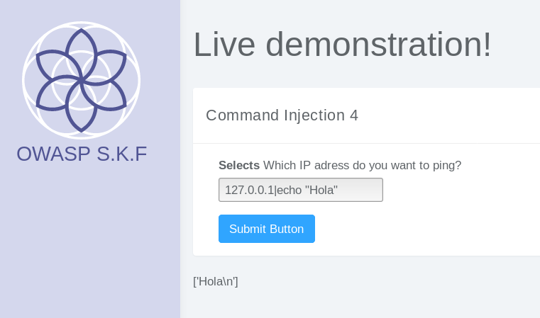

# KBID XXX - Command Injection 4 (CMD)

## Running the app

```text
$ sudo docker pull blabla1337/owasp-skf-lab:cmd4
```

```text
$ sudo docker run -ti -p 127.0.0.1:5000:5000 blabla1337/owasp-skf-lab:cmd4
```


Now that the app is running let's go hacking!


## Running the app Python3

First, make sure python3 and pip are installed on your host machine.
After installation, we go to the folder of the lab we want to practise 
"i.e /skf-labs/XSS/, /skf-labs/jwt-secret/ " and run the following commands:

```
$ pip3 install -r requirements.txt
```

```
$ python3 <labname>
```


 Now that the app is running let's go hacking!



## Reconnaissance
The command injecion is an attack in which the goal is execution of 
arbitrary commands on the host operating system via a vulnerable 
application. Command injection attacks are possible when an application 
passes unsafe user supplied data (forms, cookies, HTTP headers etc.) to 
a system shell. In the first step, the attacker needs to inspect the 
functioning of the web app in order to find possible injection points.
 
When we start the application we can see that there is a box where we can write an IP address in order to execute a ping against it.



First, we are going to try the functionality and execute the ping against the loopback address. We can also see the resulted output:




## Exploitation
For this lab we are going to try to make the website show us the result of a malicious command executed by the system unintentionally.
We start by trying methods like:





It seems that it may not be possible to execute OS commands taking advantage of the ping functionality. However, we suspect that maybe the website is
filtering some of these special characters usually used for command execution so we try some new:



We finally could execute a command (whoami)!!

Now we try with another simple example:



Goal achieved and filter bypassed!

## Additional sources
[https://www.owasp.org/index.php/Command\_Injection](https://www.owasp.org/index.php/Command_Injection)
