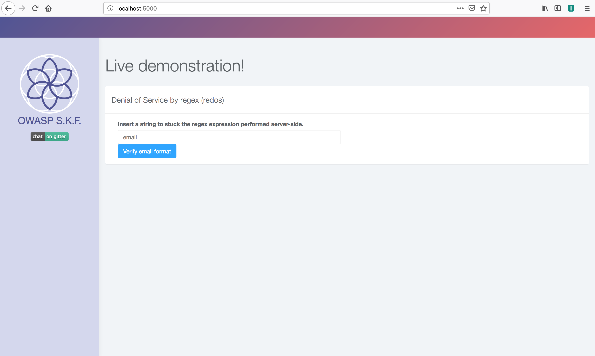
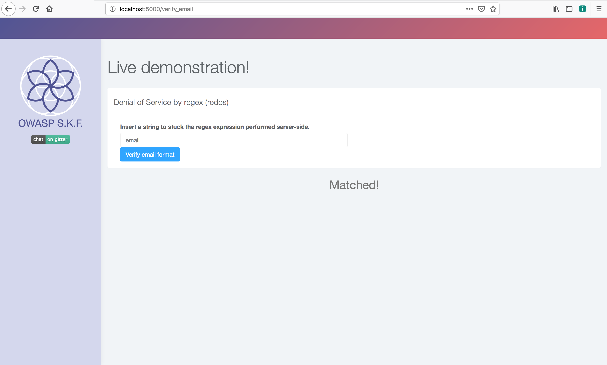
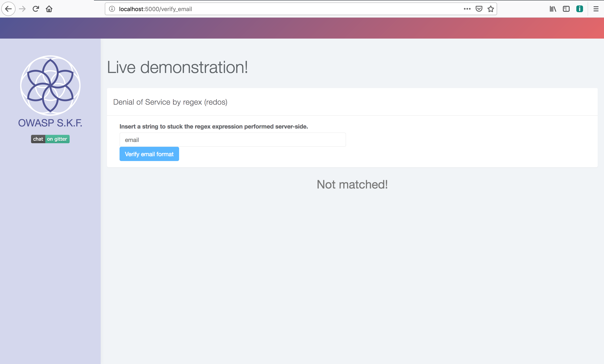
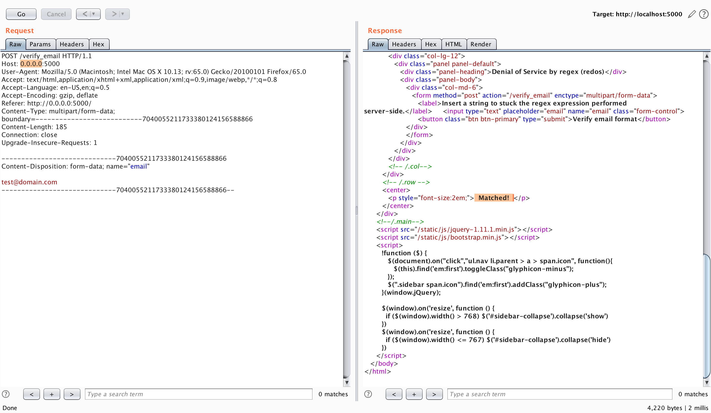
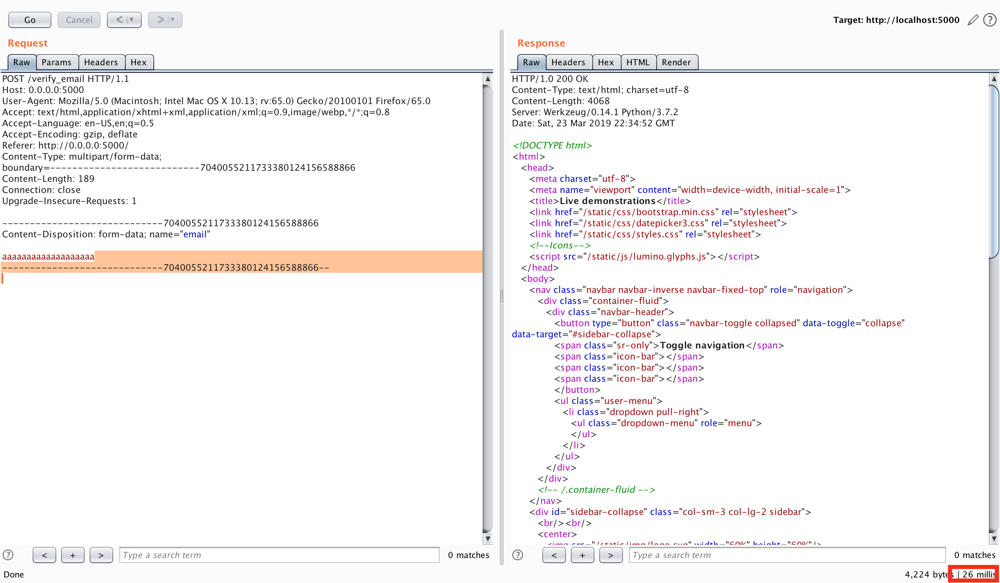
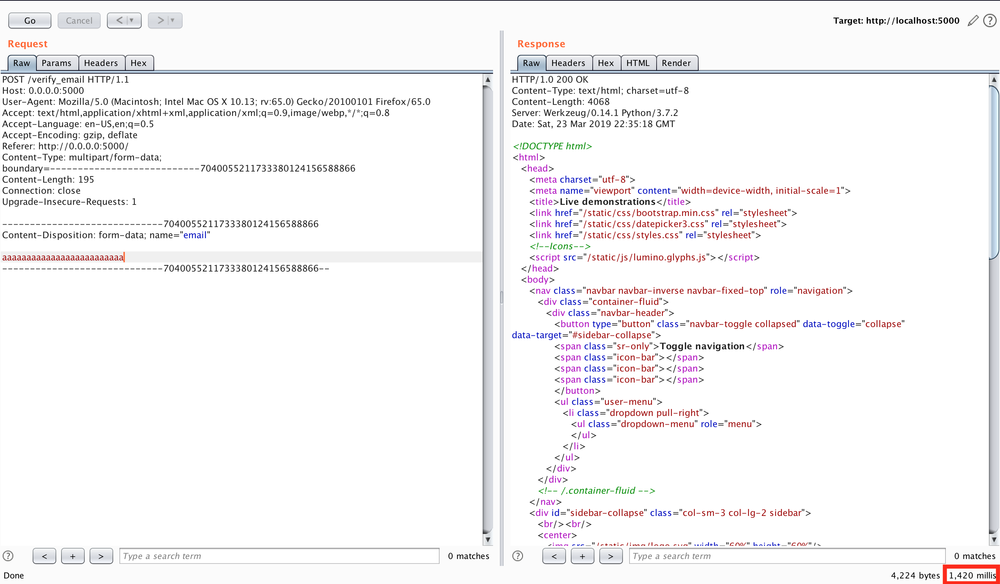

# KBID XXX - DoS using Regex

## Running the app

```
$ sudo docker pull blabla1337/owasp-skf-lab:dos-regex
```

```text
$ sudo docker run -ti -p 127.0.0.1:5000:5000 blabla1337/owasp-skf-lab:dos-regex
```


 Now that the app is running let's go hacking!



## Reconnaissance

#### Step1

This application is verfying wether the input from the user is a valid email or not, using regex.  



If we insert a valid email and verify it clicking on the button "Verify my email", the application will reply with "Matched".



If the email is not in the format user@domain.tld, the app will return "Not Matched"



The application uses regex to identify a valid email. The regex tries to find every possible combinations of a pattern in the text:

```python 
match = re.search(r"^([0-9a-zA-Z]([-.\w]*[0-9a-zA-Z])*@{1}([0-9a-zA-Z][-\w]*[0-9a-zA-Z]\.)+[a-zA-Z]{2,9})$", str(email))
```

A username can have one or more `-` (dash) or `.` (dot) in the username and/or letters and number. In the domain we could have one or more `-` (dash) and letters and/or numbers. 
 
In order to identify a possible DoS we can manipulate the input increasing the legth.

#### Step 2

Let's use Burp to see if we can trigger the app to "think" more than usual when our input increases the size. 

We first send a normal request and monitor the response time in ms




If we increase the leght of our payload we can see that the ms increases: from 2ms to 26ms: 





 Something is happening !!!


Let's increase the lenght of the payload even more. From 19 characters, we send 25. The response arrives in 1420ms. As we can see the TTR (Time To Respond) is increases exponentially.



## Exploitation

We want to exploit this problem to create a DoS (Denial of Service) and make the app unavailable. 

We send a long string like

`aaaaaaaaaaaaaaaaaaaaaaaaaaaaaaaaaaaaaaaaaaaaaaaaaaaaaaaaaaaaaaaaaaaaaa`

and wait till the app crashes or exhausts all the resources.

## Additional sources



