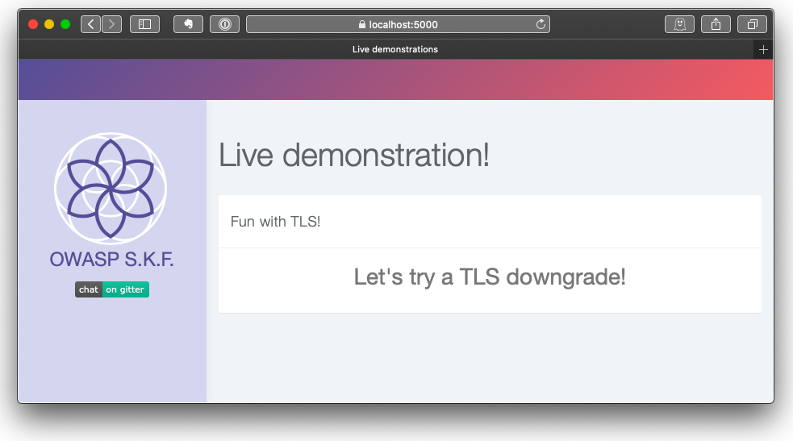

# KBID XXX - TLS Downgrade

## Running the app

```text
$ sudo docker pull blabla1337/owasp-skf-lab:tls-downgrade
```

```text
$ sudo docker run -ti -p 127.0.0.1:5000:5000 blabla1337/owasp-skf-lab:tls-downgrade
```


Now that the app is running let's go hacking!


## Running the app with Python2

First, make sure python (2, not 3) and pip are installed on your host machine. After installation, we go to the folder of the lab we want to practice, i.e "/skf-labs/XSS/", "/skf-labs/jwt-secret/ " and run the following commands:

```
$ pip install -r requirements.txt
```

```
$ python ./TLS-downgrade.py
```


 Now that the app is running let's go hacking!



## Reconnaissance

When visiting [https://localhost:5000](https://localhost:5000) we will be greeted by the following web app. It has no functionality to play with, it's just a friendly page of text. 



Our browser warned us about a bad, self-signed certificate. In a real situation that would be a bad thing to encounter, but in our test lab it's to be expected. But least we have a safe HTTPS connection, right?

Let's take a look under the hood!

The OpenSSL suite has a command line component: openssl. This command allows you to perform many TLS/SSL activities such as inspecting and converting certificates. But it also lets you test a TLS/SSL connection!

At first glance, things look okay! TLSv1.2 with ECDSA-RSA is a reasonable standard by any means! 

```text
$ openssl s_client -connect 10.0.0.50:5000 </dev/null
[...]

subject=C = NL, ST = SKF, L = Amsterdam, O = OWASP, CN = localhost
issuer=C = NL, ST = SKF, L = Amsterdam, O = OWASP, CN = localhost

[...]

SSL handshake has read 1158 bytes and written 409 bytes
Verification error: self signed certificate
---
New, TLSv1.2, Cipher is ECDHE-RSA-AES256-GCM-SHA384
Server public key is 1024 bit
Secure Renegotiation IS supported
Compression: NONE
Expansion: NONE
No ALPN negotiated
SSL-Session:
    Protocol  : TLSv1.2
    Cipher    : ECDHE-RSA-AES256-GCM-SHA384

[...]
```

A few things stand out:

* As we already knew, this server uses a self-signed certificate.
* The server uses the current TLS standard v1.2 with a strong set of algorightms.
* The server tells us that "Secure Renegotiation IS supported".

That final bit, tells us that the server is willing to discuss with us any alternate standards and algorithms. Let's see if we can downgrade our TLS connection and how deep the rabbit hole goes.

```text
$ openssl s_client -connect 10.0.0.50:5000 -tls1_1 </dev/null
[...]

    Protocol  : TLSv1.1
    Cipher    : ECDHE-RSA-AES256-SHA
```

Alright, so we can drop down to TLSv1.1. Any further?

```text
$ openssl s_client -connect 10.0.0.50:5000 -tls1 </dev/null
[...]

    Protocol  : TLSv1
    Cipher    : ECDHE-RSA-AES256-SHA
```

Okay! We've gotten the server down to TLSv1.0, which by all means is deprecated. [Many browser vendors will flat out refuse to deal with TLSv1.0 and v1.1.](https://hacks.mozilla.org/2019/05/tls-1-0-and-1-1-removal-update/)

Is there anything below TLSv1.0? Why sure there is! Back in the day we had SSLv2 and SSLv3 which are now famous for being [susceptible to vulnerabilities such as the POODLE attack](https://www.acunetix.com/blog/articles/tls-vulnerabilities-attacks-final-part/). Using specialized tools and a little patience, POODLE will allow a malicious party to intercept and decrypt your traffic! This is why [browser vendors axed these standards](https://blog.mozilla.org/security/2014/10/14/the-poodle-attack-and-the-end-of-ssl-3-0/).

Current versions of the openssl command no longer have SSLv2 and v3 compatibility built in, unless you compile it from source. Luckily there are other testing tools at our disposal! Anyone with a Linux system can use on of the following:

* [SSLyze (github)](https://github.com/nabla-c0d3/sslyze)
* [TestSSL.sh (github)](http://github.com/drwetter/testssl.sh)


## Exploitation

First, let's take a look with SSLyze.

```text
$ sslyze 10.0.0.50:5000

 SCAN RESULTS FOR 10.0.0.50:5000 - 10.0.0.50
 -------------------------------------------

 * OpenSSL Heartbleed:
                                          OK - Not vulnerable to Heartbleed

 * SSL 3.0 Cipher suites:
     Attempted to connect using 80 cipher suites.

     The server accepted the following 7 cipher suites:
        TLS_RSA_WITH_CAMELLIA_256_CBC_SHA                 256                      
        TLS_RSA_WITH_AES_256_CBC_SHA                      256                      
        TLS_RSA_WITH_AES_128_CBC_SHA                      128                      
        TLS_RSA_WITH_3DES_EDE_CBC_SHA                     168                      
        TLS_ECDHE_RSA_WITH_AES_256_CBC_SHA                256       ECDH: prime256v1 (256 bits)
        TLS_ECDHE_RSA_WITH_AES_128_CBC_SHA                128       ECDH: prime256v1 (256 bits)
        TLS_ECDHE_RSA_WITH_3DES_EDE_CBC_SHA               168       ECDH: prime256v1 (256 bits)

     The group of cipher suites supported by the server has the following properties:
       Forward Secrecy                    OK - Supported
       Legacy RC4 Algorithm               OK - Not Supported

     The server has no preferred cipher suite.

 * SSL 2.0 Cipher suites:
     Attempted to connect using 7 cipher suites; the server rejected all cipher suites.

[...]

 * Session Renegotiation:
       Client-initiated Renegotiation:    VULNERABLE - Server honors client-initiated renegotiations
       Secure Renegotiation:              OK - Supported

[...]

 * OpenSSL CCS Injection:
                                          OK - Not vulnerable to OpenSSL CCS injection

 * Downgrade Attacks:
       TLS_FALLBACK_SCSV:                 OK - Supported

 * Deflate Compression:
                                          OK - Compression disabled
```

SSLyze tells us that, while SSLv2 is not offered, SSLv3 is in fact available. Unfortunately it tells us that legacy RC4 algorithms are not supported, meaning that we'd need more effort in cracking the encyrption. Aside from that the system is looking pretty good: it's not susceptible to a number of known attacks. 

Let's see if TestSSL.sh tells us anything else. 

```text
tess@kalivm:~/Tools/testssl.sh$ ./testssl.sh 10.0.0.50:5000

[...]

 LOW: 64 Bit + DES, RC[2,4], MD5 (w/o export)      offered (NOT ok)
 Triple DES Ciphers / IDEA                         offered
 Obsoleted CBC ciphers (AES, ARIA etc.)            offered

[...]

 Testing vulnerabilities 

 Heartbleed (CVE-2014-0160)                not vulnerable (OK), timed out
 CCS (CVE-2014-0224)                       not vulnerable (OK)
 Ticketbleed (CVE-2016-9244), experiment.  not vulnerable (OK)
 ROBOT                                     not vulnerable (OK)
 Secure Renegotiation (RFC 5746)           supported (OK)
 Secure Client-Initiated Renegotiation     VULNERABLE (NOT ok), DoS threat
 CRIME, TLS (CVE-2012-4929)                not vulnerable (OK)
 BREACH (CVE-2013-3587)                    no gzip/deflate/compress/br HTTP compression (OK)  - only supplied "/" tested
 POODLE, SSL (CVE-2014-3566)               VULNERABLE (NOT ok), uses SSLv3+CBC (check TLS_FALLBACK_SCSV mitigation below)
 TLS_FALLBACK_SCSV (RFC 7507)              Downgrade attack prevention supported (OK)
 SWEET32 (CVE-2016-2183, CVE-2016-6329)    VULNERABLE, uses 64 bit block ciphers
 FREAK (CVE-2015-0204)                     not vulnerable (OK)
 DROWN (CVE-2016-0800, CVE-2016-0703)      not vulnerable on this host and port (OK)
 LOGJAM (CVE-2015-4000), experimental      not vulnerable (OK): no DH EXPORT ciphers, no DH key detected with <= TLS 1.2
 BEAST (CVE-2011-3389)                     VULNERABLE -- but also supports higher protocols  TLSv1.1 TLSv1.2 (likely mitigated)
 LUCKY13 (CVE-2013-0169), experimental     potentially VULNERABLE, uses cipher block chaining (CBC) ciphers with TLS. Check patches
 Winshock (CVE-2014-6321), experimental    not vulnerable (OK) - CAMELLIA or ECDHE_RSA GCM ciphers found
 RC4 (CVE-2013-2566, CVE-2015-2808)        VULNERABLE (NOT ok): ECDHE-RSA-RC4-SHA RC4-SHA RC4-MD5 

[...]
```

In the end, it looks like this web application was made a long time ago and was meant to serve end-users with old browsers. Think "Internet Explorer 6 old". Maybe it's from some corporate network; you never what you'll find in those! The site appears to be potentially vulnerable to the POODLE and [SWEET32 attacks](https://sweet32.info) and attempts on cracking RC4. 

Performing an actual attack would require that we set up a man-in-the-middle (MitM), to intercept and adjust the traffic. Unfortunately that is something outside the scope of this exercise. Most importantly: don't take it at face-value that a site offering HTTPS will always offer you the best and strongest configuration. A man-in-the-middle can in some cases force both client and server to downgrade their algorithms to something more easily cracked.


## Remediation

Let's delve into the code to see what's happening here.

The file TLS-downgrade.py forms the entry point for this web application. Like most of the SKF Labs applications, it runs Flask with Python. The TLS listener is configured as follows:

```python
ctx = ssl.SSLContext(ssl.PROTOCOL_SSLv23)                                                                               
ctx.options &= ~ssl.OP_NO_SSLv3                                                                                         
ciphers = 'ECDHE-RSA-AES256-GCM-SHA384:ECDHE-ECDSA-AES256-GCM-SHA384:ECDHE-RSA-AES256-SHA384:ECDHE-ECDSA-AES256-SHA384:ECDHE-RSA-AES256-SHA:ECDHE-ECDSA-AES256-SHA:SRP-DSS-AES-256-CBC-SHA:SRP-RSA-AES-256-CBC-SHA:SRP-AES-256-CBC-SHA:DH-DSS-AES256-GCM-SHA384:DHE-DSS-AES256-GCM-SHA384:DH-RSA-AES256-GCM-SHA384:DHE-RSA-AES256-GCM-SHA384:DHE-RSA-AES256-SHA256:DHE-DSS-AES256-SHA256:DH-RSA-AES256-SHA256:DH-DSS-AES256-SHA256:DHE-RSA-AES256-SHA:DHE-DSS-AES256-SHA:DH-RSA-AES256-SHA:DH-DSS-AES256-SHA:DHE-RSA-CAMELLIA256-SHA:DHE-DSS-CAMELLIA256-SHA:DH-RSA-CAMELLIA256-SHA:DH-DSS-CAMELLIA256-SHA:ECDH-RSA-AES256-GCM-SHA384:ECDH-ECDSA-AES256-GCM-SHA384:ECDH-RSA-AES256-SHA384:ECDH-ECDSA-AES256-SHA384:ECDH-RSA-AES256-SHA:ECDH-ECDSA-AES256-SHA:AES256-GCM-SHA384:AES256-SHA256:AES256-SHA:CAMELLIA256-SHA:PSK-AES256-CBC-SHA:ECDHE-RSA-AES128-GCM-SHA256:ECDHE-ECDSA-AES128-GCM-SHA256:ECDHE-RSA-AES128-SHA256:ECDHE-ECDSA-AES128-SHA256:ECDHE-RSA-AES128-SHA:ECDHE-ECDSA-AES128-SHA:SRP-DSS-AES-128-CBC-SHA:SRP-RSA-AES-128-CBC-SHA:SRP-AES-128-CBC-SHA:DH-DSS-AES128-GCM-SHA256:DHE-DSS-AES128-GCM-SHA256:DH-RSA-AES128-GCM-SHA256:DHE-RSA-AES128-GCM-SHA256:DHE-RSA-AES128-SHA256:DHE-DSS-AES128-SHA256:DH-RSA-AES128-SHA256:DH-DSS-AES128-SHA256:DHE-RSA-AES128-SHA:DHE-DSS-AES128-SHA:DH-RSA-AES128-SHA:DH-DSS-AES128-SHA:DHE-RSA-SEED-SHA:DHE-DSS-SEED-SHA:DH-RSA-SEED-SHA:DH-DSS-SEED-SHA:DHE-RSA-CAMELLIA128-SHA:DHE-DSS-CAMELLIA128-SHA:DH-RSA-CAMELLIA128-SHA:DH-DSS-CAMELLIA128-SHA:ECDH-RSA-AES128-GCM-SHA256:ECDH-ECDSA-AES128-GCM-SHA256:ECDH-RSA-AES128-SHA256:ECDH-ECDSA-AES128-SHA256:ECDH-RSA-AES128-SHA:ECDH-ECDSA-AES128-SHA:AES128-GCM-SHA256:AES128-SHA256:AES128-SHA:SEED-SHA:CAMELLIA128-SHA:IDEA-CBC-SHA:PSK-AES128-CBC-SHA:ECDHE-RSA-RC4-SHA:ECDHE-ECDSA-RC4-SHA:ECDH-RSA-RC4-SHA:ECDH-ECDSA-RC4-SHA:RC4-SHA:RC4-MD5:PSK-RC4-SHA:ECDHE-RSA-DES-CBC3-SHA:ECDHE-ECDSA-DES-CBC3-SHA:SRP-DSS-3DES-EDE-CBC-SHA:SRP-RSA-3DES-EDE-CBC-SHA:SRP-3DES-EDE-CBC-SHA:EDH-RSA-DES-CBC3-SHA:EDH-DSS-DES-CBC3-SHA:DH-RSA-DES-CBC3-SHA:DH-DSS-DES-CBC3-SHA:ECDH-RSA-DES-CBC3-SHA:ECDH-ECDSA-DES-CBC3-SHA:DES-CBC3-SHA:PSK-3DES-EDE-CBC-SHA'
ctx.set_ciphers(ciphers) 
```

It looks like someone has deliberately enable every cipher available to OpenSSL and has also re-enabled SSLv3. This doesn't have to be a malicious action, it could be down to inexperience or even a design decision based on the need to support legacy applications like IE6, IE8 or Java 6. 

However, we can't go on like this! We have to fix things. 

First of all, all the ciphers need to go! We will have to trust the OpenSSL defaults to be stronger than what's configured now. Python's documentation also tells us that: "Changed in version 2.7.16: The context is created with secure default values. ... The initial cipher suite list contains only HIGH ciphers, no NULL ciphers and no MD5 ciphers". That would suggest an upgrade might be needed. 

https://docs.python.org/2/library/ssl.html#ssl-contexts

Next up, we really should not allow SSLv3 anymore, so we'll take out the manual override. And finally, if we would like to also disable the deprecated TLSv1.0 and v1.1, we could tell Python's SSL Context to only accept v1.2. 

The new, resulting code would be:

```python
ctx = ssl.SSLContext(ssl.PROTOCOL_TLSv1_2)
```

Well now! That looks a lot simpler!

If you'd really like to bring this application into the 21st century, then upgrades are in order! Replacing Pything 2.7 with anything >= 3.7 would be great. Ditto for OpenSSL, which should really be replaced with anything over 1.1.0. Making changes like those, would require a rebuild of the Docker container though, since you'd be looking at upgrading to Alpine 3.15 for example. ;)


## Additional sources






