# Advanced x


####Building the machine with docker
```
docker build . -t advanced2
```
####Running the machine with docker
```
docker run  -h advanced2 -ti -p 80:80 -p 21:21 -p 7000-7010:7000-7010 advanced2
```

## Reconnaissance
An quick nmap scan shows that the ports of the FTP and HTTP services are open. The high ports are high likely there for passive FTP. Note: the docker image is started on a windows box. The ports that are exposed by the host and are not relevant for this lab are greyed out.
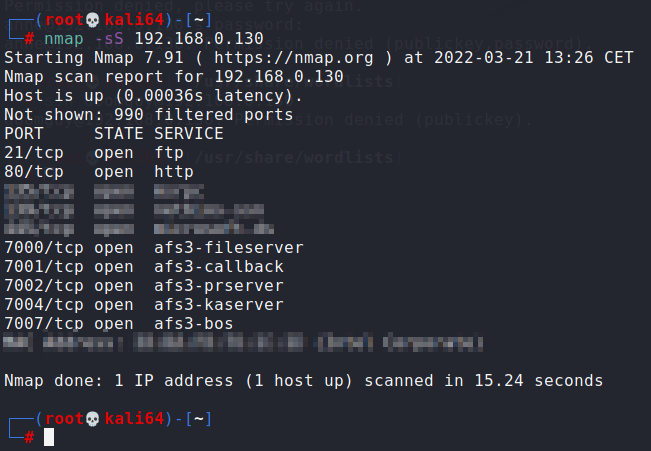

Let´s see if there are any vulnerabilities on the ftp server
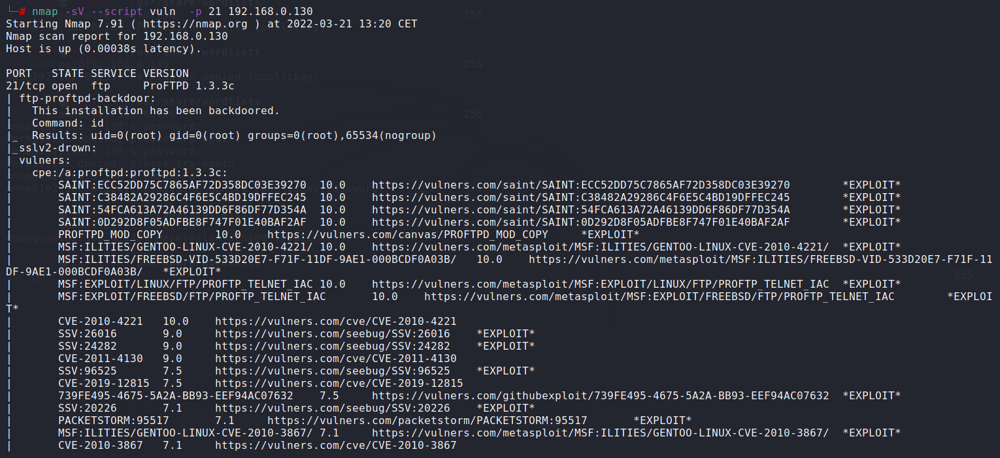

We will skip this vulnerability for now and discuss it in the privilege escalation section below.

Let´s first see what the webserver yields. Aparently it is a wordpress site.
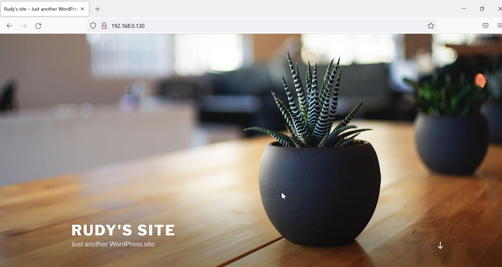

Doing further reconaissance shows that there is a wordpress site (identified both by gobuster and a nikto scan), but we already knew that. The nikto scan identied the login page. Also the appache server seem to have multiple vulnerabilities.
Gobuster:
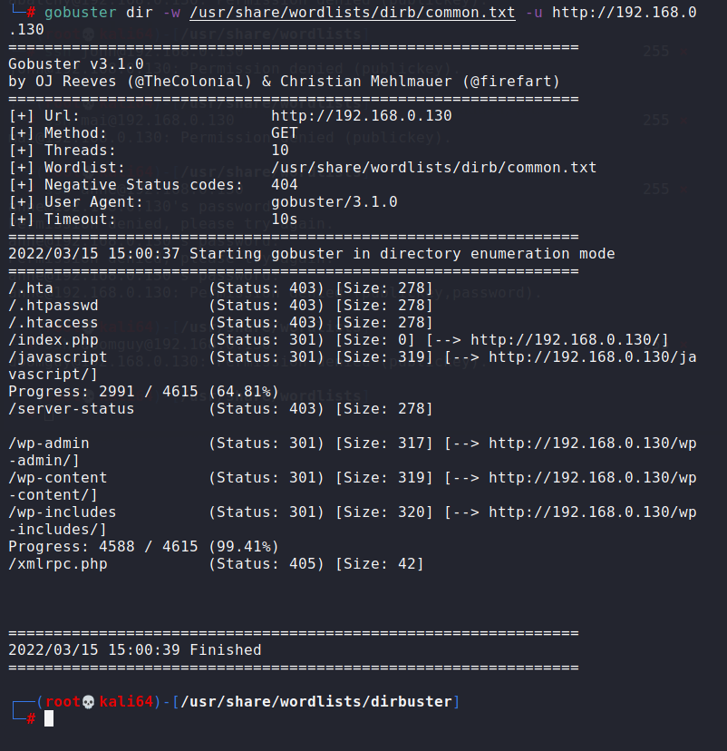
Nikto:
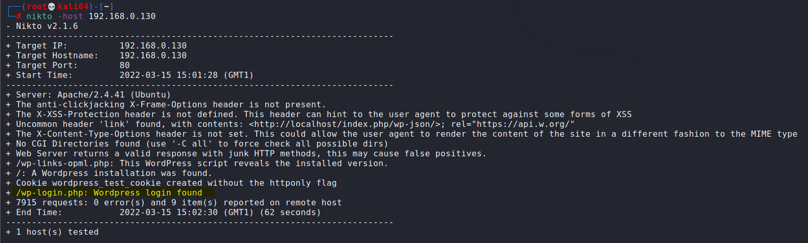
Apache:
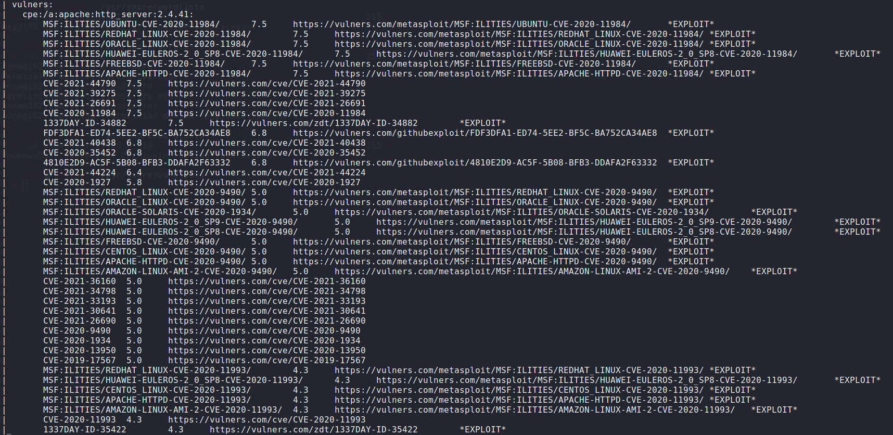

Let´s yet not dive into the various known vulnerabilites found above , but first look into the Wordpress installation.

We can reach the login page by going directly to the login page URL that was identified in the nikto scan (or click on the down arrow on the main page and then click on ´login´):
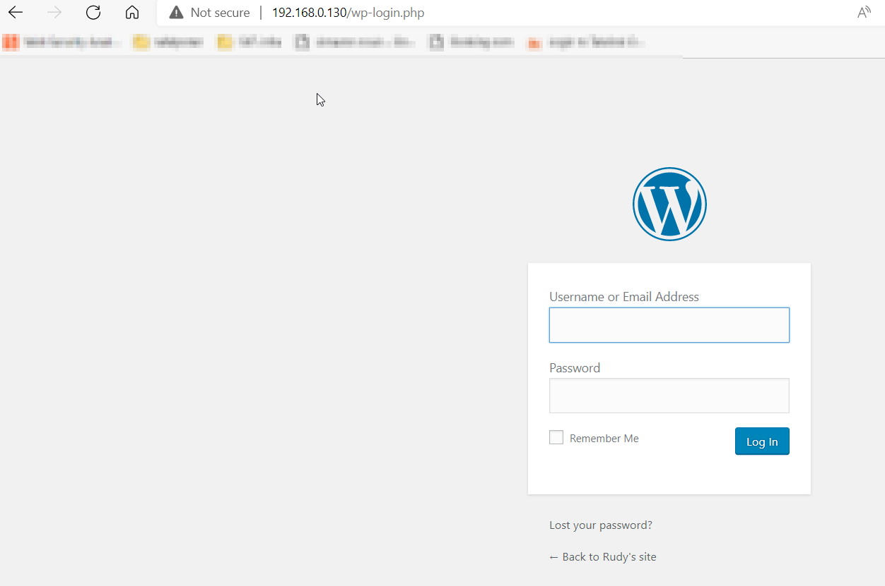


## Exploitation
The sysadmin has carelessly left the default credentials unchanged: admin/admin
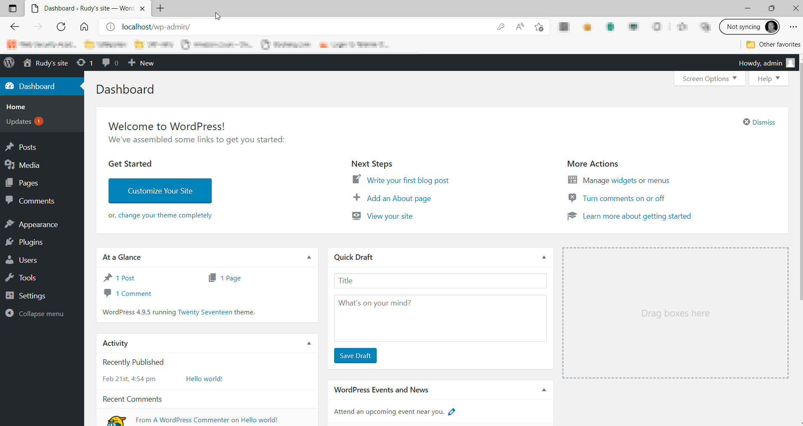

In the admin interface go to appearance / editor and edit the 404 page.
replace the content with a reverse PHP shell, for example https://github.com/pentestmonkey/php-reverse-shell/blob/master/php-reverse-shell.php
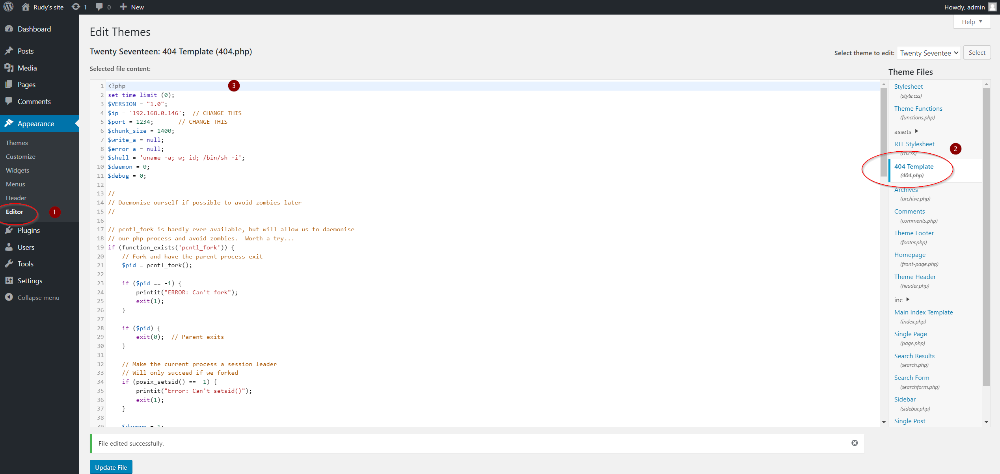

Once you have updated the page, browse to http://[IP of victim machine]/wp-content/themes/twentyseventeen/404.php
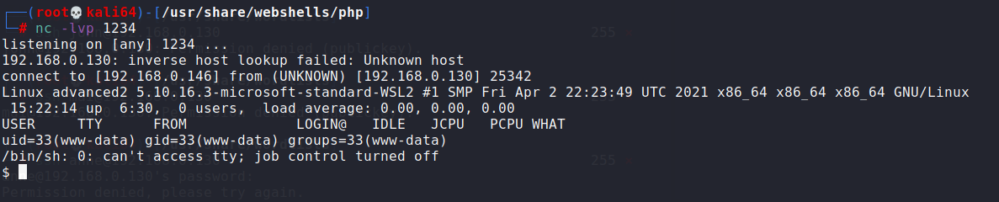

As you can see in the screenshot above, the current user is www-data.
So now we need to escalate our privileges. 
One thing we can look at is see which executables are running under root and can be modified or replaced by our own executable. As we can see in the screenshot below, proftpd is writable.


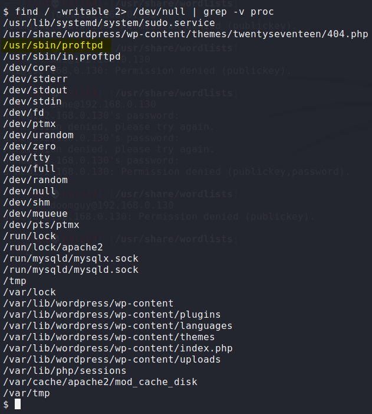

Let´s create a maliicous proftpd on our attacking machine that creates a reverse shell:
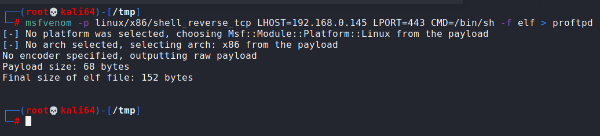

On our attacking machine we setup a wenserver in the /tmp directory where we´ve created the reverse shell.
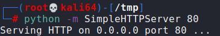

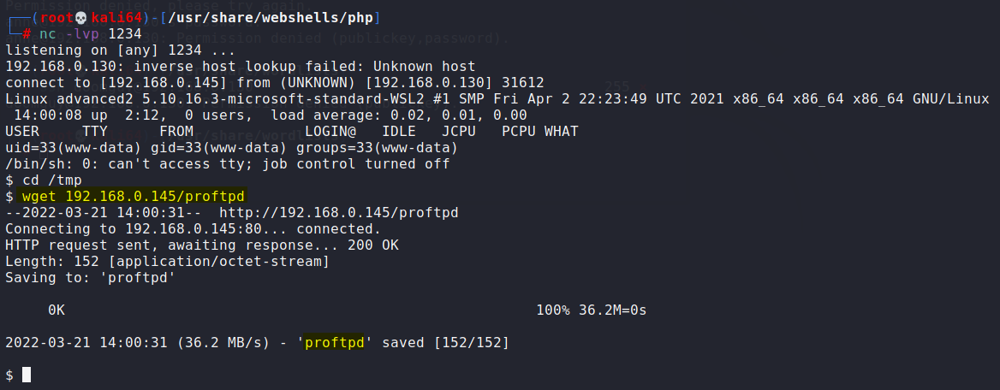

Next we prepare a listner for our reverse shell and overwrite the proftpd executable with the one we downloaded to the /tmp folder.
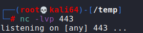

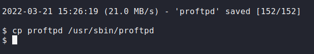

For availability reasons, the sysadmins restart the FTP server every night with a cron job. So your reverse shell should fire on its own. Here in the lab we´ve increased the frequency to restart the ftp service every 5 minutes so you don't have to wait that long for your reverse shell to kick in.

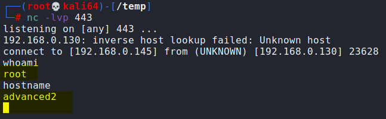

We´re now root on the system !

Do you remember that we also found that proftpd has a RCE vulnerability ?
Using metasploit , we can exploit this vulnerability and become root very easy.
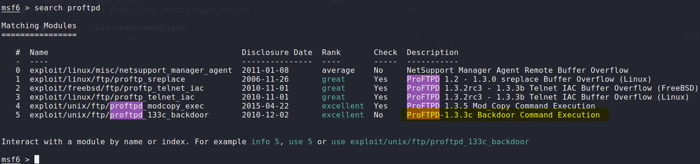

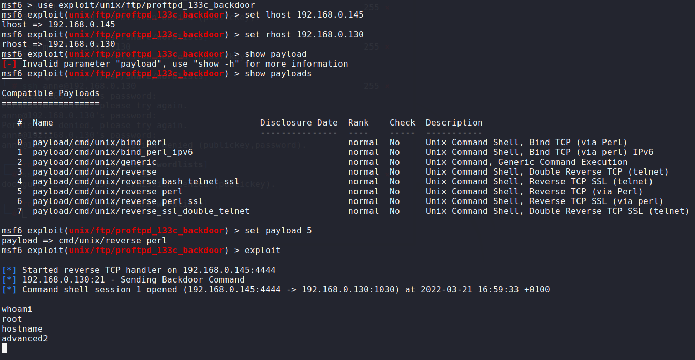

## Lessons learned
Always change the default password but not in an easy guessable one. If your password is part of common password lists like the metasploit pasword.lst file or the rockyou.txt file, chances are real that it may be brute forced.
With current computerpower, to counter act bruteforcing, make your password 10 characters or more, including a non-alfabetical/non-numeric characters.
Make sure that configuration can only be changed by users that should be allowed to change them. In this lab, the user was able to change the content of the 404.php file. Site administrators should be able to change website content but one might reconsider the ability to change configuration files for site administrators. 
System administrators must maintain their installations and keep their patch level current. Although systems may be up to date regarding their patch levels, misconfiured permissions like the ones on the 404.php and the proftpd executable are real world scenario´s that you're likely to encounter. 
Also on Windows machines, misconfigured NTFS permissions often lead to privilege escalation possibilities. 
