# Advanced 3


####Building the machine with docker
```
docker build . -t advanced3
```
####Running the machine with docker
```
docker run  -h advanced3 -ti -p 80:80 -p 22:22 advanced3
```

## Reconnaissance
An nmap scan shows that ssh and http is open. Note: this is a docker instance that also shows the local windows ports. These are blurred in the screenshot as they are not relevant.
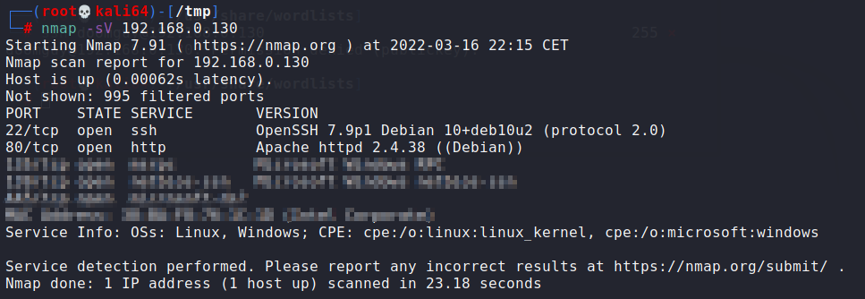

let's first check out the webpage:
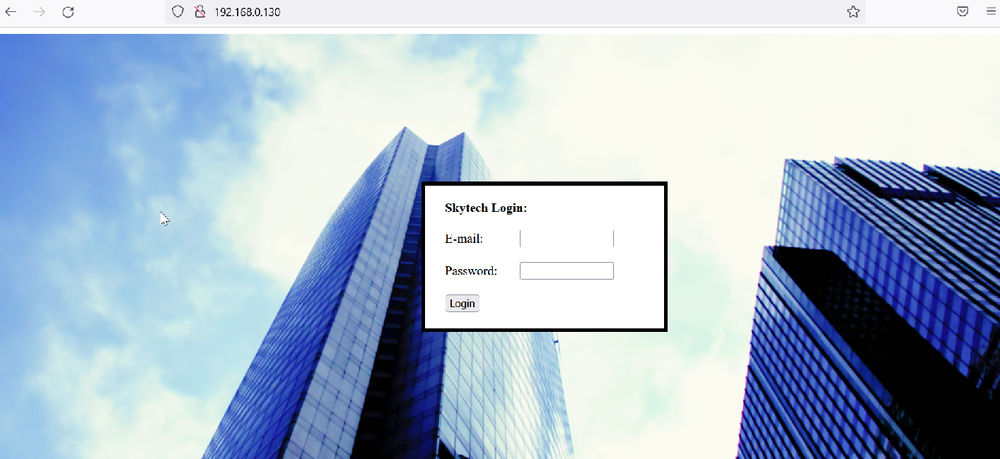

We have a login page that we can fuzz with. 

## Exploitation
The first thing we try is SQL injection (ofcourse)... 
let's see what happens if we terminate the username and put the rest of the query in comment:
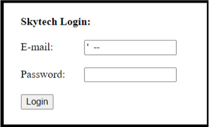

We get an error
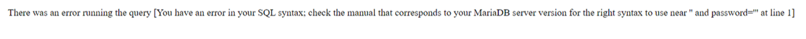

That's a good thing !
So our query syntax is not correct. A few attemts show that commenting out with # instead of -- produce a correct syntax.

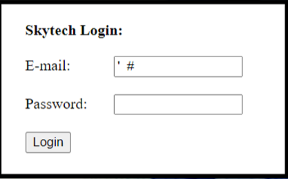


Lets try the basic sql injection
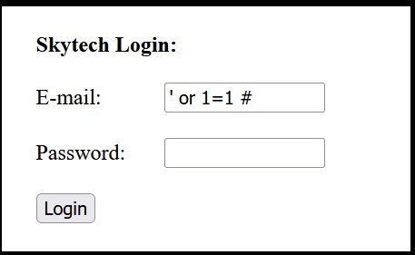

The 'OR' seems to be filtered out
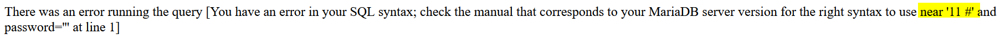

Let's see if this is really the case:
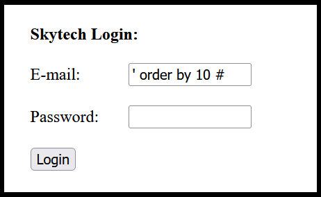

yes, the letter 'or' are filtered out:
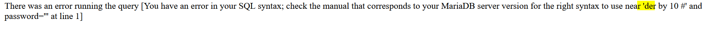

Let's try to create an or with ||
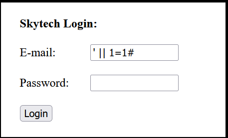

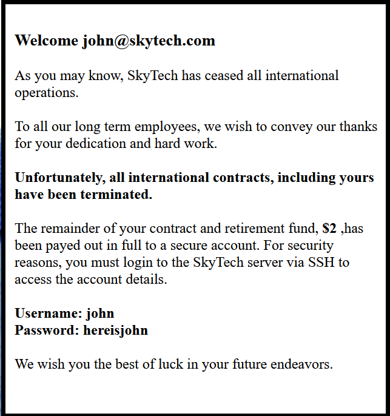

Now we can try to login via SSH with the user john


The SSH session appears to terminate as soon as it connects, this could be due to a command specified in the .bashrc file. Let's remove this file by giving an ssh command line parameter:
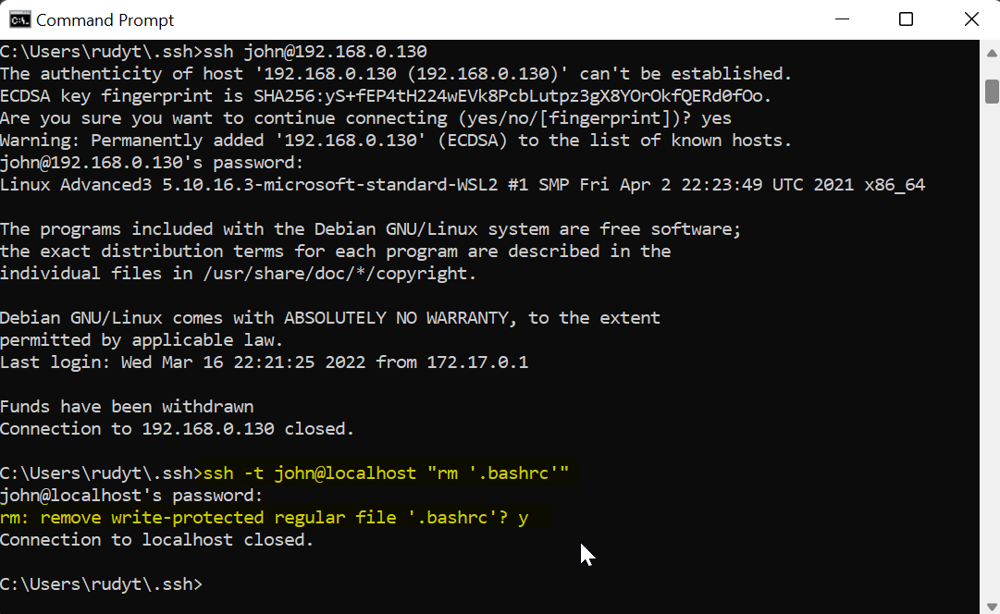

Now we can try to login again:
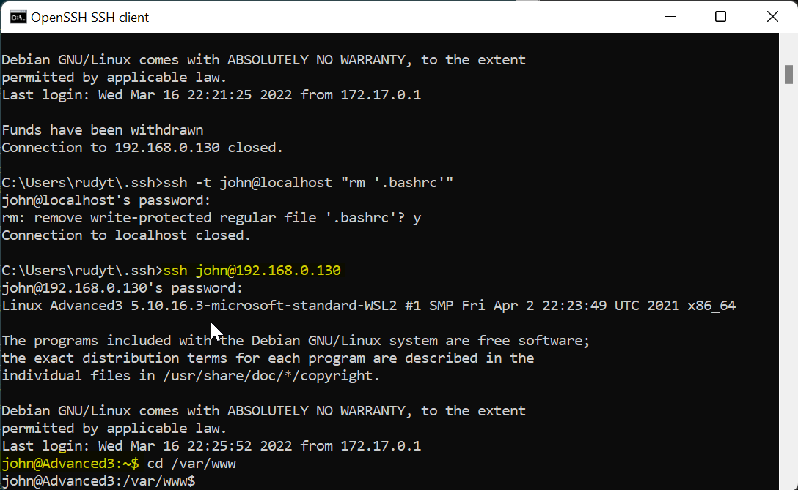


The login page may contain credentials to connect to a backend database. 
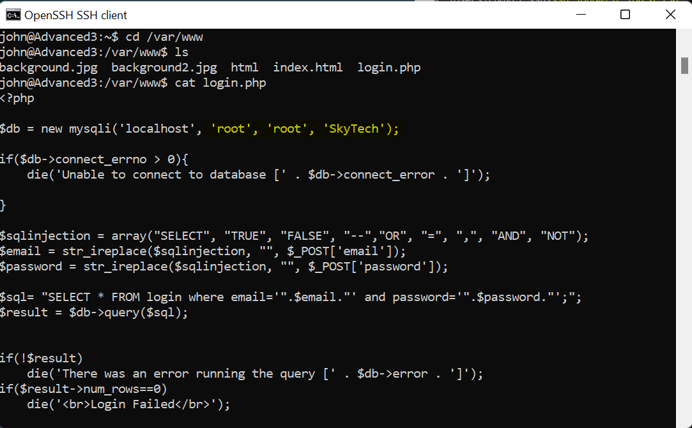
We could also have guessed those ;-)

Now we can login into mysql:
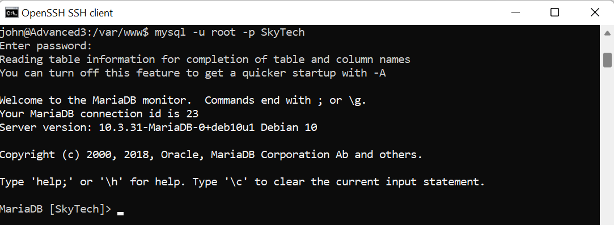

What do we have here:
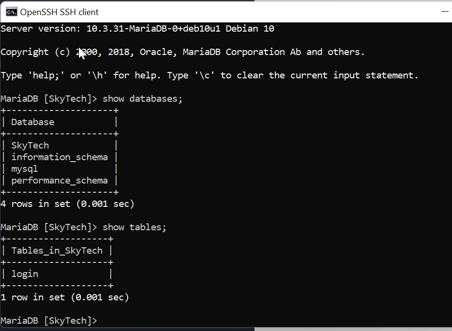

We found clear text credentials
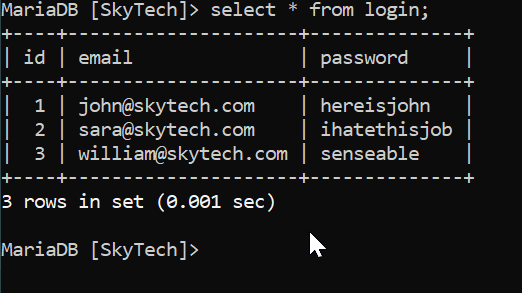

We can try to login with sara
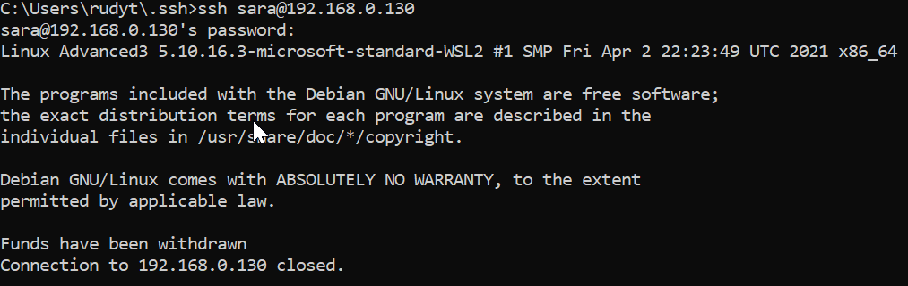

Same batchrc issue here, we know what to do:
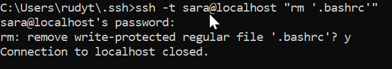

It appears that sara can execute the cat and ls command against all files in the /accounts directory:
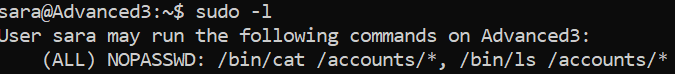

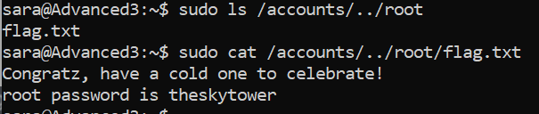

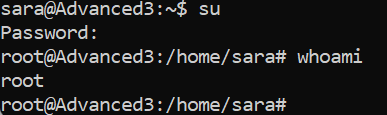

## Lessons learned
Vulnerabilities like sql injection may lead to information leakage and/or command execution. Proper input validation needs to be implemented by whitelisting allowed/expected characters. Credentials should not be stored in clear text in databases. Password hashes should be stored instead.
Users should be given privileges according to the least privilege principle.
