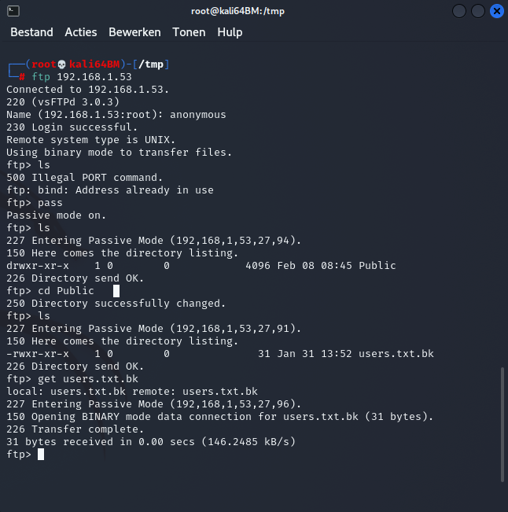
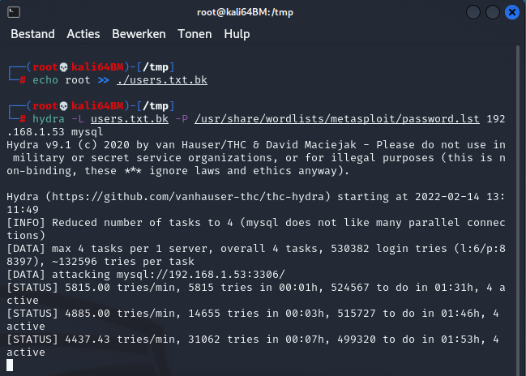

# Basic 1

####Building the machine with docker
```
docker build . -t basic1
```
####Running the machine with docker
```
docker run  -h Basic1 -ti -p 80:80 -p 22:22 -p 21:21 -p 3306:3306 -p 7000-7010:7000-7010 basic1
```

## Reconnaissance

Lets quickly scan the box with nmap


We see FTP, mysql and some unfamiliar ports.

Let's see if we can access the FRP server anonymous.


We found some users !


## Exploitation

Now we have some users and we can try a dictionary attack on the mysql database.
Before we start lets also see find out which the default users of mysql are.
Googeling that, yields <b>root</b> with <b>no password</b>.


Doesn't work, so lets add the 'root' user to the user.txt.bk file (we would rather have the root credentials then those of a regular account, right ?).



While hydra is performing the dictionary attack on the users, let's try some trivial passwords our selves:


Password 'toor' doesn't work.
Password 'root' is bingo !

Remember, the mysql root user is not the same user as the linux root user.
How to get from mysql root to linux root, you'll see in another LAB.

## Lessons learned
Always change the default password but not in an easy guessable one. If your password is part of the metasploit pasword.lst file or the rockyou.txt file, chances are real that it may be brute forced.
With current computerpower, to counter act brute forcing, make your password 10 characters or more, including a non-alfabetical/non-numeric characters.
Always configure software to block accounts after x amount of login failures.
In mysql the parameter "max_connect_errors" limits the amount of connection failures an blocks the host after the limit is reached.
