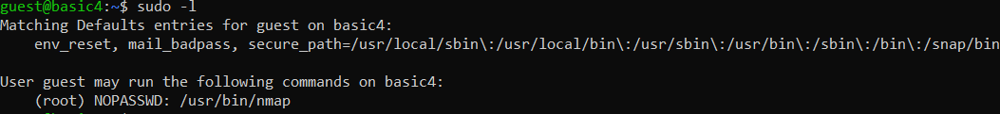
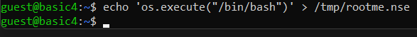
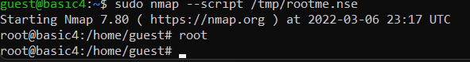

# Basic 3

####Building the machine with docker
```
docker build . -t basic3
```
####Running the machine with docker
```
docker run  -h basic3 -ti -p 22:22 basic3
```

## Reconnaissance
For this exercise you need to connect via SSH with user guest and password guest
The goal is to escalate privileges. It may be possible to find multiple ways to escalate privileges but in this case you should be looking at commands you're allowed to run.

after logging invia ssh with user guest:guest, we can run sudo -l to list the commands that we're allowed to run as another user.



## Exploitation
We're allowed to run nmap in the context of the root user. As nmap can has an option to launch nse scripts, we can exploit this functionality to run our on commands in such a script.
So lets create a script that yields us a shall in the context of root:


if we now sudo nmap with the nse script, we'll obtain a shell in the context of the root user:


The shell doesn't show what you type. In the above screenshot we typed whoami and the result was 'root'.
to obtain a normal command prompt just type 'reset' (without quotes).

## Lessons learned
When an application doesn't work without elevated privileges, always honor the least privilege principle and grant the user or application only the rights that it actually needs to perform the job. Granting full administrative rights is usually the easiest way to get things working but also usually the bad way...
