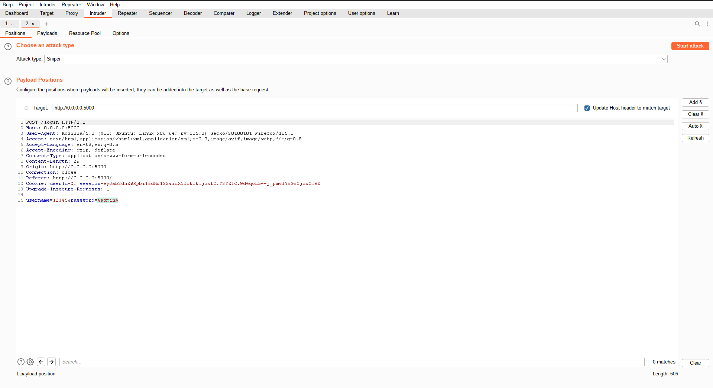
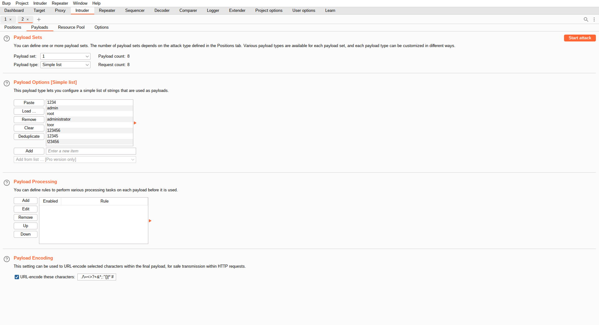
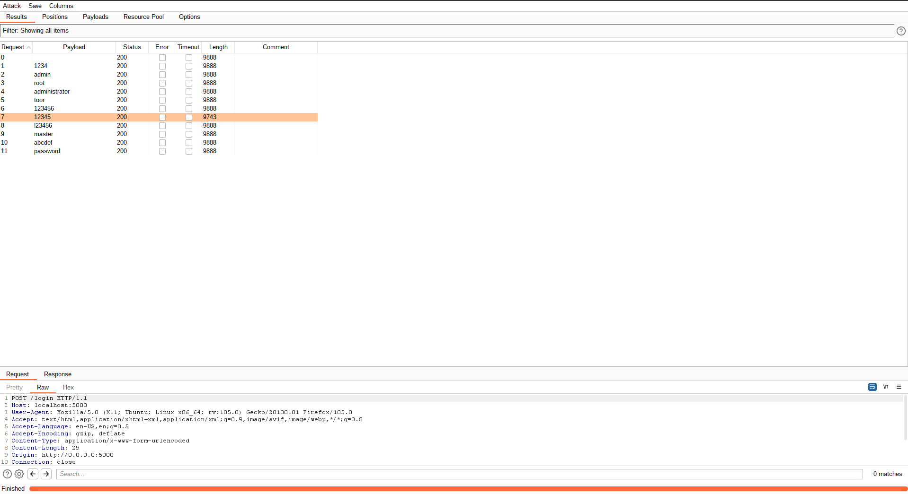
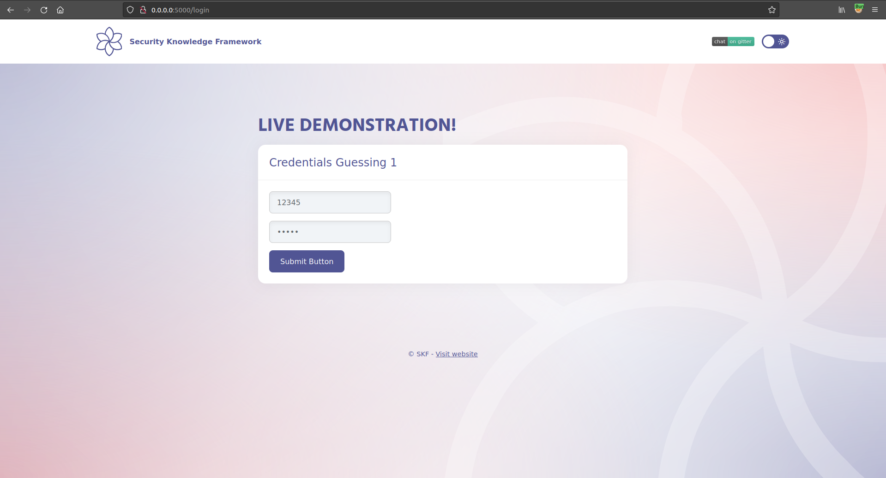
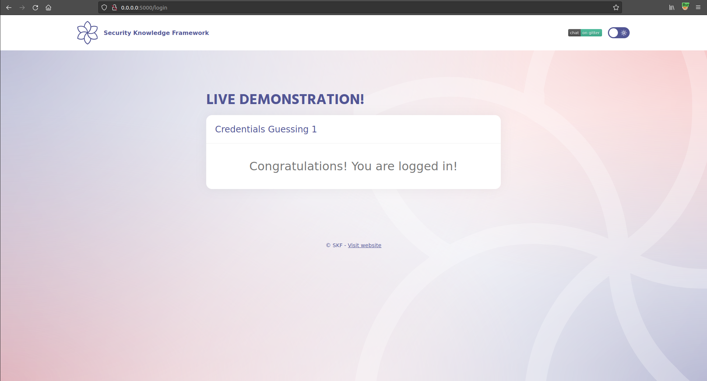

# Credentials Guessing 1

## Running the app on Docker

```
$ sudo docker pull blabla1337/owasp-skf-lab:java-credentials-guessing1
```

```
$ sudo docker run -ti -p 127.0.0.1:5000:5000 blabla1337/owasp-skf-lab:java-credentials-guessing1
```


Now that the app is running let's go hacking!


## Reconnaissance

It is very common to use very guessable and weak usernames and passwords because they are easier to use and remember.
However, this ease for the users becomes a great advantage for potential attackers who are trying to crack the user's credentials.
It is pretty easy for them to guess or brute force many different credentials until they get to the right ones.

When we start the application we can see that there is a login form.


If we try with some wrong and random credentials such as: [ admin:admin ], we don`t get access to the inside of the website.


## Exploitation

Provided that the username will be 12345, we will use Burp in order to brute force the password and discover it.
We use the "Intruder" functionality and we will load a prefixed dictionary with multiple usernames that will be tried against the website one by one.





If we check the lenght of the different HTTP responses for each of the password that Burp tried, we find that there's one with a different length than
the rest of the possibilities:



We found something promising!

Now, if we try this password as the credential in the login form we get access to the inside of the website:






And goal achieved!

## Additional sources

https://www.owasp.org/index.php/Testing_for_User_Enumeration_and_Guessable_User_Account_(OWASP-AT-002)
