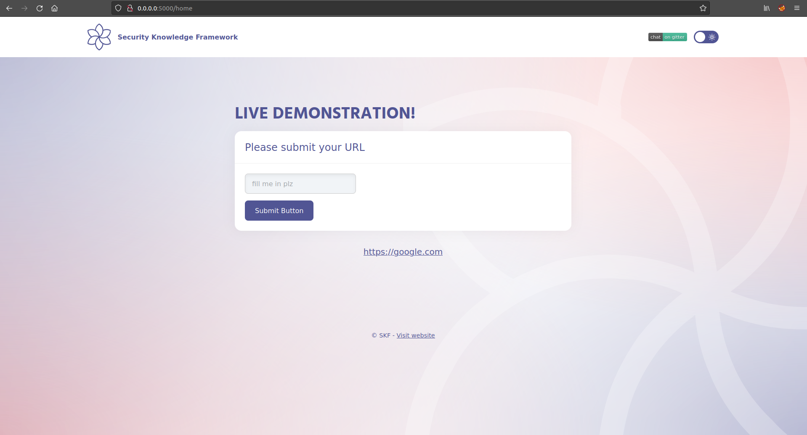

# Right to Left Override \(RTLO\)

## Running the app on Docker

```
$ sudo docker pull blabla1337/owasp-skf-lab:java-rtlo
```

```
$ sudo docker run -ti -p 127.0.0.1:5000:5000 blabla1337/owasp-skf-lab:java-rtlo
```


Now that the app is running let's go hacking!


## Reconnaissance

#### Step1

To start with this exploit we need to know about the existance of the right to left character and what it is normally used for. The right-to-left mark (RLM) is a non-printing character used in the computerized typesetting of bi-directional text containing mixed left-to-right scripts (such as English and Cyrillic) and right-to-left scripts (such as Persian, Arabic, Urdu, Syriac and Hebrew). RLM is used to change the way adjacent characters are grouped with respect to text direction.

To start with our attack we first verify of the app filters unknown uni-characters from
user supplied input.

To start of we visit the following page:

```
https://unicode-explorer.com/c/202E
```

Here we can easily copy the non printable character to paste and use in our payload.

Throughout the rest of the write up, the non-printable character that we just put on our clipboard is refered to as **[RTLO]**


#### Step 2

The next step is to look at the target application and where it is used for.
The target application is used to share links that refer to content stored on
a different service.



We can test if the server is rejecting un expected uni-characters adding the right to left override unicharacter in our input and submit it to the server. First our payload looks as shown in the screenshot below

    [RTLO]test input


After we put in the right to left override uni-character in fron of the "test input" payload we see the following behaviour with the payload:


As you can see the input has been put from right to left.
After submitting the input we find that the server does not filtered the override uni-character. From here we can start crafting our exploit payload.


now in this scenario

    [RTLO]test input -> tupni tset

## Exploitation

We inject the payload in the input field with the [RTLO] uni-character between the
brackets. After submitting this input we find a non suspicous link to an mp4 resource.


However as soon as you would hover your mouse over the link you will find how the link itself is actually interpreted by your browser. The behaviour is shown in the screenshot below highlighted in red. Now when a user clicks the link to download a mp4 file he will actually download a potentially malicous executable.


#### Additional exploitation options

Not only can this attack vector be used to craft malicious links, but it can also
be used for social engineering attacks where you can register a user that for the database point of view looks like a unique user but where the output is obfuscated to an existing user such as an admin or other high privileged user.

    [RTLO]rotartsinimdA -> Administrator
    [RTLO]rotaredoM -> Moderator
    etc

Another scenario is to use this attack vector to spoof different URLS.

    [RTLO]http://someevilsite.com/moc.elgoog.www//:ptth

will display as:

    http://www.google.com/moc.etisliveemos//:ptth

## Additional sources



 and find:

```
   -=[ RTLO Spoofing ]=-
      [ Author: storm ]
Email: storm@gonullyourself.org
Website: http://gonullyourself.org/
```
