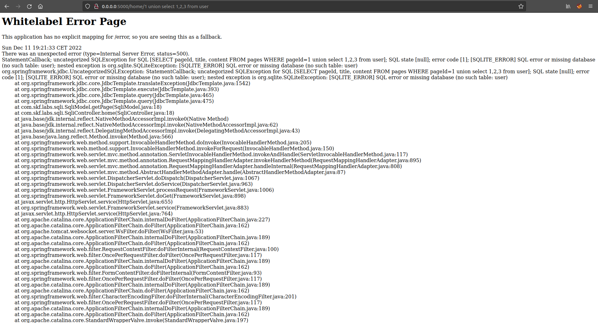

# SQLI

## Running the app on Docker

```
$ sudo docker pull blabla1337/owasp-skf-lab:java-sqli
```

```
$ sudo docker run -ti -p 127.0.0.1:5000:5000 blabla1337/owasp-skf-lab:java-sqli
```


Now that the app is running let's go hacking!


## Reconnaissance

### Step1

The first step is to identify parameters which could be potentially used in an SQL query to communicate with the underlying database. In this example we find that the "/home" method grabs data by pageID and displays the content.


```
http://0.0.0.0:5000/home/1
```

### Step2

Now let's see if we can create an error by injecting a single quote


```text
http://localhost:5000/home/1'
```

By doing so the SQL query syntax is now faulty. This is due to the fact that the user supplied input is being directly concatenated into the SQL query.

```java
String sql = "SELECT pageId, title, content FROM pages WHERE pageId="+pageId;
```

### Step3

Now we can also use logical operators to determine whether we can actually manipulate the SQL statements.

We start with a logical operator which is false (and 1=2). The expected behaviour for injecting a false logical operator would be an error.


```
http://0.0.0.0:5000/home/1 and 1=2
```

After that we inject a logical operator which is true (and 1=1). This should result in the application run as intended without errors.


```
http://0.0.0.0:5000/home/1 and 1=1
```

## Exploitation

Now that we know that the application is vulnerable for SQL injections we are going to use this vulnerability to read sensitive information from the database. This process could be automated with tools such as SQLMAP. However, for this example let's try to exploit the SQL injection manually.

### Step1

The UNION operator is used in SQL injections to join a query, purposely forged to the original query. This allows to obtain the values of columns of other tables. First we need to determine the number of columns used by the original query. We can do this by trial and error.


```
http://0.0.0.0:5000/home/1 union select 1
```

This query results in an error, this is due to the fact that the original query started with 3 columns namely\
\* pageId\
\* title\
\* content


```
http://0.0.0.0:5000/home/1 union select 1,2,3
```

Notice how "title" and "content" became placeholders for data we want to retrieve from the database

### Step 2

Now that we determined the number of columns we need to take an educated guess for the table we want to steal sensitive information from. Again we can see if we try to query a non existent table we get an error. For a correct table we see the application function as intended.



```
http://0.0.0.0:5000/home/1 union select 1,2,3 from user
```


```
http://0.0.0.0:5000/home/1 union select 1,2,3 from users
```

## Mitigation

SQL Injection can be prevented by following the methods described below:

Primary Defenses:

First step: White-list Input Validation\
Second step: Use of Prepared Statements (Parameterized Queries)\

Additional Defenses:

Also: Enforcing Least Privilege\
Also: Performing Allow-list Input Validation as a Secondary Defense

In this case, we have presented a SQLi code fix by using parameterized queries (also known as prepared statements) instead of string concatenation within the query.

The following code is vulnerable to SQL injection as the user input is directly concatenated into query without any form of validation:

```java
public List<Page> getPage(String pageId){
    String sql = "SELECT pageId, title, content FROM pages WHERE pageId="+pageId;
    List<Page> pages = jdbcTemplate.query(sql, (resultSet, rowNum) -> new Page(resultSet.getInt("pageId"),resultSet.getString("title"), resultSet.getString("content")));
    return pages;
}
```

This code can be easily rewritten in a way that prevent the user input from interfering with the query structure:

```java
public List<Page> getPage(String pageId){
    String sql = "SELECT pageId, title, content FROM pages WHERE pageId=?";
    List<Page> pages = jdbcTemplate.query(sql,new Object[]{pageId} , (resultSet, rowNum) -> new Page(resultSet.getInt("pageId"),resultSet.getString("title"), resultSet.getString("content")));
    return pages;
}
```

Can you try to implement input validation or escaping?

## Additional sources

Please refer to the OWASP testing guide for a full complete description about SQL injection with all the edge cases over different platforms!



SQLite Reference


