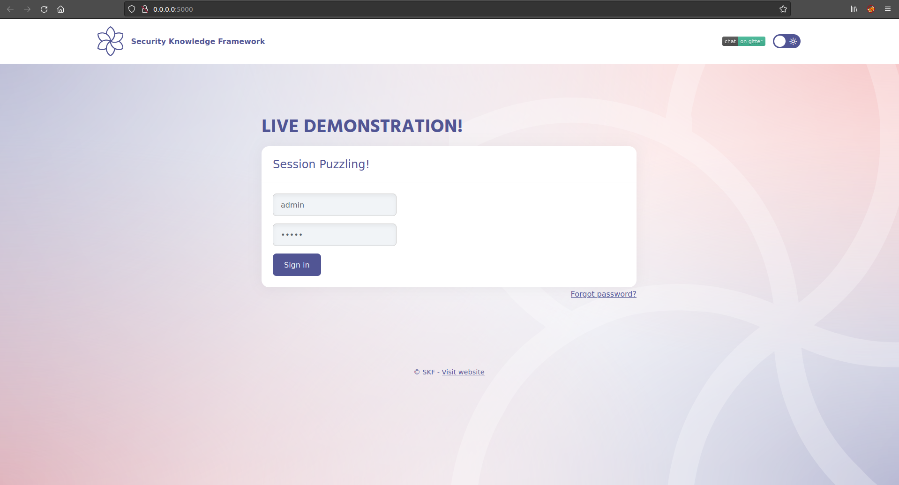
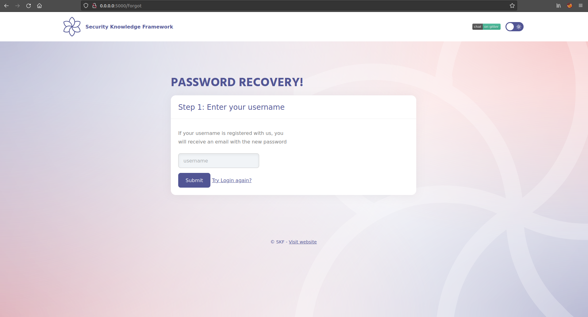
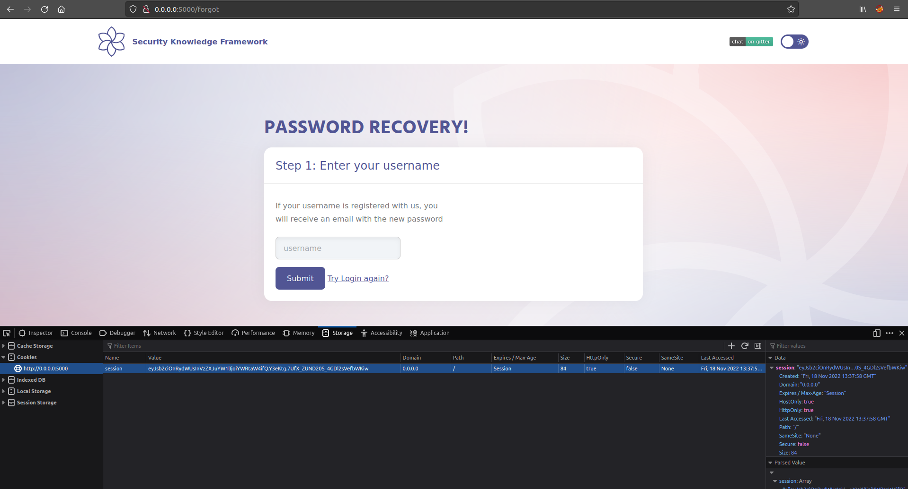
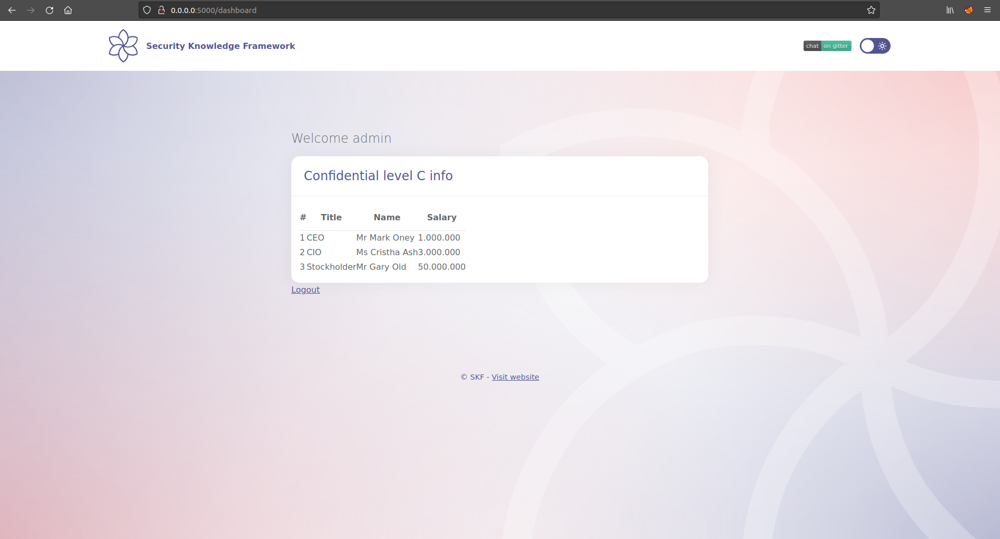

# Session Puzzling

## Running the app on Docker

```
$ sudo docker pull blabla1337/owasp-skf-lab:java-sessionpuzzle
```

```
$ sudo docker run -ti -p 127.0.0.1:5000:5000 blabla1337/owasp-skf-lab:java-sessionpuzzle
```


Now that the app is running let's go hacking!


## Reconnaissance

Session puzzling is an application level vulnerability that occurs when the application session variable is using more than one purpose. The other name of session puzzling is session variable overloading.

The attacker tries to access application entry points. The session objects creation can be indirectly initiated while exploiting session puzzles, and later exploited, by accessing an entry point such as web services, web pages, remote procedure calls, etc.

Session puzzle enables the attackers to bypass authentication, Impersonate legitimate users, elevate privileges, bypass flow restrictions, and even execute additional attacks.

## Exploitation

Session puzzles can be detected and exploited by enumerating all of the session variables used by the application and in which context they are valid. And even though it’s much easier to detect instances in source code reviews. While there are multiple attack vectors we would be focussing on the authentication bypass scenario for this demo.

Let us see how can we exploit the session puzzles in a real world scenario, the application here allows us to the user to sign in and also provides "forgot password" functionality. By making an educated guess and as highlighted by the placeholders we log in using the well known credentials set(admin/admin). On successful authentication we are gifted with some confidential C level information. So, all good uptil now.



On successful authentication we are gifted with some confidential C level information. So, all good uptil now.


Now, lets assume the user logs out and forgets his password and attempts to recover his password by providing his username(admin) and if the username is valid the app says he/she should recieve his new password through an email.



Also if we observe closely the application sets a new session cookie once the user provides a username as requested by the app.



As we know the session puzzling attack is possible since the app uses session variables for more than one purpose what if in this scenario we try to access /dashboard page which provides some confidential C level information. Lets try accessing /dashboard and what do we see :-) we can actually access authenticated pages without logging in to the application thus proving that we are able to successfully bypass authentication mechanism.



## Additional sources

[https://dzone.com/articles/using-session-puzzling-to-bypass-two-factor-authen](https://dzone.com/articles/using-session-puzzling-to-bypass-two-factor-authen)
