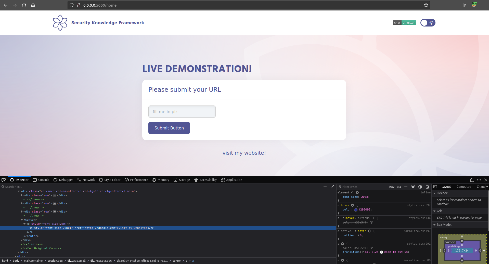
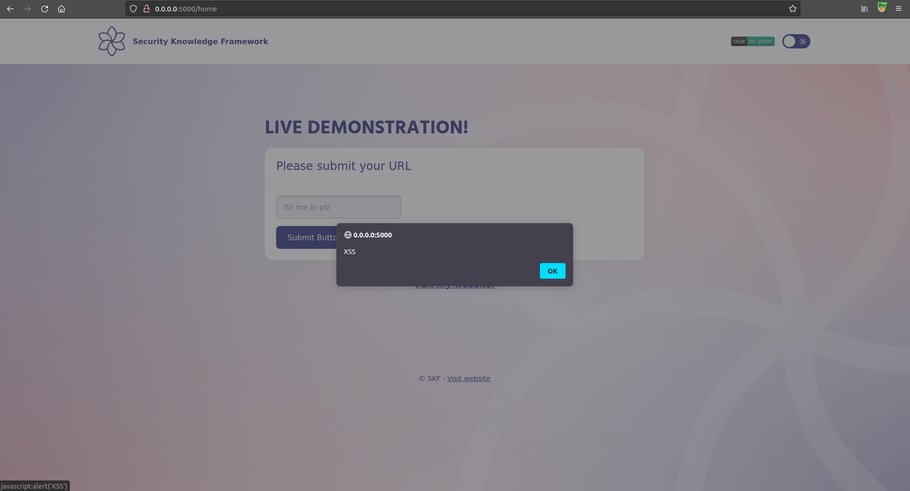

# Cross site scripting \(href\)

## Running the app on Docker

```
$ sudo docker pull blabla1337/owasp-skf-lab:java-xss-url
```

```
$ sudo docker run -ti -p 127.0.0.1:5000:5000 blabla1337/owasp-skf-lab:java-xss-url
```


Now that the app is running let's go hacking!


## Reconnaissance

### Step 1

The application invites you to fill a website in the input box, that will be used from the "visit my website!" link to redirect to it.


If we insert `https://google.com`, and click on "visit my website!" we will be redirected to the Google website. As we can see in the screenshot below our input is reflected in the page inside an `href` attribute.



#### Step 2

The next step is to see if we could include JavaScript that can be executed in the `href` attribute.

href="javascript:JS PAYLOAD"

Autoescape is disabled by default so every characters will be reflected in the following snippet in the template.

```markup
  <center> <p style="font-size:2em;"> <a style="font-size:20px;" th:href="${xss}">visit my website!</a> </p></center>
```

## Exploitation

#### Step 1

Now we have seen where the user input is being reflected in the href, we can craft the payload to trigger an alert box and exploit our XSS.

```markup
javascript:alert('XSS')
```

and clicking the button, we achieve what we were looking for.



## Additional sources

Please refer to the OWASP testing guide for a full complete description about cross site scripting!



