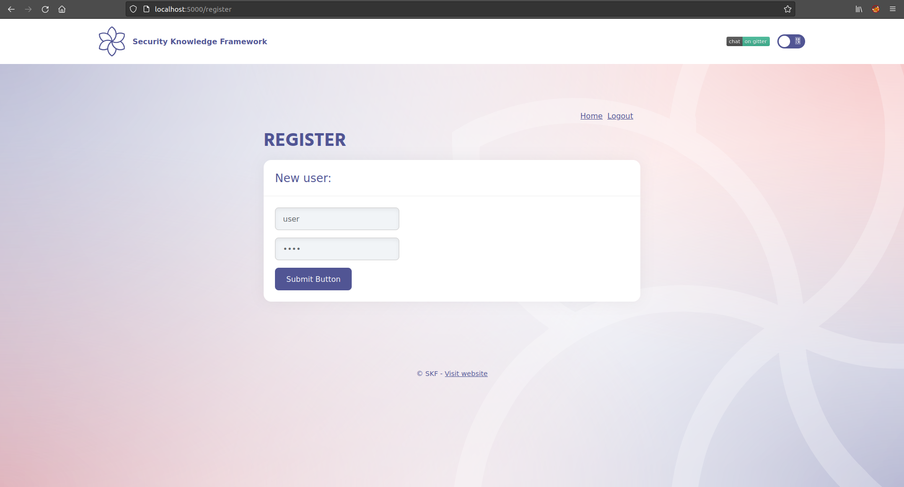
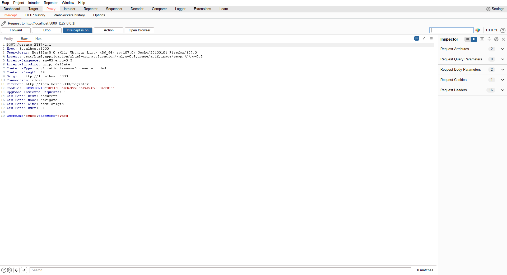

# KBID 147 - Parameter binding

## Running the app Java

First make sure java is installed on your host machine.
After installation, we go to the folder of the lab we want to practice.
"i.e /skf-labs/XSS, /skf-labs/RFI/" and run the following command:

```
$ ./mvnw spring-boot:run
```


Now that the app is running let's go hacking!


## Reconnaissance

Mass assignment is a computer vulnerability where an active record pattern in a web application is abused to modify data items that the user should not normally be allowed to access such as password, granted permissions, or administrator status.

Please take note of the following code in the User.java . This line of code will prove critical for exploiting the parameter binding attack.

```java
@PostMapping("/create")
  public String createUser(User user, Model model) { // here is the issue
    authModel.createUser(user);
    model.addAttribute("content", "Your user has been created");
    return "index";
  }
```

To fully understand the attack we need to examine the properties "User" model, which looks like this:

```java
public User(String username, String password, Boolean isAdmin) {
  this.username = username;
  this.password = password;
  this.isAdmin = isAdmin;
}
```

## Exploitation

Now, let's examine the target application and determine the objective.


Let's register a new user




Log in as the new user


Let's register a new user and check the request on Burp.



As we saw in this line of code:

```java
public String createUser(User user, Model model)
```

Maybe if we add another parameter in the request this parameter will also pass to our new User.


Now if we login.


Bingo! We have now created a new user with Admin privileges.

## Additional sources

Please refer to the OWASP cheat sheet for a full complete description about parameter binding attacks.




