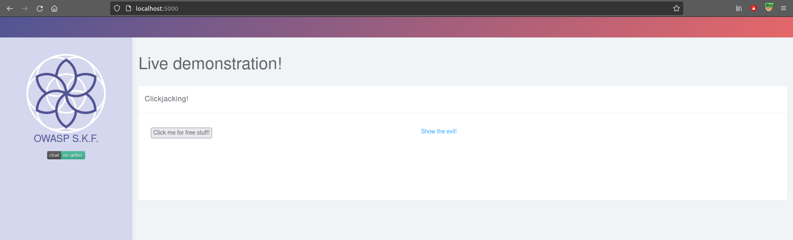
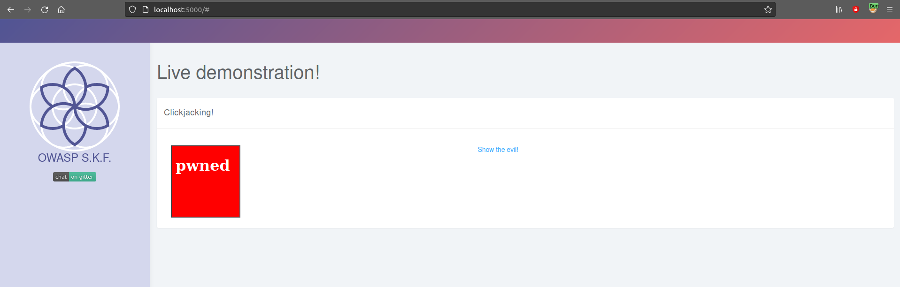

# KBID 20 - Clickjacking

## Running the app Java

First make sure java is installed on your host machine.
After installation, we go to the folder of the lab we want to practice.
"i.e /skf-labs/XSS, /skf-labs/RFI/" and run the following command:

```
$ ./mvnw spring-boot:run
```


Now that the app is running let's go hacking!


## Reconnaissance

Clickjacking, also known as a "UI redress attack", is when an attacker uses multiple transparent or opaque layers to trick a user into clicking on a button or link on another page when they were intending to click on the top level page. Thus, the attacker is "hijacking" clicks meant for their page and routing them to another page, most likely owned by another application, domain, or both.

Using a similar technique, keystrokes can also be hijacked. With a carefully crafted combination of stylesheets, iframes, and text boxes, a user can be led to believe they are typing in the password to their email or bank account, but are instead typing into an invisible frame controlled by the attacker.

Examples: Imagine an attacker who builds a web site that has a button on it that says "click here for a free iPod". However, on top of that web page, the attacker has loaded an iframe with your mail account, and lined up exactly the "delete all messages" button directly on top of the "free iPod" button. The victim tries to click on the "free iPod" button but instead actually clicked on the invisible "delete all messages" button. In essence, the attacker has "hijacked" the user's click, hence the name "Clickjacking".

## Exploitation

In order to exploit this vulnerability, the attacker would place an iframe with the malicious link behind a valid actionable button and make it transparent to capture the clicks.



In our situation if we click on show evil, we notice the attacker in reality wants to capture facebook likes behind "Click me for free stuff!" button.



## Additional sources :


