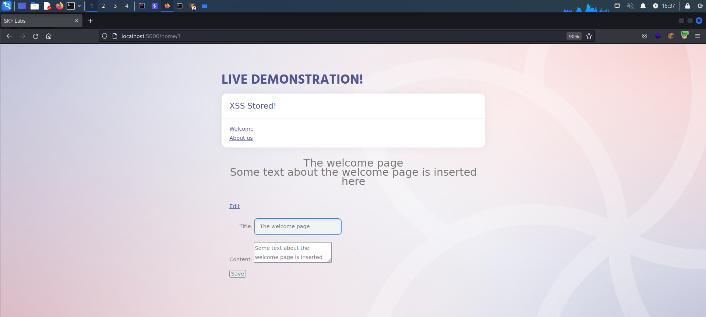
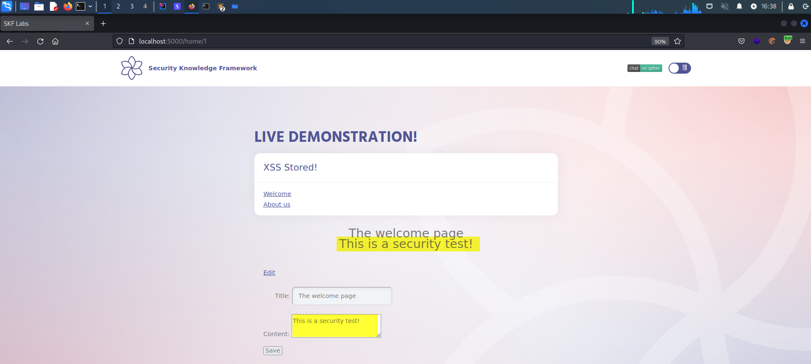
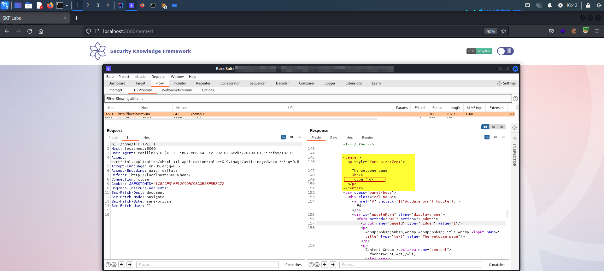
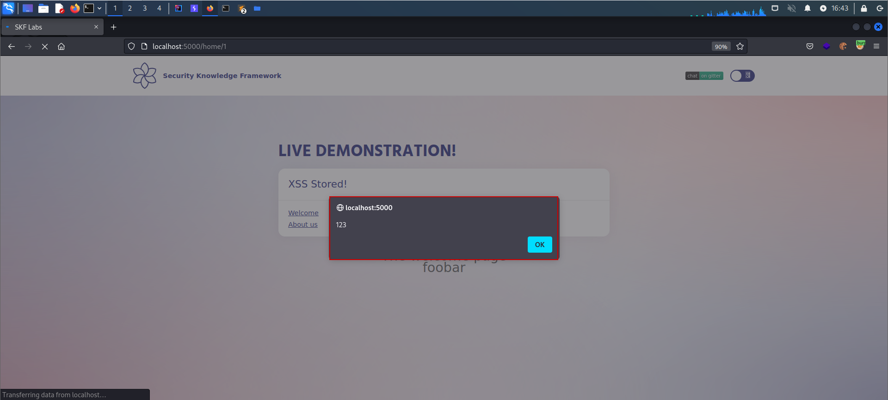

# KBID 3 - Cross Site Scripting Stored

## Running the app Java

First make sure java is installed on your host machine.
After installation, we go to the folder of the lab we want to practice.
"i.e /skf-labs/XSS, /skf-labs/RFI/" and run the following command:

```
$ ./mvn spring-boot:run
```


Now that the app is running let's go hacking!


## Reconnaissance

#### Step 1

The application home page shows links to different pages.


By clicking in one of the links and on the *Edit* button,the application shows an input field box were we can try our injections.



Lets first inject a normal test string and see how our input is used in the application.


Now, clicking on save, the page content is updated.




In the source of the application we can see that this application will take the user input and save the page updates in the database. Thereafter, the page is reloaded and the new information is displayed via template variable.

**Controller**

```java
  @GetMapping("/home/{id}")
    public String home(@PathVariable String id, Model model) {
        List<Page> pages = xssModel.getPage(id);
        model.addAttribute("page", pages.get(0));
        return "index";
    }

    @PostMapping("/update")
	public String update(@RequestParam(name="pageId", required=true) int pageId,
                        @RequestParam(name="title", required=true) String title,
                        @RequestParam(name="content", required=true) String content) {
    Page page = new Page(pageId, title, content);
    xssModel.updatePage(page);
        return "redirect:/home/"+pageId;
    }
```

**HTML Template**

```markup
<center>
        <p style="font-size:2em;"> 
			 <th:block th:text="${page?.title}"></th:block>
		    	 <br/>
	 		<th:block th:utext="${page?.content}"></th:block>
		  </p>
      </center>
```

The variable is then used in the index.html to display the content suplied by the user. But as you can see the tag being used is th:utext which means is not being escaped by the thymeleaf template engine . This indicates that is should be possible to perform a Cross Site Scripting \(XSS\) injection.

## Exploitation

#### Step 1

Now we have seen where the user input is stored in the database and reflected in the application we will have to look what dangerous HTML characters are not properly escaped so we can build our XSS payload. So for our first check we use the following string as an input:

```text
foobar">/<
```


The application automatically reloads the page with a redirection. Let's see how the payload is loaded in the HTTP response:



As you can see the application did not encode or blacklisted any of the dangerous HTML characters. Now lets try the XSS payload to see if this also is reflected back withouth any escaping or blacklist filtering.

```text
foobar<script>alert(123)</script>
```

Again the application is not encoding or blacklisted any of the dangerous HTML characters. This payload seems to work in the intercepting proxy. Now lets try it in our browser.



We can see the XSS alert pop-up and we have successfully performed the XSS attack.

## Additional sources

Please refer to the OWASP testing guide for a full complete description about cross site scripting!



