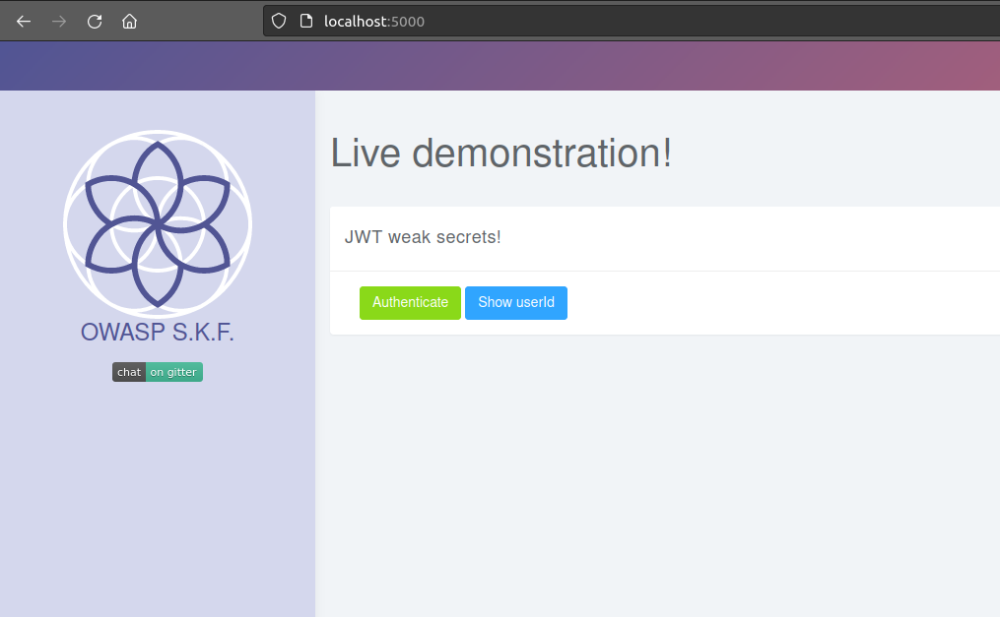
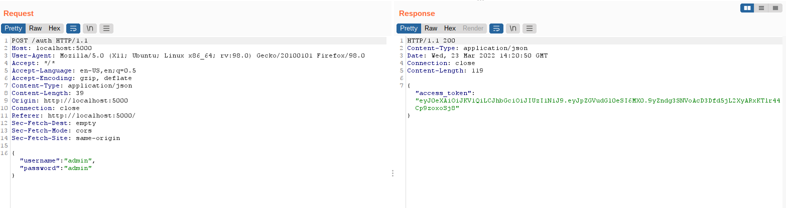
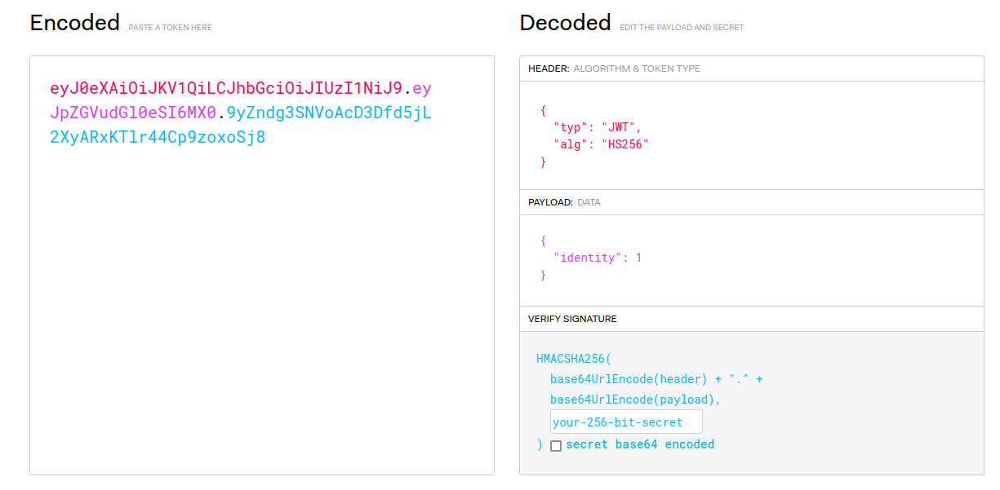
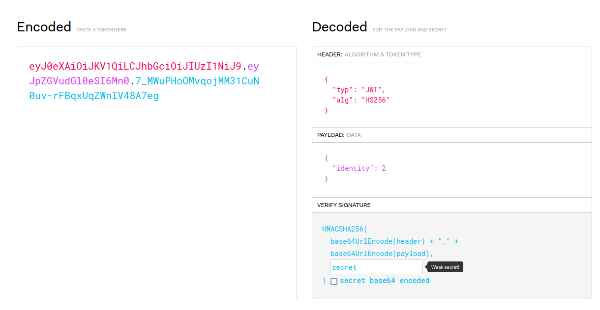
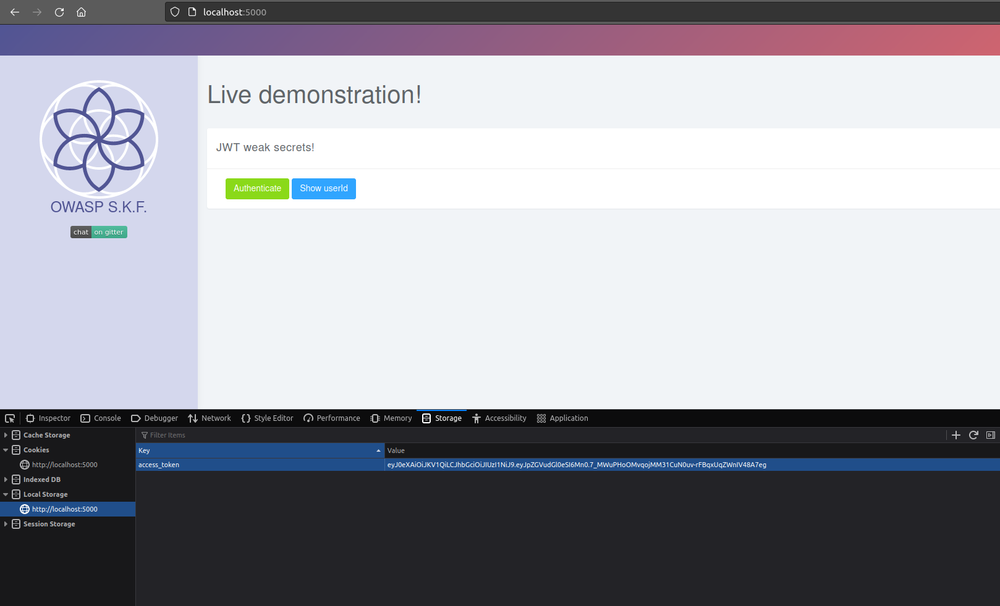
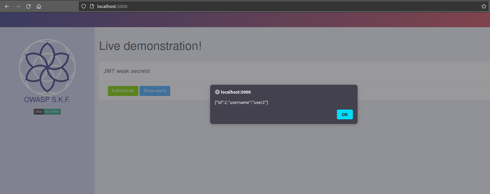

# KBID 7006 - JWT Secret

## Running the app Java

First make sure java is installed on your host machine.
After installation, we go to the folder of the lab we want to practice.
"i.e /skf-labs/XSS, /skf-labs/RFI/" and run the following command:

```
$ ./mvnw spring-boot:run
```


Now that the app is running let's go hacking!


## Reconnaissance

### Step1

The application shows a dropdown menu from which we can choose an intro or chapters to be displayed on the client-side.



First thing we need to do know is to do more investigation on the requests that are being made. We do this by setting up our intercepting proxy so we can gain more understanding of the application under test.

After we set up our favourite intercepting proxy we are going to look at the traffic between the server and the front-end. Click on _Authenticate_.

The first thing to notice is after sucessful logon, the response contains an access token.



The image above shows the access-token contains three base64 encoded splitted with two dots \(.\) separators, which indicates it's a JSON Web Token \(JWT\):

#### Header

```json
{
  "typ": "JWT",
  "alg": "HS256"
}
```

#### Claims

```json
{
  "identity": 1
}
```

#### Signature

Last encrypted part, containing the digital signature for the token..

## Exploitation

### Step1

A potential attacker can now decode the token in [http://jwt.io](http://jwt.io) website to check its content.



As shown in the above picture, there are 2 points which can be tampered.

- alg header: contains the information of which algorithm is being used for digital signature of the token.
- indentity: this information is used by the application to identify which user ID is currently authenticated.

How about checking if the server used a weak secret key for digital signature algorithm?

Checking the code below it's possible to see a weak secret key is being used, which can be easily guessed by a dictionary attack using tools available on internet and in your favorite PenTest distro.

```java
Algorithm algorithm = Algorithm.HMAC256("secret");
String token = JWT.create()
  .withClaim("identity",user.getId())
  .sign(algorithm);
```

### Step 2

Using the weak secret key, let's change the _identity_ value.



### Step 3

Now, let's use the new generated JWT token to replace the one stored in browser's local storage.



And click on _Show userID_ to check if the server accepted the tampered token.



Yes! The server accepted the tampered access-token. Can we check if there are more users available which can be impersonated?

## Additional Resources

Please refer to the JWT.io information for more information regarding JWT.



Other:


