# Java - Auth Bypass - 2

## Running the app Java

First make sure java is installed on your host machine. After installation, we go to the folder of the lab we want to practice. "i.e /skf-labs/XSS, /skf-labs/RFI/" and run the following command:

```
$ ./mvnw spring-boot:run
```


Now that the app is running let's go hacking!


## Reconnaissance

While most applications require authentication to gain access to private information or to execute tasks, not every authentication method is able to provide adequate security. Negligence, ignorance, or simple understatement of security threats often result in authentication schemes that can be bypassed by simply skipping the log in page and directly calling an internal page that is supposed to be accessed only after authentication has been performed.

In addition, it is often possible to bypass authentication measures by tampering with requests and tricking the application into thinking that the user is already authenticated. This can be accomplished either by modifying the given URL parameter, by manipulating the form, or by counterfeiting sessions.

Obviously, an attacker can tamper with the URL, the form or the session cookie in order to get logged in as a user without knowing the actual credentials.

The goal of this lab is to get logged in as an administrator without knowing his/her credentials

Lets start the application and register a new user

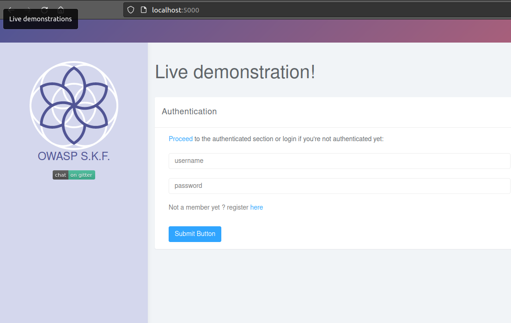

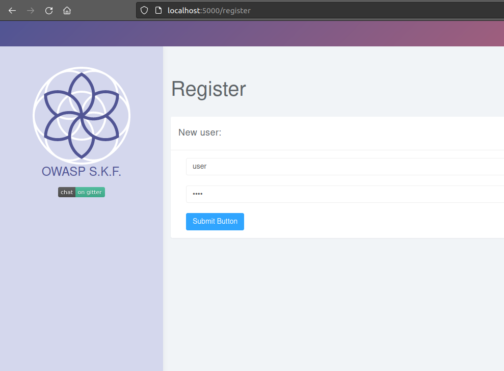

Please note that (for convenience) your password will be reset if the user already exists. Also note that the username and password are case sensitive.

Now that we have valid credentials, we can login:

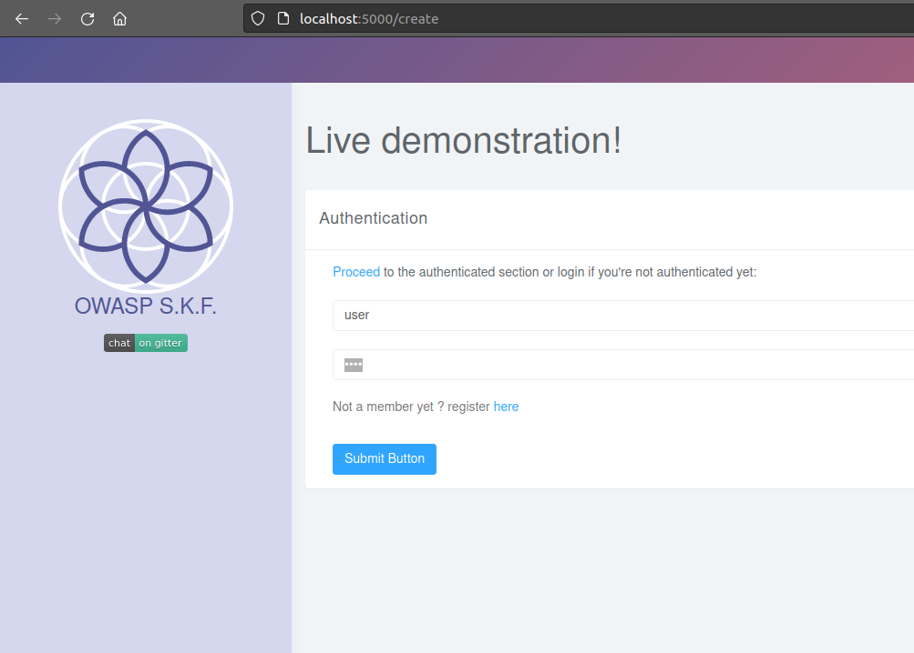

After providing the correct credentials we're logged in:

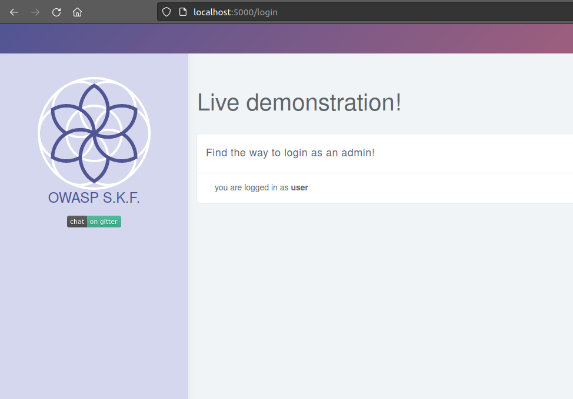

## Exploitation

We can capture the login in the burpsuite proxy and send it to the repeater. We notice that with every login, the session cookie stays the same. It is high likely that this sessionid is related to our user name:

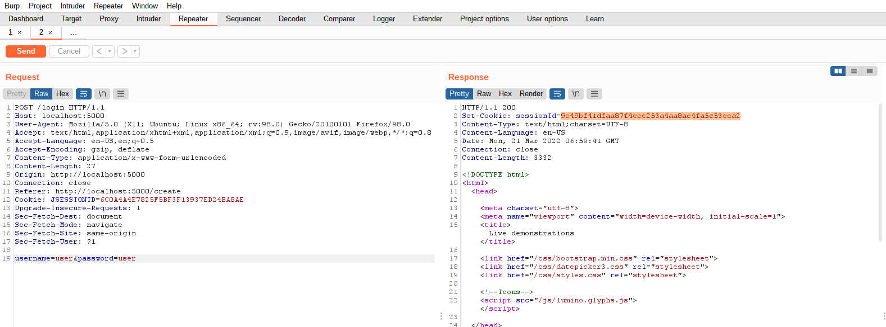

If we quickly google for this sessionid, we find nothing:

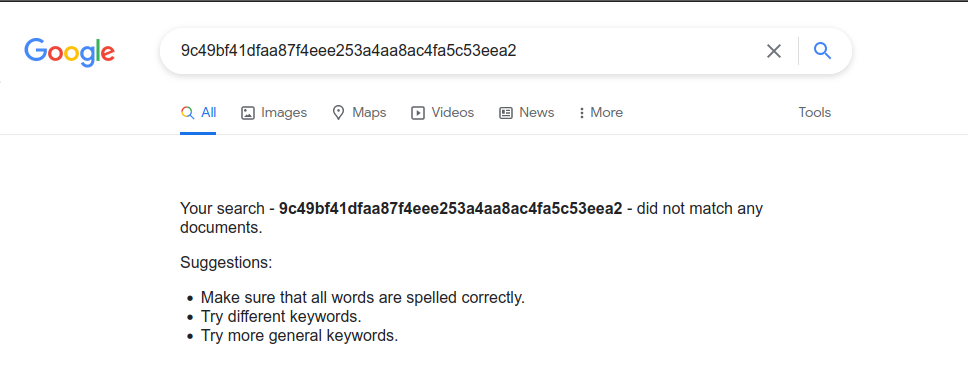

We can check whether it is a hash:

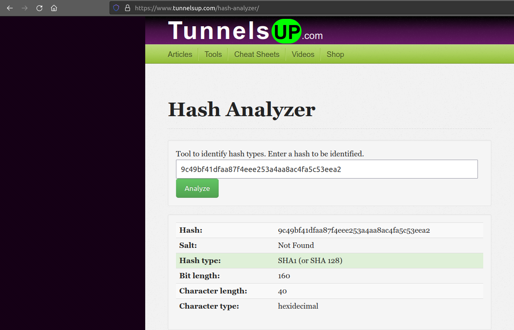

it seems to be a sha1...

It is possible that the developer added a salt to the username and hashed the concatenated string admin+some\_salt -> maybe this is also the reason why we can't find with Google what the hash represents.

The about page seem to contain a lot of text, maybe the salt is a typical word for this company that is also mentioned on that page…

Using cewel we can grab all the words from a page like this: cewl -m 4 -w wordlist.txt -d 0 -v http://127.0.0.1:5000/about\
_-m 4: minimum word length is 4 characters_\
_-w wordlist: write output to file ‘wordlist’_\
_-d 0: follow links x times deep (0=stay on the same page)_\
_-v: verbose (show what you are doing)_\


Using a terminal window:

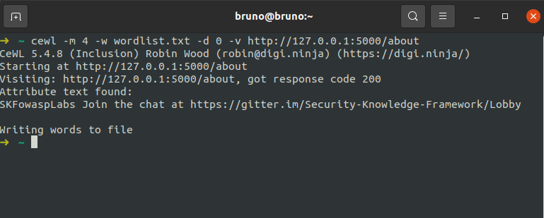

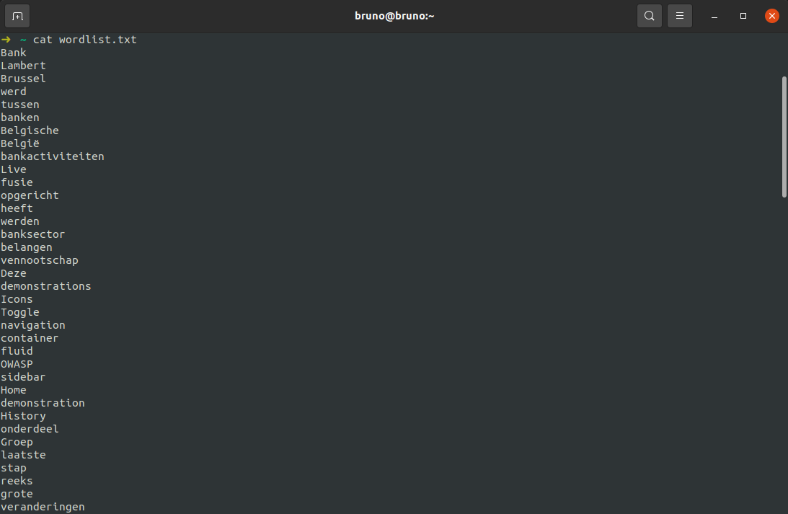

Let’s use burp intruder to calculate a sha-1 for every admin+word combination.

Payload position:

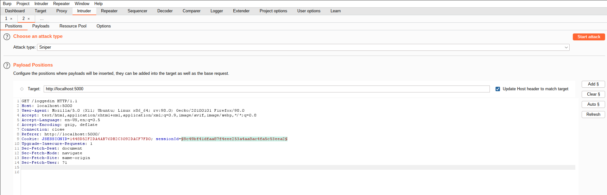

Paste the content of the word list in the payload options and add the payload processing rules as indicated in the following screenshot.

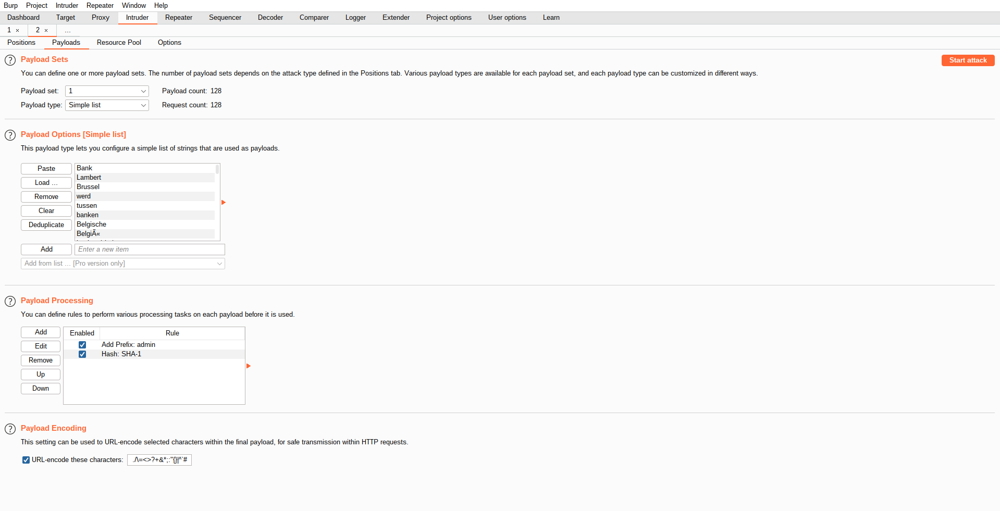

This will prefix the word 'admin' to each word from the list and calculate a sha1 of the concatenated string. for example sha1(adminBank)

Start the attack The result:

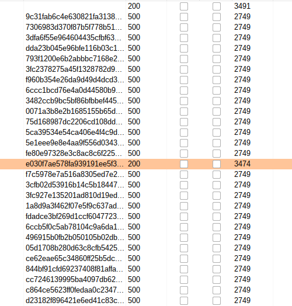

Now we can replace our cookie/sessionID with the value we found.

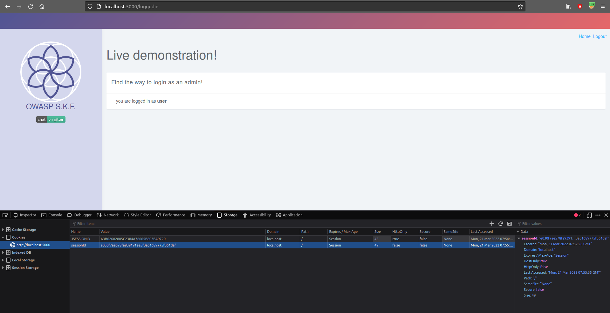

After refreshing the screen we're logged in as admin !

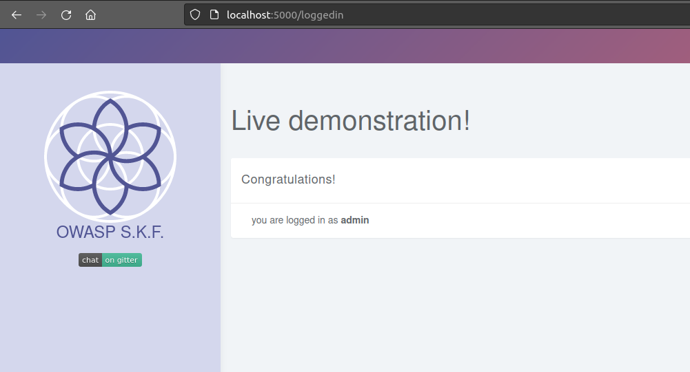

## Additional sources




