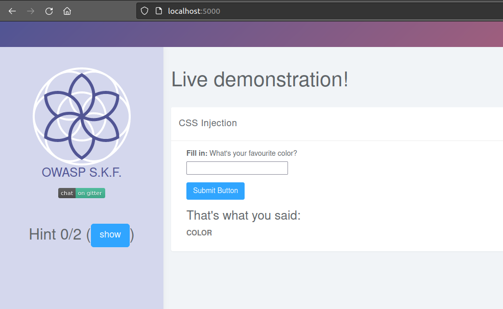
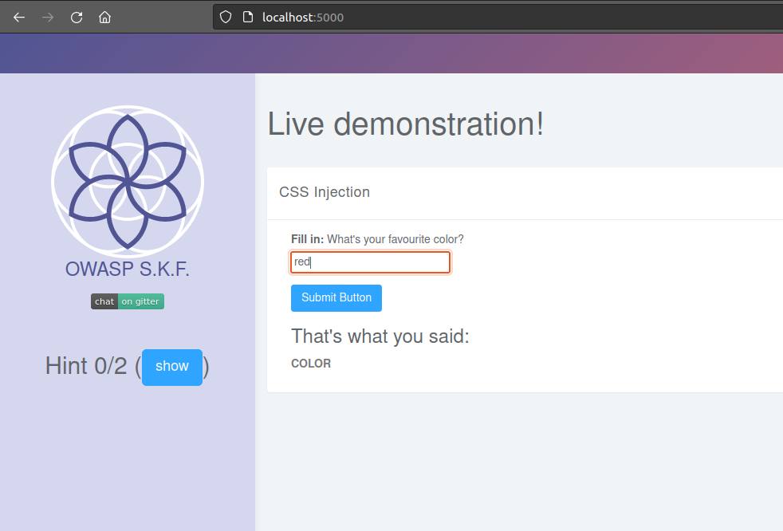
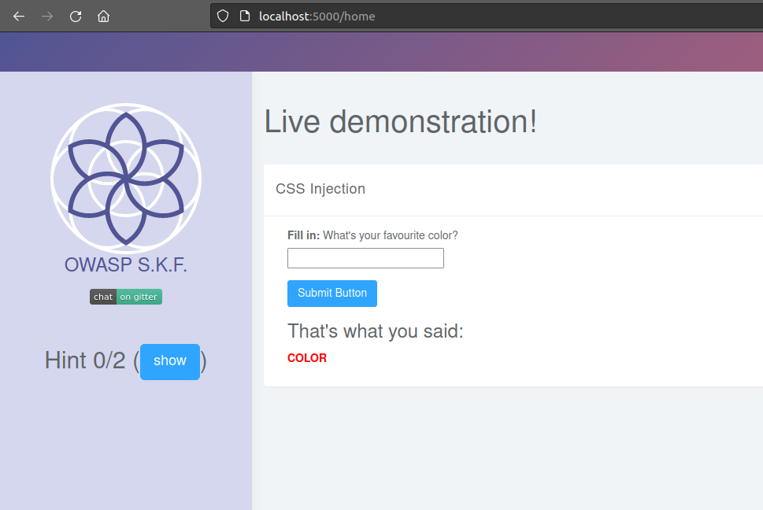
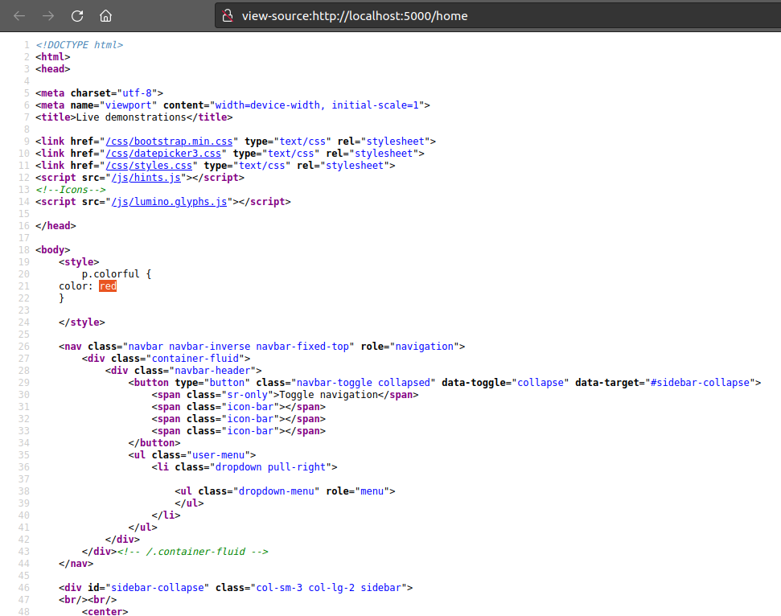
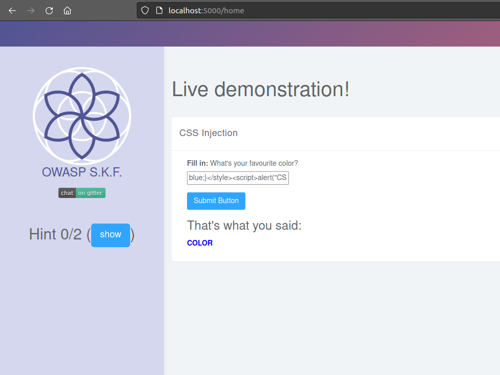

# Java - CSS Injection (CSSI)

## Running the app Java

First make sure java is installed on your host machine. After installation, we go to the folder of the lab we want to practice. "i.e /skf-labs/XSS, /skf-labs/RFI/" and run the following command:

```
$ ./mvnw spring-boot:run
```


Now that the app is running let's go hacking!


## Reconnaissance

When we start the application we can see that there is a text box that allow you to write a color name.



We can write a color like:



And depending on the color that we chose, this will be the color in the text below:



## Exploitation

If we check how the text that we wrote in the text box is later put into the code we can see:



If we try to insert a malicious code that we know it will be inserted in the source code, we can try something like this:

```
blue;}</style><script>alert("CSSI")</script>
```



This code should show an alert box or pop up alerting the text "CSSI". If we check the website after sending the malicious request:

!\[]\(../../.gitbook/assets/java/CSSI/6 .png)

And goal achieved!

## Additional sources


