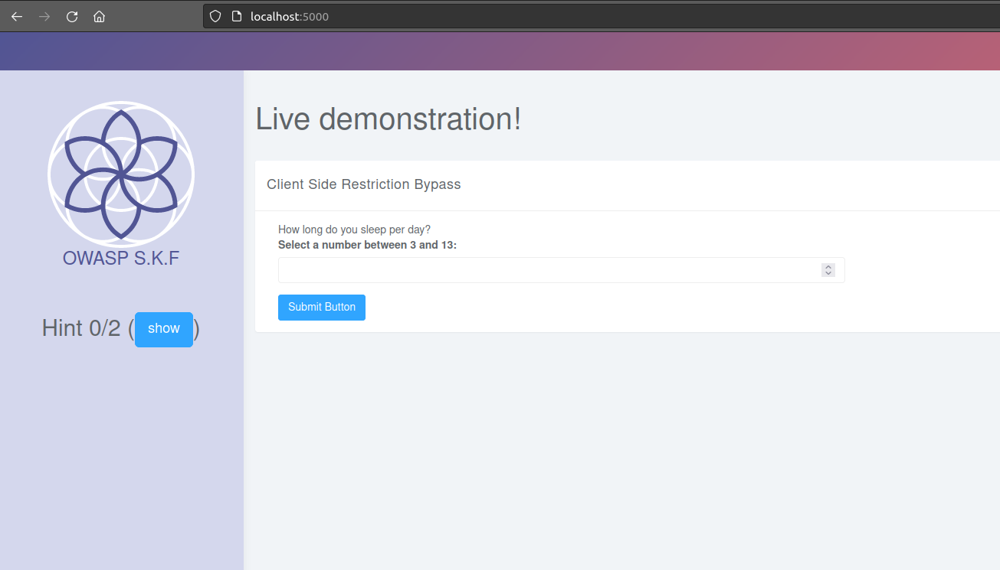
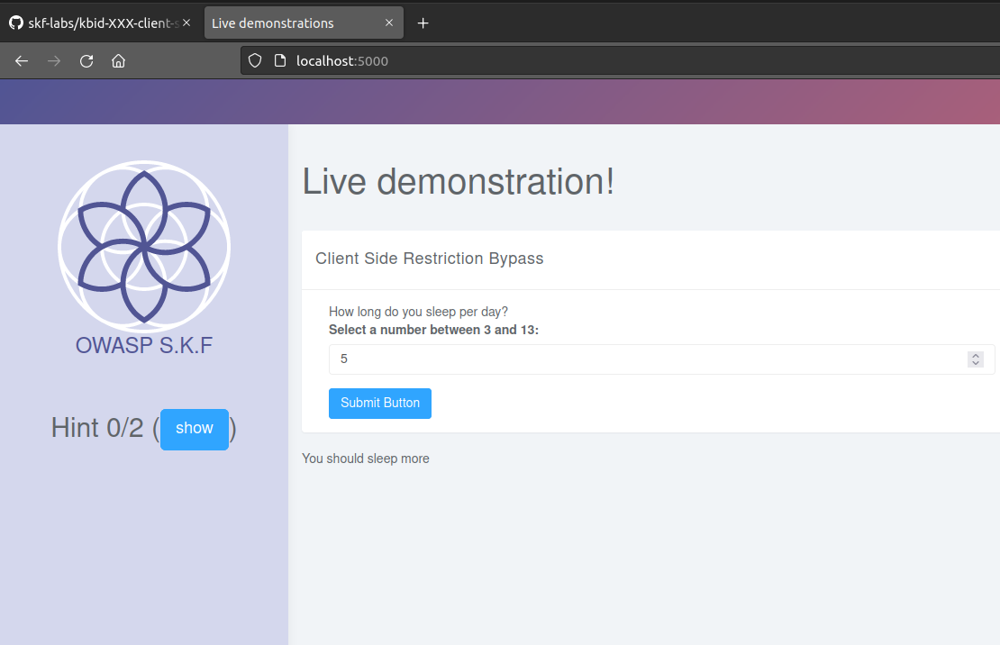
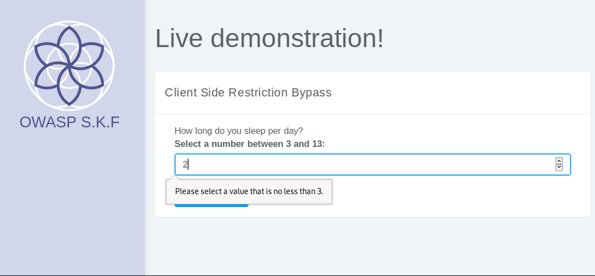
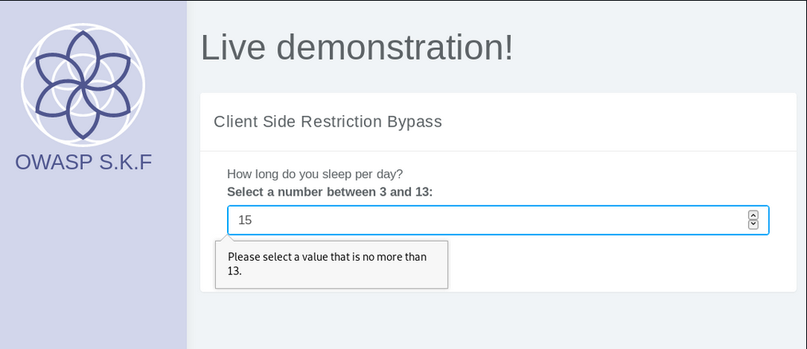
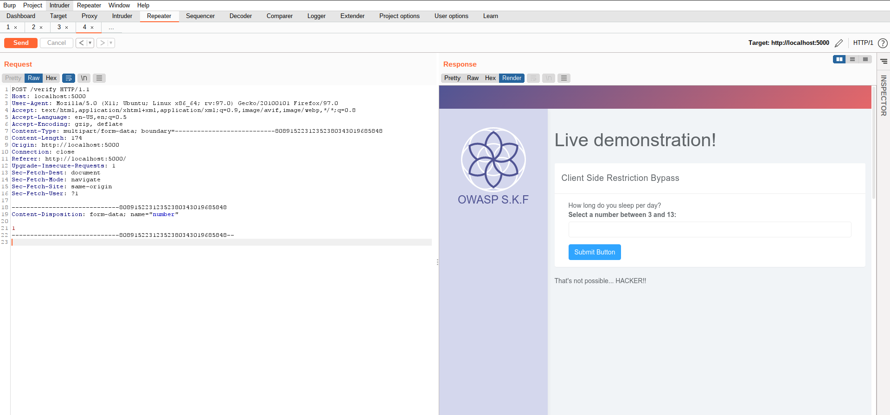

# KBID XXX - Client Side Restriction Bypass

## Running the app Java

First make sure java is installed on your host machine.
After installation, we go to the folder of the lab we want to practice.
"i.e /skf-labs/XSS, /skf-labs/RFI/" and run the following command:

```
$ ./mvnw spring-boot:run
```


Now that the app is running let's go hacking!


## Reconnaissance









## Exploitation



And goal achieved! We could bypass the client-side restrictions.

## Additional sources


