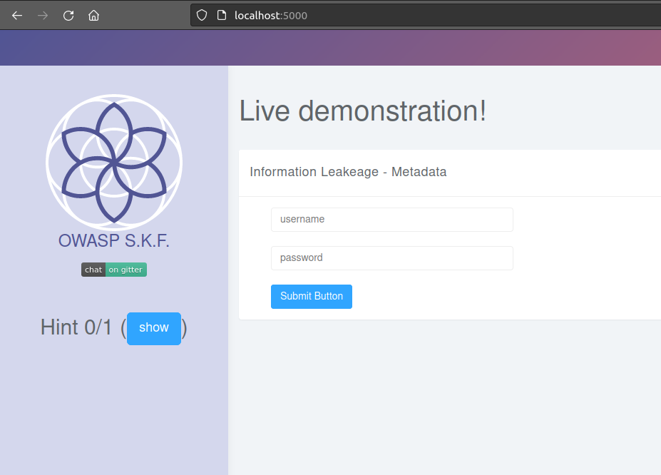
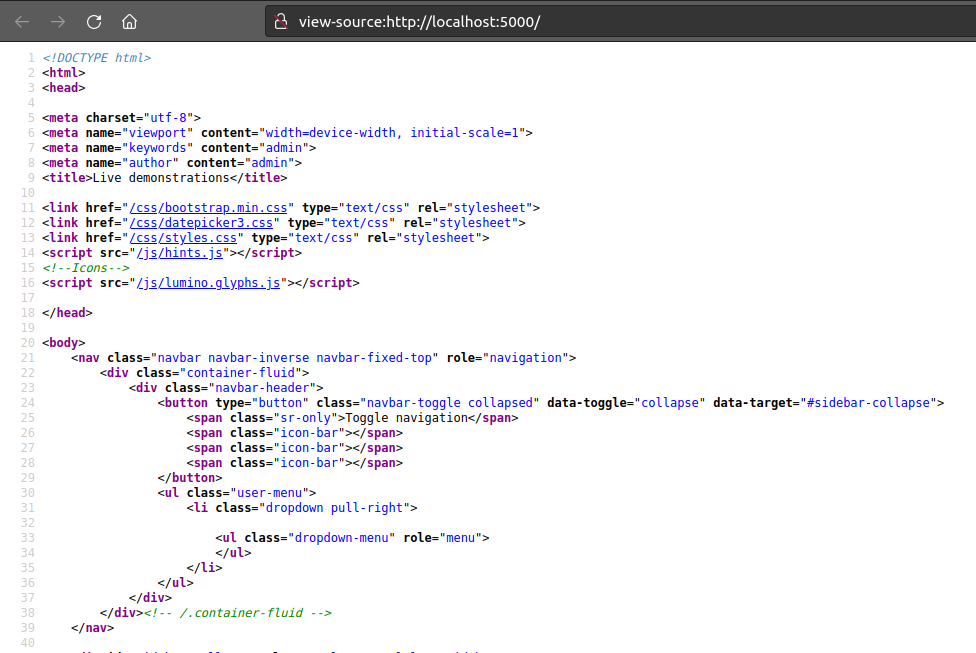
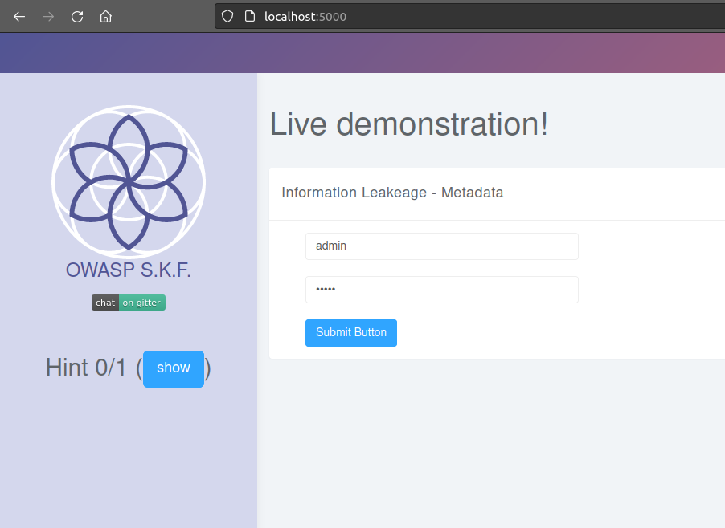
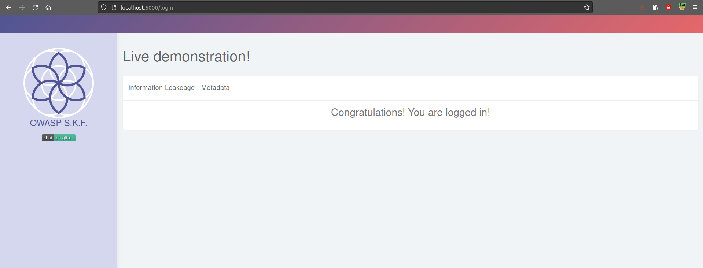

# KBID XXX - Information Leakeage in Metadata (info-leakeage-metadata)

## Running the app Java

First make sure java is installed on your host machine.
After installation, we go to the folder of the lab we want to practice.
"i.e /skf-labs/XSS, /skf-labs/RFI/" and run the following command:

```
$ ./mvnw spring-boot:run
```


Now that the app is running let's go hacking!


## Reconnaissance

It is very common, and even recommended, for programmers to include detailed comments and metadata on their source code.
However, comments and metadata included into the HTML code might reveal internal information that should not be available
to potential attackers. Comments and metadata review should be done in order to determine if any information is being leaked.

When we start the application we can see that there is a login form.



## Exploitation

What we are going to do is explore and check the source code of the website in order to find some useful information that the programmer may have forgotten or hidden
in the source code and metadata tag and fields.



We found something promising inside two of the metadata tags!
Now, we try these words as the credentials in the login form:



And goal achieved!



## Additional sources


