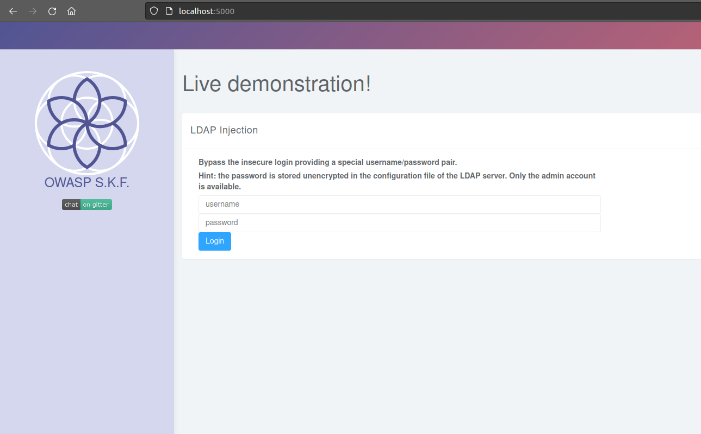
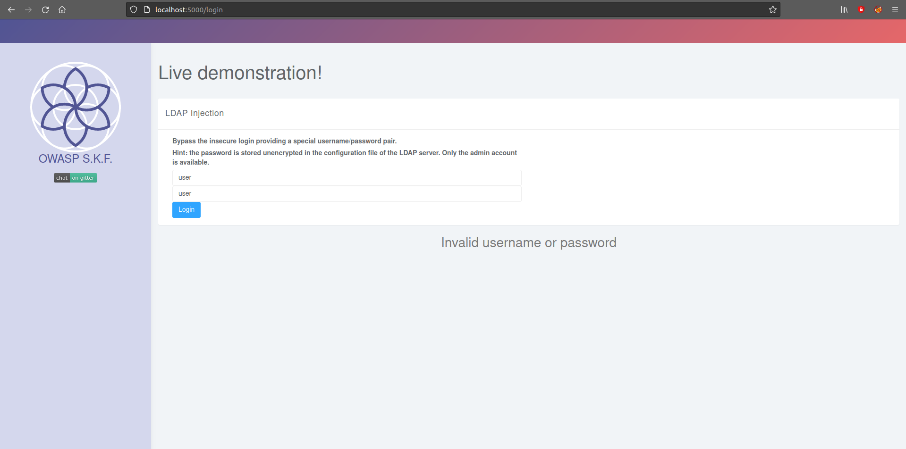

# KBID xxx - Ldap Injection

## Running the app Java

First make sure java is installed on your host machine.
After installation, we go to the folder of the lab we want to practice.
"i.e /skf-labs/XSS, /skf-labs/RFI/" and run the following command:

```
$ ./mvnw spring-boot:run
```


Now that the app is running let's go hacking!


## Reconnaissance

LDAP Injection is an attack used to exploit web based applications that construct LDAP statements based on user input. When an application fails to properly sanitize user input, it’s possible to modify LDAP statements using a local proxy. This could result in the execution of arbitrary commands such as granting permissions to unauthorized queries, and content modification inside the LDAP tree. The same advanced exploitation techniques available in SQL Injection can be similarly applied in LDAP Injection.

Let's open the app.



Trying to loggin with a random username and password.



The application architecture that supports LDAP includes both server-side and client-side components. The LDAP queries submitted to the server are known as LDAP search filters, which are constructed using prefix notation. Below is an example of an LDAP search filter:

```text
find("(&(cn=" + username +")(userPassword=" + pass +"))")
```

This prefix filter notation instructs the query to find an LDAP node with the given username and password.

## Exploitation

Let's check the controller file.

```java
String filter = "(&(cn="+username+")(sn="+password+"))";
String base = "ou=accounts";
```

We can see that the filter is constructed by concatenating the username and password directly into the filter without proper sanitization. If we replace the username and password with a special character we can bypass authentication controls. Using \* as the username and password will result in a successful login.

```java
String filter = "(&(cn="+username+")(sn="+password+"))";
```


We successfully logged in as the Admin.

## Additional sources






