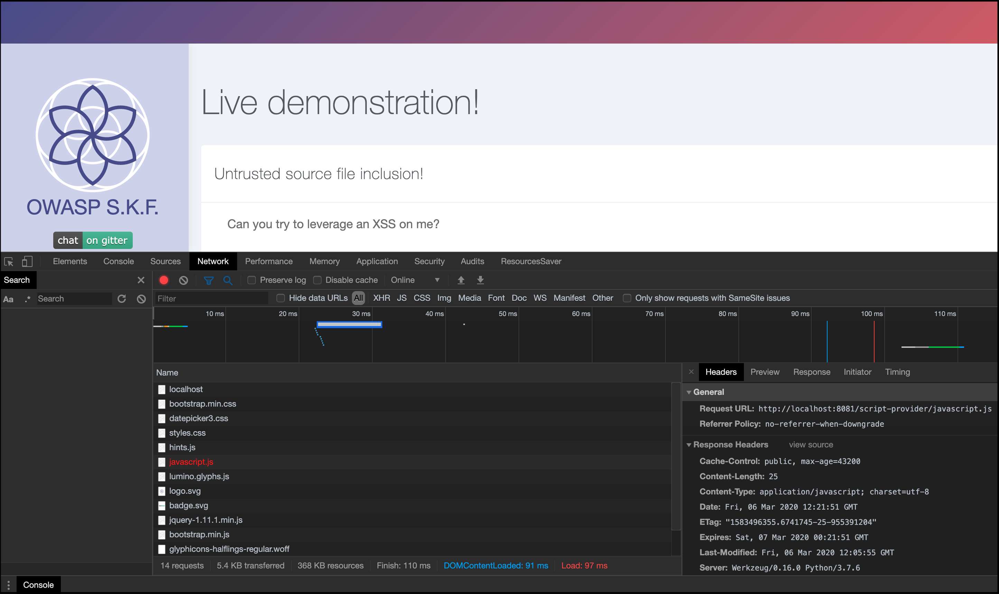
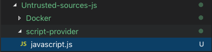
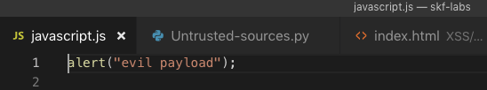
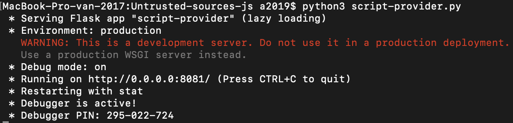
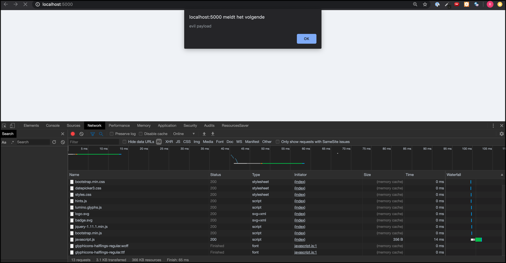
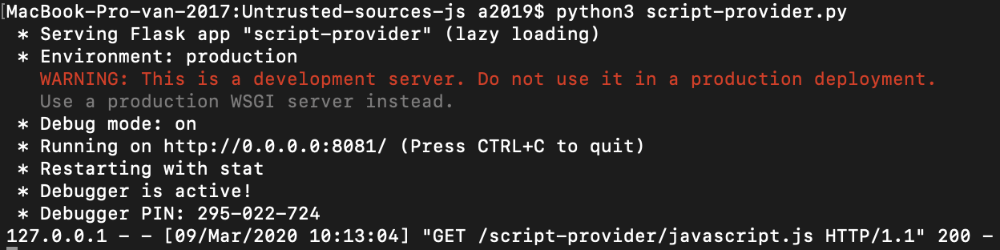

# Java - Untrusted Sources (XSSI)

## Running the app Java

First make sure java is installed on your host machine. After installation, we go to the folder of the lab we want to practice. "i.e /skf-labs/XSS, /skf-labs/RFI/" and run the following command:

```
$ ./mvnw spring-boot:run
```


Now that the app is running let's go hacking!


## Reconnaissance

#### Step1

When including third-party functionality, such as a web widget, library, or other source of functionality, the software must effectively trust that functionality. Without sufficient protection mechanisms, the functionality could be malicious in nature (either by coming from an untrusted source, being spoofed, or being modified in transit from a trusted source). The functionality might also contain its own weaknesses, or grant access to additional functionality and state information that should be kept private to the base system, such as system state information, sensitive application data, or the DOM of a web application.

This might lead to many different consequences depending on the included functionality, but some examples include injection of malware, information exposure by granting excessive privileges or permissions to the untrusted functionality, DOM-based XSS vulnerabilities, stealing user's cookies, or open redirect to malware

First, let's check the application to see if there are any sources being loaded in the app that return a 404.



When inspecting the network tab we see that the application fails to load a JS file to the URL

```
https://localhost:8081/script-provider/javascript.js
```

_note: in a penetration test we would now see if the domain that is used to grab the js source file from is free for us to register_

## Exploitation

#### Step1

Now, in order to leverage a successfull XSS attack we need to set up our own local server on port 8081 that serves the our malicious javascript:

```python
from flask import Flask, request, url_for, render_template, redirect, send_file

app = Flask(__name__)
app.config['DEBUG'] = True


@app.route('/<path:path>')
def static_file(path):
    return send_file(path)

if __name__ == '__main__':
    app.run(debug=True,host='0.0.0.0', port=8081)
```

#### Step2

We ofcourse also need to set the right path where to serve the file from:



#### Step3

The content of the JS file that we use to deliver the malicious XSS from looks no more basic than this:



#### Step4

Now it is time to start our web server.



#### Step5

We visit the target application where we now find our 'alert' that we coded in our javascript.js file





## Additional sources


