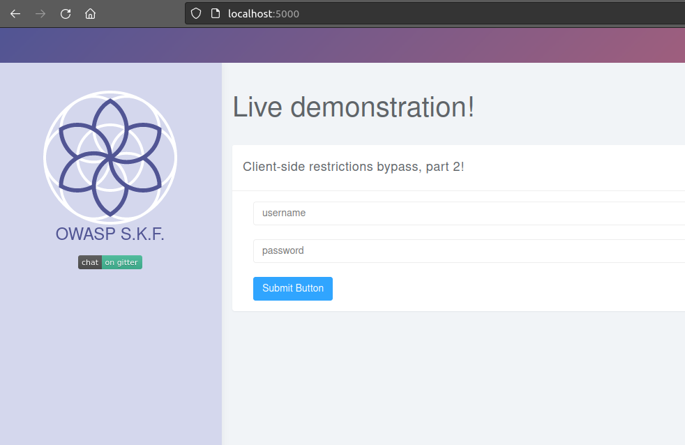
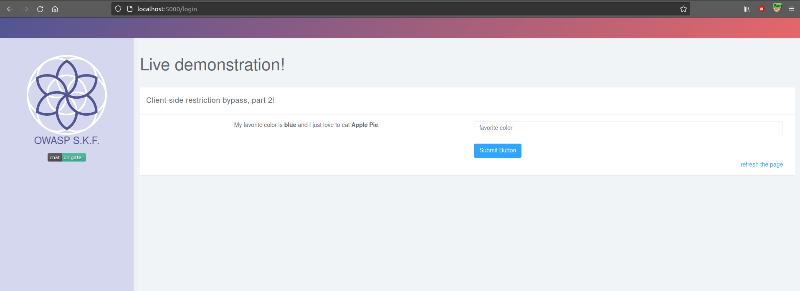
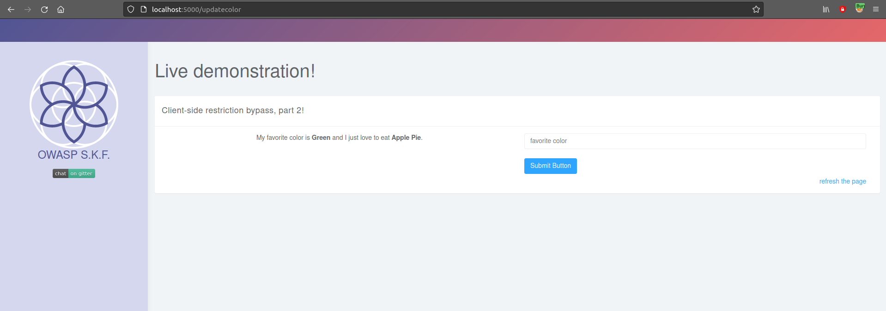
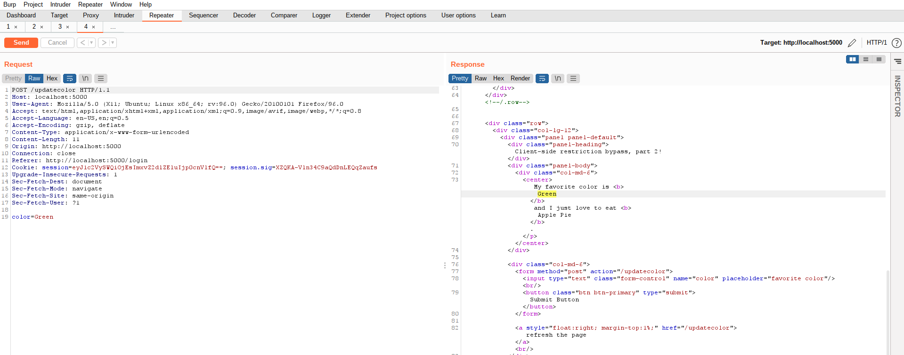
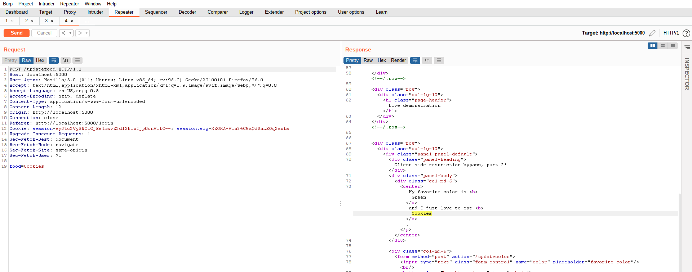
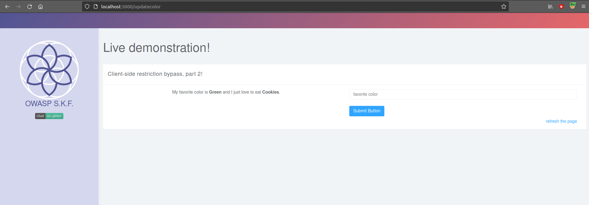
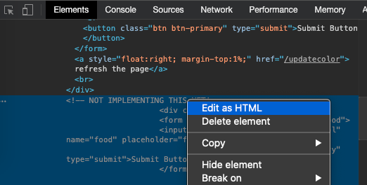
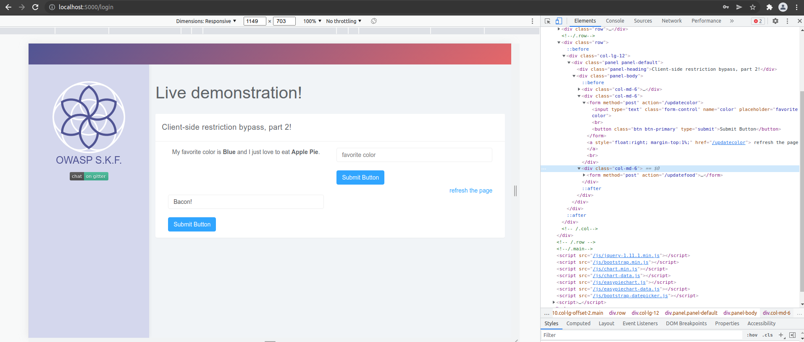

# Client Side Restriction Bypass - 2

## Running the app on Docker

```
$ sudo docker pull blabla1337/owasp-skf-lab:js-client-side-restriction-bypass-2
```

```
$ sudo docker run -ti -p 127.0.0.1:5000:5000 blabla1337/owasp-skf-lab:js-client-side-restriction-bypass-2
```


Now that the app is running let's go hacking!


## Reconnaissance

As we have done with previous labs, be sure to start Burp Suite so you can play along!

Let us visit http://localhost:5000. It presents us with a familiar login screen.



For now, let's try user "admin" and password "admin". Which does let us inside!



We're told that the "admin" user really likes the color blue and that they enjoy feasting on apple pie. That's great news! And since we're logged in as the user "admin", we can even update our favorite color!

After submitting the form with a different color, the output has changed.



Let's take a look at Burp Suite's proxy history, to see what's happening in the background.



Burp shows us that a POST request was made to http://localhost:5000/updatecolor. The form was submitted with one key:value pair, being "color=Green".

## Exploitation

Looking into the HTTP requests in Burp, there appear to be no hidden form values that would allow us to change admin's favorite food. But let's try something! Maybe the web app is trying to hide some things in plain sight by simply not including them in the user interface. We can make a few guesses about what to try, no?

We _could_ just edit HTTP requests in Burp, making educated guesses.

If you right-click the POST request in Burp's proxy history, you can select "_Send to Repeater_". This will light up the **Repeater** tab in orange, showing that something new appeared. Over there, we can edit the request before submitting it.

Let's change the called URL to http://localhost:5000/updatefood and let's change the form key to "food". Then if we click the "_Send_" button, maybe we'll get lucky!



We did! And if you use the "_Refresh the page_" link (or the _Refresh_ button of the browser) you'll see that the change is persistent.



Alternatively, let's take a closer look at that front-end code! By right-clicking the form in our Chrome browser and choosing "_Inspect_" we can investigate the HTML in question.


What's this?!

The developer left us the clues right there in the HTML? And we manually did the hard work? No fair! Well, might as well use the form then!

If you right-click the commented text and choose "_Edit as HTML_" we can just remove the `<!--` and `-->` comment markers. And presto, there's our other form which will let us change the favorite food as well.





## Additional sources

Security research company Mitre maintains a list of common vulnerability types, with CWE registrations: Common Weakness Enumeration.


