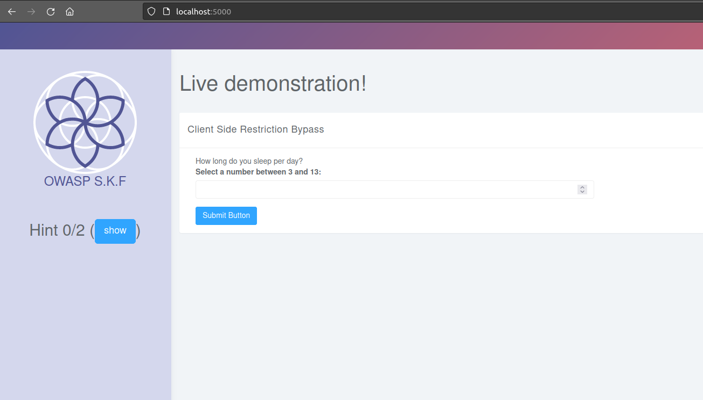
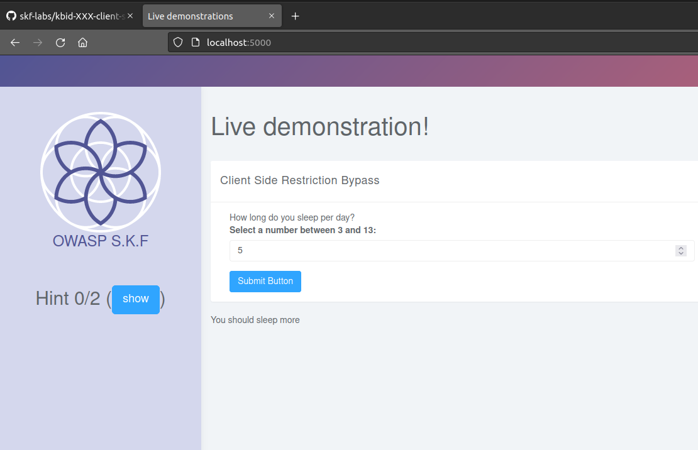
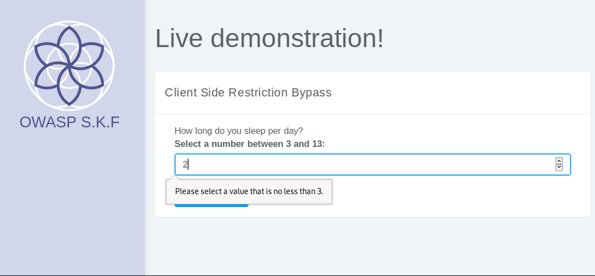
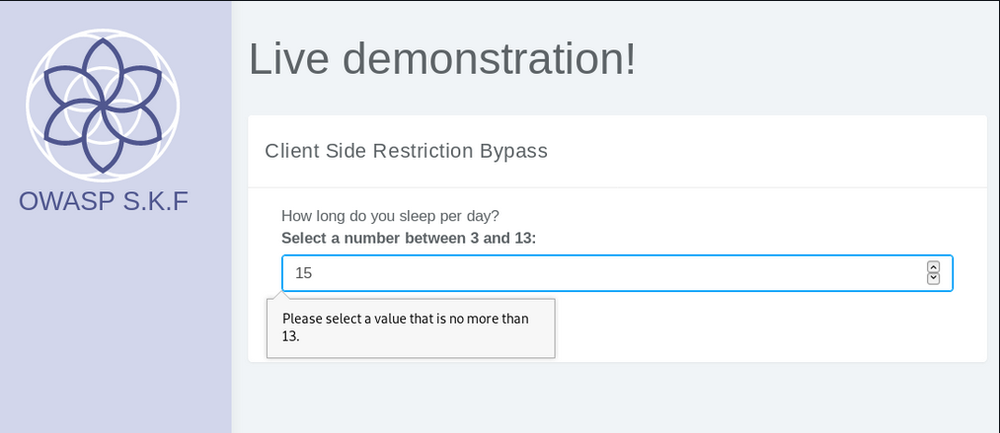
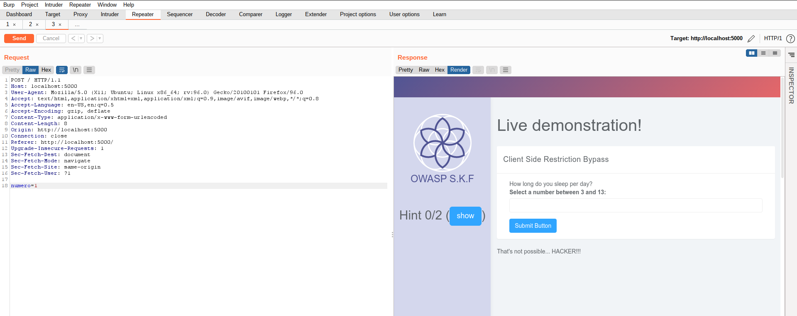

# Client Side Restriction Bypass

## Running the app on Docker

```
$ sudo docker pull blabla1337/owasp-skf-lab:js-client-side-restriction-bypass
```

```
$ sudo docker run -ti -p 127.0.0.1:5000:5000 blabla1337/owasp-skf-lab:js-client-side-restriction-bypass
```


Now that the app is running let's go hacking!


## Reconnaissance









## Exploitation



And goal achieved! We could bypass the client-side restrictions.

## Additional sources


