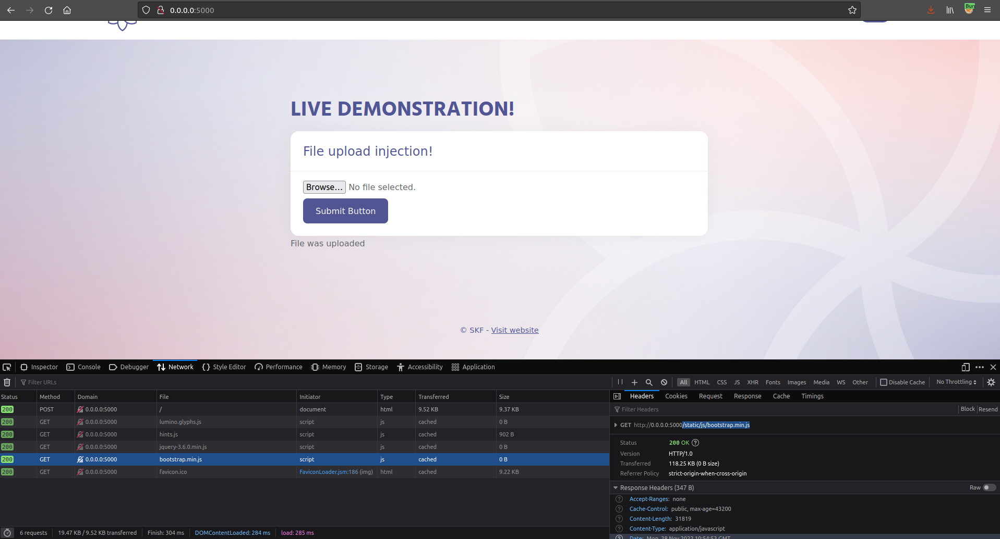
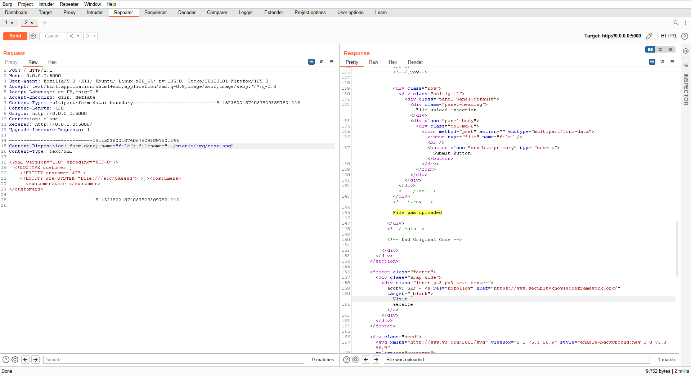

# File upload

## Running the app on Docker

```
$ sudo docker pull blabla1337/owasp-skf-lab:js-file-upload
```

```
$ sudo docker run -ti -p 127.0.0.1:5000:5000 blabla1337/owasp-skf-lab:js-file-upload
```


Now that the app is running let's go hacking!


## Reconnaissance

Uploaded files represent a significant risk to applications. The first step in many attacks is to get some code to the system to be attacked. Then the attack only needs to find a way to get the code executed. Using a file upload helps the attacker accomplish the first step.

The consequences of unrestricted file upload can vary, including complete system takeover, an overloaded file system or database, forwarding attacks to back-end systems, and simple defacement.

There are really three classes of problems here. The first is with the file metadata, like the path and file name. These are generally provided by the transport, such as HTTP multi-part encoding. This data may trick the application into overwriting a critical file or storing the file in a bad location. You must validate the metadata extremely carefully before using it.

The second one is the problem with the file size or content where the attacker can upload a huge 5gig file and creating a DoS. Also an attacker can easily craft a valid image file with PHP code inside that can be ecxecuted when the file is uploaded inside the website root folder.


When start the application we can see that we have upload functionality and this file will be stored on the server. First lets try to upload a valid image to see how the application behaves.


If we inspect the request with an intercepting proxy we can see that the application is performing a POST request that results in a data mutation, storing our file on the server.

## Exploitation

Now lets try to upload a different file for example a XML file and see how the application will behave.


As you can see this file is not allowed to be uploaded. Also when we upload files idealy we want to be able to access the files. Let's see if we can find the uploaded file back in the application.

The tool for example we can use for this is called Wfuzz and can be started with the following command:

```bash
wfuzz -c -z file,/usr/share/wfuzz/wordlist/general/common.txt --hc 404 http://localhost:5000/FUZZ
```

Unfortunately Wfuzz doesnt find any upload directories where our file is being stored. So lets have a look at the application what other folders are available and are accessible.



The application uses different directories to store the stylesheets and images that are being used by the application. Lets see if we can use a path traversel injection to upload our files inside these folders.



We have tried the path traversal directory injection and we got the message back from the application that the file was successfully uploaded. Now lets see if we can access our file.

```
http://localhost:5000/static/img/test.png
```

And there it is our file was being uploaded successfully in the static/img folder of the application and because this is accessible by the application we can access our file.


Now try also to upload other files like \*.exe or \*.html and do a Cross Site Scripting attack. Maybe also try to upload a very big file and see if the application is also protected agains that type of attack.

## Additional sources


