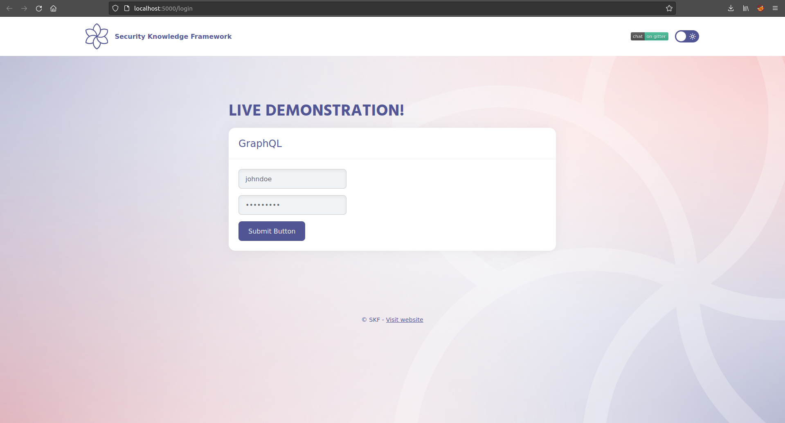
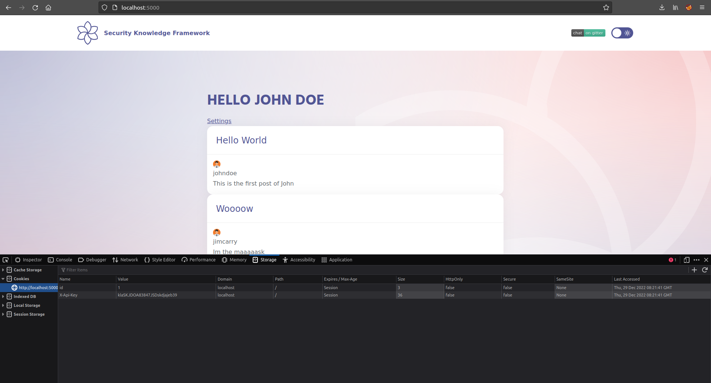
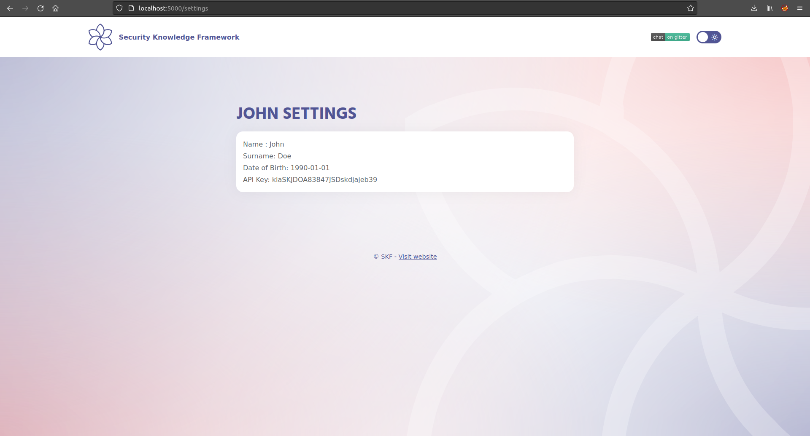

# GraphQL IDOR

## Running the app on Docker

```
$ sudo docker pull blabla1337/owasp-skf-lab:js-graphql-idor
```

```
$ sudo docker run -ti -p 127.0.0.1:5000:5000 blabla1337/owasp-skf-lab:js-graphql-idor
```


Now that the app is running let's go hacking!


## Reconnaissance

As soon as we browse on `http://0.0.0.0:5000` we see that now our app implements a login screen to support multiple users



We already registered a user , the famous Jhon Doe and we can authneticate with the credentials

```
jhondoe
password1

```

Now that we are in, we discover that every time a user logs in, the application sets a cookie called

`X-Api-Key`



that is used by the app to authenticate the keep the session active and recognize the user.

The API key can be used also to retrieve info from the blog. But this is another story.

What we want to do, is to find a way to authenticate us other users using an IDOR vulnerability.

## Exploitation

What's new in this application is that an user can see his settings, browsing to the page:

`http://0.0.0.0:5000/settings`



of course only if authenticated. But how does this page retrieve the information is crucial. If we intercept the traffic we can see that the application sends a GraphQL query to the backend to ask for the information we see in the page. The query looks like this:

```
{
    UserInfo (id: 1)
    {
        api_key
        name
        surname
        date_of_birth
    }
}

```

> Knowing that, use the IDOR vulnerability to authenticate as another user

## Solution

Implement authorization on graphql endpoint. Although authenticated users could query the information, you should validate that the requestor of the information is actually the legit one, and use UUID instead of ID as Int.

## Additional resources


