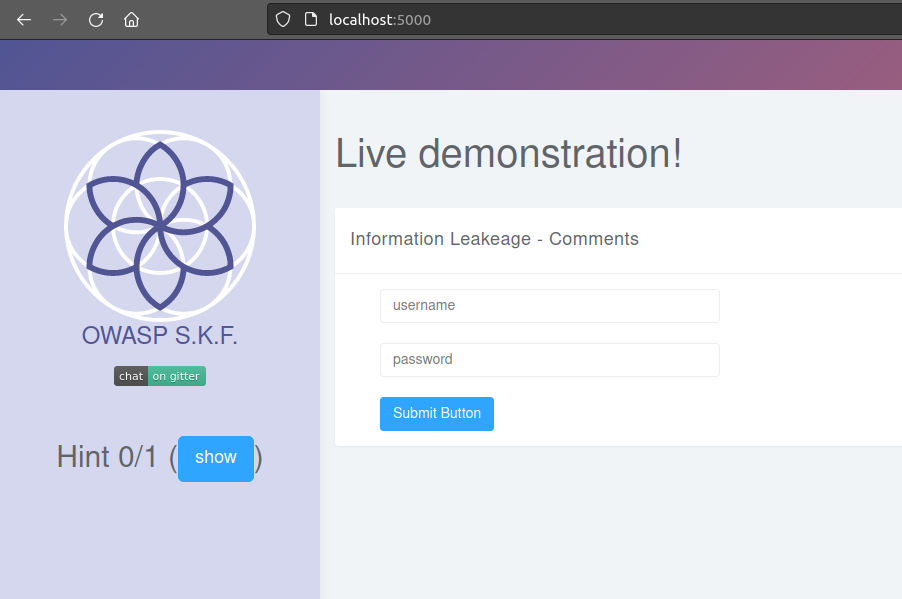
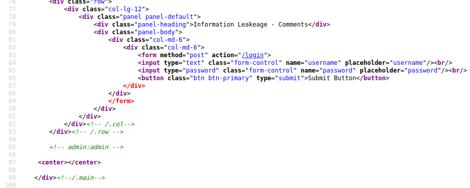
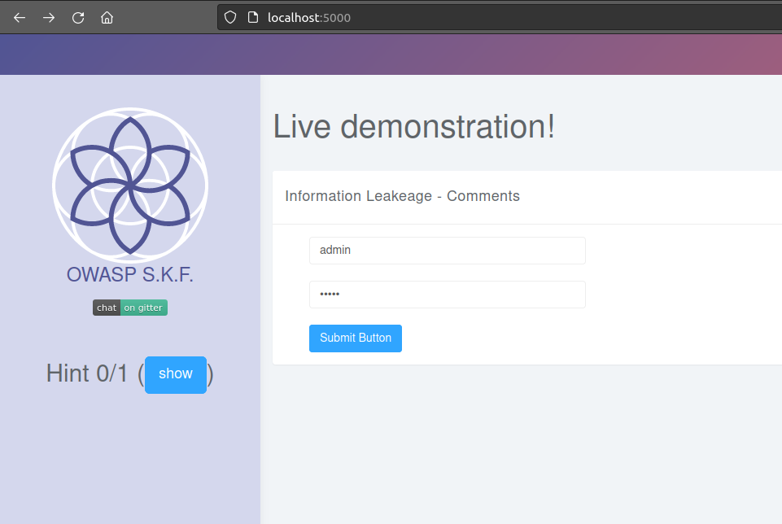
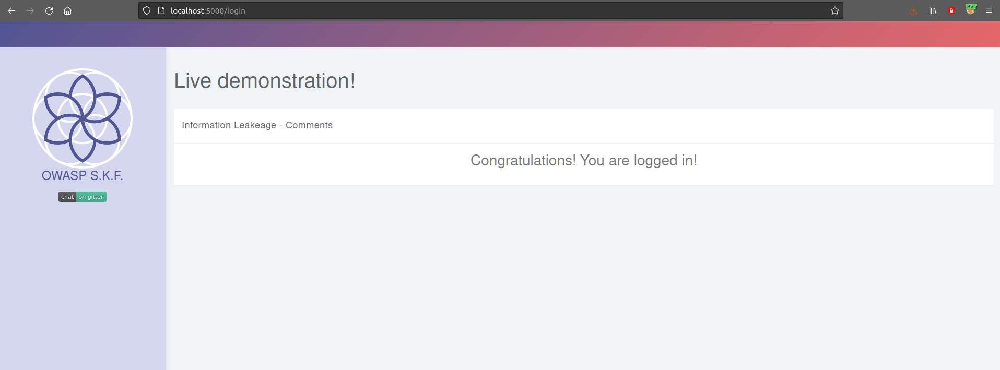

# Information Leakeage in Comments

## Running the app on Docker

```
$ sudo docker pull blabla1337/owasp-skf-lab:js-info-leakage-comments
```

```
$ sudo docker run -ti -p 127.0.0.1:5000:5000 blabla1337/owasp-skf-lab:js-info-leakage-comments
```


Now that the app is running let's go hacking!


## Reconnaissance

It is very common, and even recommended, for programmers to include detailed comments and metadata on their source code.
However, comments and metadata included into the HTML code might reveal internal information that should not be available
to potential attackers. Comments and metadata review should be done in order to determine if any information is being leaked.

When we start the application we can see that there is a login form.



## Exploitation

What we are going to do is explore and check the source code of the website in order to find some useful information that the programmer may have forgotten
in the source code.



We found something promising!
Now, we try these words as the credentials in the login form:



And goal achieved!



## Additional sources


