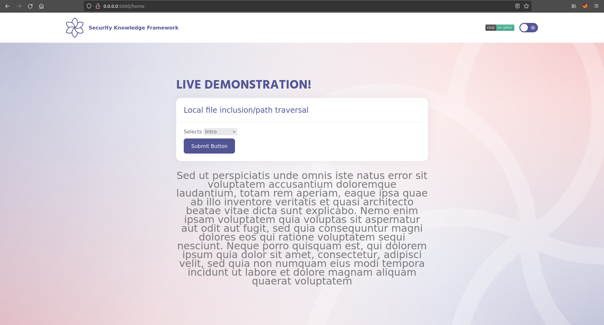
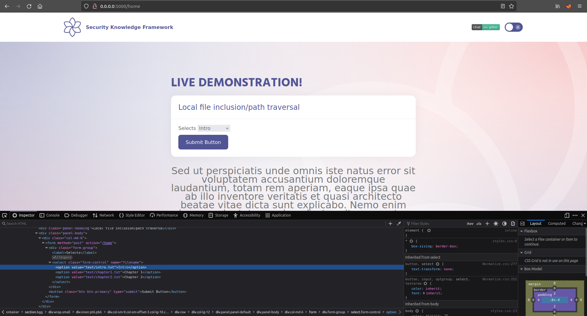
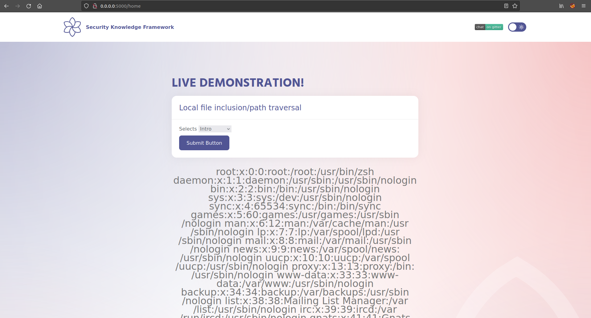

# LFI

## Running the app on Docker

```
$ sudo docker pull blabla1337/owasp-skf-lab:js-lfi
```

```
$ sudo docker run -ti -p 127.0.0.1:5000:5000 blabla1337/owasp-skf-lab:js-lfi
```


Now that the app is running let's go hacking!


## Reconnaissance

Local File Inclusion (also known as LFI) is the process of including files, that are already locally present on the server, through the exploiting of vulnerable inclusion procedures implemented in the application. This vulnerability occurs, for example, when a page receives, as input, the path to the file that has to be included and this input is not properly sanitized, allowing directory traversal characters (such as dot-dot-slash) to be injected. Although most examples point to vulnerable PHP scripts, we should keep in mind that it is also common in other technologies such as JSP, ASP and others.

Warning: To successfully test for this flaw, the tester needs to have knowledge of the system being tested and the location of the files being requested. There is no point requesting /etc/passwd from an IIS web server.

Some Examples:

```
http://example.com/getUserProfile.jsp?item=../../../../etc/passwd

Cookie: USER=1826cc8f:PSTYLE=../../../../etc/passwd
```

## Exploitation

The File Inclusion vulnerability allows an attacker to include a file, usually exploiting a "dynamic file inclusion" mechanisms implemented in the target application. The vulnerability occurs due to the use of user-supplied input without proper validation.

This can lead to something as outputting the contents of the file, but depending on the severity, it can also lead to:

Code execution on the web server

Code execution on the client-side such as JavaScript

which can lead to other attacks such as:

Cross-site scripting (XSS)

Denial of Service (DoS)

Sensitive Information Disclosure

Let us see how can we exploit the file inclusion vulnerability in a real world scenario, the application here allows us to view details on Intro, Chapter1, Chapter2 and so on.





To exploit let us try to modify the "Intro item" and attempt to access the world-readable /etc/passwd file by directory traversal.








Success! As we observed, we can access the /etc/passwd file through LFI.

Checking the source-code of the application we can understand why this is happening:

```javascript
app.post("/home", (req, res) => {
  const filename = req.body.filename;
  fs.readFile(filename, "utf8", (err, data) => {
    if (err) {
      console.error(err);
      return;
    }
    res.render("index.ejs", { file: data });
  });
});
```

In the code example the "filename" parameter that is used to read content from files of the file system is under the users control. Instead of just reading the intended text files from the file system, a potential attacker could abuse this function to also read other sensitive information from the web server.

## Additional sources

Please refer to the OWASP testing guide for a full complete description about path traversal with all the edge cases over different platforms!


